# Fiche MMC complète pour la Task I — équilibre quasi-statique au SHPB

Articles cités : [Roth 2015] = Roth, Gary & Mohr (2015) ; [Beerli 2026] = Beerli, Roth, Li, Grolleau & Mohr (2026) ; [Roth & Mohr 2014] ; [Dunand & Mohr 2010]. Références complètes en partie P.

---

## Notations

| Objet | Notation | Remarque |
|---|---|---|
| Scalaire | $a,\ \rho,\ T$ | |
| Vecteur | $\underline{u},\ \underline{x},\ \underline{n}$ (souligné) | |
| Tenseur d'ordre 2 | $\underset{\sim}{\sigma},\ \underset{\sim}{F},\ \underset{\sim}{\varepsilon}$ (tilde dessous) | |
| Tenseur d'ordre 4 | $\underset{\approx}{\Lambda}$ (double tilde dessous) | tenseur des modules d'élasticité |
| Composantes (base orthonormée $\underline{e}_i$) | $\underline{u} = u_i\,\underline{e}_i$, $\underset{\sim}{\sigma} = \sigma_{ij}\,\underline{e}_i\otimes\underline{e}_j$ | convention d'Einstein : indice répété = somme de 1 à 3 |
| Contraction simple | $(\underset{\sim}{A}\cdot\underline{u})_i = A_{ij}u_j$ | « appliquer » le tenseur au vecteur |
| Double contraction | $\underset{\sim}{A}:\underset{\sim}{B} = A_{ij}B_{ij}$ | donne un scalaire |
| Produit tensoriel | $(\underline{a}\otimes\underline{b})_{ij} = a_i b_j$ | |
| Identité | $\underset{\sim}{1}$, composantes $\delta_{ij}$ | $\delta_{ij}=1$ si $i=j$, 0 sinon |
| Transposée, trace, déterminant | $\underset{\sim}{A}^T$, $\operatorname{trace}\underset{\sim}{A} = A_{ii}$, $\det\underset{\sim}{A}$ | |
| Dérivée partielle | $u_{i,j} = \partial u_i/\partial X_j$ | virgule = dérivée |
| Gradient lagrangien / eulérien | $\operatorname{Grad}$ (par rapport à $\underline{X}$) / $\operatorname{grad}$ (par rapport à $\underline{x}$) | |
| Dérivée en suivant la matière | $\dot{f}$ | |
| Saut à travers une surface | $[\![ f ]\!] = f^+ - f^-$ | |

**Convention du gradient.** On écrit $\operatorname{Grad}\underline{u} = \underline{u}\otimes\nabla_X$, de composantes $u_{i,j}$ : le **second** indice est celui de la dérivée. Certains ouvrages utilisent la transposée ; vérifie toujours la convention quand tu compares avec un article.

---

## A. Outils mathématiques minimaux

### A.1 Pourquoi un tenseur d'ordre 2 ?

Coupe un solide chargé par un plan fictif de normale $\underline{n}$. La matière d'un côté exerce sur l'autre une force par unité de surface $\underline{t}$, le **vecteur-contrainte**. Si tu changes l'orientation du plan, $\underline{t}$ change. Cette dépendance est **linéaire** (théorème de Cauchy, C.2) : il existe une « machine » $\underset{\sim}{\sigma}$ qui transforme la normale en force surfacique, $\underline{t} = \underset{\sim}{\sigma}\cdot\underline{n}$. Une application linéaire d'un vecteur vers un vecteur, c'est exactement un **tenseur d'ordre 2**. Dans une base, il se représente par une matrice $3\times3$, $[\sigma_{ij}]$.

Exemple : en traction simple de 500 MPa selon $\underline{e}_1$, $[\sigma] = \operatorname{diag}(500,0,0)$ MPa. Sur une facette de normale $\underline{n} = \underline{e}_1$, $\underline{t} = 500\,\underline{e}_1$ MPa ; sur une facette de normale $\underline{e}_2$, $\underline{t} = \underline{0}$ (les bords de l'éprouvette sont libres).

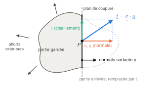\
*Figure A.1 — Vecteur-contrainte. On coupe le solide par un plan de normale sortante $\underline{n}$ ; la partie enlevée agit sur la partie gardée par une force surfacique $\underline{t}$, qui se décompose en une composante normale $\sigma_n\,\underline{n}$ et un cisaillement $\tau$ dans le plan de coupe.*

**Changement de base orthonormée.** Si $[Q]$ est la matrice de passage (ses colonnes sont les nouveaux vecteurs de base exprimés dans l'ancienne base),

$$
[\sigma'] = [Q]^T\,[\sigma]\,[Q].
$$

Le tenseur ne change pas, seules ses composantes changent. C'est ce qui te servira pour exprimer une contrainte dans le repère de la tôle (direction de laminage) ou dans celui d'une éprouvette découpée à 45°.

### A.2 Tenseur symétrique : valeurs propres, décomposition spectrale, invariants

Un tenseur symétrique ($A_{ij} = A_{ji}$) a trois **valeurs propres réelles** et trois **directions propres orthogonales**. On peut donc toujours l'écrire

$$
\underset{\sim}{\sigma} = \sum_{i=1}^{3}\sigma_i\,\underline{n}_i\otimes\underline{n}_i,
\qquad \underset{\sim}{\sigma}\cdot\underline{n}_i = \sigma_i\,\underline{n}_i .
$$

Dans la base $(\underline{n}_1,\underline{n}_2,\underline{n}_3)$, la matrice est diagonale. Les **invariants** sont des fonctions des composantes qui ne dépendent pas de la base :

$$
I_1 = \operatorname{trace}\underset{\sim}{\sigma} = \sigma_1+\sigma_2+\sigma_3,\qquad
I_2 = \sigma_1\sigma_2+\sigma_2\sigma_3+\sigma_3\sigma_1,\qquad
I_3 = \det\underset{\sim}{\sigma} = \sigma_1\sigma_2\sigma_3 .
$$

Un critère de plasticité pour un matériau **isotrope** ne peut dépendre que des invariants (ou, ce qui revient au même, des contraintes principales, de façon symétrique). S'il dépendait aussi des directions principales, il donnerait un résultat différent selon l'orientation de l'éprouvette dans la tôle, ce qui contredit l'isotropie.

### A.3 Partie sphérique et partie déviatorique

Tout tenseur d'ordre 2 se décompose en

$$
\underset{\sim}{A} = \underbrace{\tfrac{1}{3}(\operatorname{trace}\underset{\sim}{A})\,\underset{\sim}{1}}_{\underset{\sim}{A}^{sph}} \;+\; \underset{\sim}{A}^{dev},
\qquad \operatorname{trace}\underset{\sim}{A}^{dev} = 0 .
$$

Pour les contraintes, la partie sphérique est une pression pure, $p = -\tfrac13\operatorname{trace}\underset{\sim}{\sigma}$. La partie déviatorique mesure l'écart à une pression pure et contient tous les cisaillements. **Les métaux ne plastifient quasiment pas sous pression pure** (ils restent élastiques jusqu'à plusieurs GPa de pression hydrostatique) : c'est pourquoi les critères de plasticité portent sur $\underset{\sim}{\sigma}^{dev}$.

Exemple : pour la traction simple $\operatorname{diag}(\sigma,0,0)$, $p = -\sigma/3$ et $\underset{\sim}{\sigma}^{dev} = \sigma\operatorname{diag}(2/3,-1/3,-1/3)$.

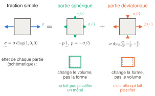\
*Figure A.3 — La traction simple est la somme d'une partie sphérique (la même traction $\sigma/3$ dans toutes les directions, qui ne change que le volume) et d'une partie déviatorique ($2\sigma/3$ selon l'axe, $-\sigma/3$ dans les deux autres directions, qui ne change que la forme). Le dessin est en 2D : la troisième direction se comporte comme la direction 2.*

### A.4 Opérateurs différentiels et théorème de la divergence

- Gradient d'un champ de vecteurs : $\operatorname{Grad}\underline{u}$, composantes $u_{i,j}$.
- Divergence d'un vecteur : $\operatorname{div}\underline{v} = v_{i,i}$.
- Divergence d'un tenseur d'ordre 2 : c'est un **vecteur**, $(\operatorname{div}\underset{\sim}{\sigma})_i = \partial\sigma_{ij}/\partial x_j$ (divergence de chaque ligne).
- Théorème de la divergence (ou d'Ostrogradski), pour un domaine $D$ de frontière $\partial D$ et de normale sortante $\underline{n}$ :

$$
\int_{\partial D}\underset{\sim}{\sigma}\cdot\underline{n}\;ds = \int_D \operatorname{div}\underset{\sim}{\sigma}\;dv .
$$

Ce théorème transforme une somme de forces sur une surface en une intégrale de volume. C'est lui qui permet de passer d'un bilan « global » (sur un morceau de matière) à une équation locale (en chaque point).

### A.5 Notation « vecteur à 6 composantes » (Voigt, Mandel)

Un tenseur symétrique n'a que 6 composantes indépendantes. Les codes de calcul et les articles les rangent souvent dans un vecteur. [Beerli 2026] écrit par exemple

$$
\boldsymbol{\sigma} = [\sigma_{11},\sigma_{22},\sigma_{33},\sigma_{12},\sigma_{23},\sigma_{13}]^T,\qquad
\boldsymbol{\varepsilon}^p = [\varepsilon^p_{11},\varepsilon^p_{22},\varepsilon^p_{33},2\varepsilon^p_{12},2\varepsilon^p_{23},2\varepsilon^p_{13}]^T .
$$

Le facteur 2 sur les cisaillements de déformation sert à ce que le produit scalaire des deux vecteurs donne bien $\underset{\sim}{\sigma}:\underset{\sim}{\varepsilon}$ : dans la double contraction, chaque terme croisé ($\sigma_{12}\varepsilon_{12}$ et $\sigma_{21}\varepsilon_{21}$) apparaît deux fois. $2\varepsilon_{12} = \gamma_{12}$ est le **glissement de l'ingénieur**.

> **Attention.** Dans [Beerli 2026], la dernière composante du vecteur $\boldsymbol{\varepsilon}^p$ est imprimée « $\sigma_{13}$ » : c'est une coquille, il faut lire $2\varepsilon^p_{13}$.

---

## B. Cinématique : décrire le mouvement et la déformation

### B.1 Le milieu continu et le volume élémentaire représentatif

Une tôle d'acier est faite de grains (1 à 12 µm pour les aciers DP de [Beerli 2026]), eux-mêmes faits d'atomes. On renonce à suivre chaque grain : on remplace la matière par un **milieu continu**, où chaque « point matériel » représente un petit volume qui contient assez de grains pour être représentatif. Cela suppose la hiérarchie d'échelles

$$
d \ll L_{VER} \ll L,
$$

avec $d$ la taille des hétérogénéités (grains), $L_{VER}$ la taille du volume élémentaire représentatif et $L$ la taille de la structure. En dynamique, $L$ doit être remplacée par la plus petite **longueur d'onde** des sollicitations : une onde dont la longueur serait comparable à la taille de grain « verrait » les grains un par un.

> **Pour la Task I.** Deux vérifications :
> - Tôle de 1,5 mm, grains de 10 µm : environ 150 grains dans l'épaisseur. L'approche continue est justifiée.
> - Une montée en charge de 40 µs dans une barre où l'onde va à 5 000 m/s correspond à une longueur d'onde de l'ordre de 0,2 m, bien plus grande que les grains. Le continu reste valable.

### B.2 Configurations, transformation, déplacement

On repère chaque point matériel par sa position $\underline{X}$ dans la **configuration de référence** $\Omega_0$ (l'éprouvette avant l'essai) et par sa position $\underline{x}$ dans la **configuration actuelle** $\Omega_t$. La **transformation** les relie :

$$
\underline{x} = \Phi(\underline{X},t),\qquad
\underline{u}(\underline{X},t) = \underline{x} - \underline{X}\quad\text{(déplacement)} .
$$

Deux points de vue coexistent :

- **lagrangien** : on suit chaque point matériel, et les grandeurs sont fonctions de $(\underline{X},t)$. C'est naturel pour les solides, et c'est ce que fait la **corrélation d'images (DIC)**, qui suit des motifs peints sur l'éprouvette (B.10) ;
- **eulérien** : on regarde ce qui se passe en un point fixe de l'espace, et les grandeurs sont fonctions de $(\underline{x},t)$. C'est naturel pour les fluides.

### B.3 Le gradient de la transformation

Pour décrire ce qui arrive **localement** à la matière, on regarde comment un petit segment matériel $d\underline{X}$ se transforme :

$$
d\underline{x} = \underset{\sim}{F}\cdot d\underline{X},\qquad
\underset{\sim}{F} = \frac{\partial\underline{x}}{\partial\underline{X}} = \underset{\sim}{1} + \operatorname{Grad}\underline{u},\qquad
F_{ij} = \delta_{ij} + u_{i,j} .
$$

$\underset{\sim}{F}$ contient toute l'information locale sur la transformation : allongements, changements d'angles et rotations. Il transporte aussi les volumes et les surfaces orientées :

$$
dv = J\,dV,\quad J = \det\underset{\sim}{F} > 0,
\qquad\qquad
d\underline{s} = J\,\underset{\sim}{F}^{-T}\cdot d\underline{S}\quad\text{(formule de Nanson)} .
$$

- $J$ est le rapport des volumes actuel et initial d'un petit élément de matière. $J = 1$ : la transformation conserve le volume, elle est **isochore**.
- Ne confonds pas **isochorie** (propriété d'un mouvement) et **incompressibilité** (propriété d'un matériau, qui ne peut subir que des mouvements isochores).
- La formule de Nanson donne l'évolution d'un élément de surface : sa normale ne suit pas la matière comme un segment matériel, d'où le $\underset{\sim}{F}^{-T}$.

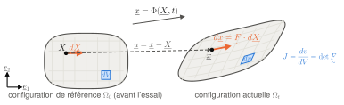\
*Figure B.3 — La transformation $\Phi$ envoie chaque point $\underline{X}$ de la configuration de référence en $\underline{x}$ ; $\underline{u} = \underline{x}-\underline{X}$ est le déplacement. Un petit segment matériel $d\underline{X}$ devient $d\underline{x} = \underset{\sim}{F}\cdot d\underline{X}$ (il s'allonge et tourne), et un petit volume $dV$ devient $dv = J\,dV$. La grille, dessinée sur la matière, se déforme avec elle.*

> **Pour la Task I.** La formule de Nanson dit comment la section de l'éprouvette évolue : c'est elle qui relie la contrainte « ingénieur » et la contrainte « vraie » (C.6).

### B.4 Décomposition polaire : séparer rotation et déformation pure

Toute transformation locale se décompose de façon unique en une déformation pure suivie d'une rotation, ou l'inverse :

$$
\underset{\sim}{F} = \underset{\sim}{R}\cdot\underset{\sim}{U} = \underset{\sim}{V}\cdot\underset{\sim}{R},
\qquad
\underset{\sim}{C} = \underset{\sim}{F}^T\cdot\underset{\sim}{F} = \underset{\sim}{U}^2,
\qquad
\underset{\sim}{B} = \underset{\sim}{F}\cdot\underset{\sim}{F}^T = \underset{\sim}{V}^2 .
$$

- $\underset{\sim}{R}$ est une rotation ($\det\underset{\sim}{R} = 1$).
- $\underset{\sim}{U}$ (tenseur droit de déformation pure) et $\underset{\sim}{V}$ (gauche) sont symétriques définis positifs. Leurs valeurs propres $\lambda_r$ sont les **allongements principaux**.
- $\underset{\sim}{C}$ et $\underset{\sim}{B}$ sont les tenseurs de Cauchy-Green droit et gauche.

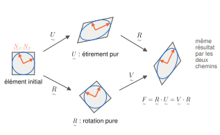\
*Figure B.4 — Deux chemins pour la même transformation $\underset{\sim}{F}$ : étirer d'abord selon les directions principales $\underline{N}_1$, $\underline{N}_2$ (c'est $\underset{\sim}{U}$) puis tourner (c'est $\underset{\sim}{R}$), ou tourner d'abord puis étirer ($\underset{\sim}{V}$). Le cercle devient une ellipse dont les axes sont les directions principales. Seule la partie $\underset{\sim}{U}$ (ou $\underset{\sim}{V}$) déforme la matière.*

Pourquoi c'est important : une rotation de corps rigide ne déforme pas la matière, donc une **mesure de déformation doit être insensible aux rotations**. C'est pour cela qu'on construit les déformations à partir de $\underset{\sim}{U}$ ou de $\underset{\sim}{C}$ (où la rotation a disparu : $\underset{\sim}{C} = \underset{\sim}{U}\cdot\underset{\sim}{R}^T\cdot\underset{\sim}{R}\cdot\underset{\sim}{U} = \underset{\sim}{U}^2$), et pas directement à partir de $\underset{\sim}{F}$.

### B.5 Allongement et mesures de déformation

**Allongement** d'une fibre de direction unitaire $\underline{M}$ :

$$
\lambda(\underline{M}) = \frac{|d\underline{x}|}{|d\underline{X}|} = \sqrt{\underline{M}\cdot\underset{\sim}{C}\cdot\underline{M}} .
$$

Pour une fibre de longueur initiale $l_0$ devenue $l$ : $\lambda = l/l_0$.

**Mesures de déformation.** « Mesurer » une déformation est une affaire de convention. On demande seulement qu'une mesure de déformation soit symétrique et sans dimension, qu'elle soit nulle pour un mouvement de corps rigide, et qu'elle coïncide avec la déformation infinitésimale (B.6) quand les déformations sont petites. La famille la plus utilisée est

$$
\underset{\sim}{E}_n = \frac{1}{n}\left(\underset{\sim}{U}^n - \underset{\sim}{1}\right)\ (n\neq0),
\qquad
\underset{\sim}{E}_0 = \log\underset{\sim}{U} .
$$

Le logarithme d'un tenseur se calcule dans sa base propre : on prend le logarithme de chaque valeur propre, puis on revient dans la base de départ.

Pour une fibre qui passe de $l_0$ à $l$ (déformation homogène) :

| Nom | Définition | En traction : composante 11 | Nom dans les articles |
|---|---|---|---|
| Déformation **nominale** | $\underset{\sim}{E}_1 = \underset{\sim}{U}-\underset{\sim}{1}$ (Biot) | $E_1 = \dfrac{l-l_0}{l_0}$ | *engineering strain* $\varepsilon_{eng}$ |
| Déformation **logarithmique** | $\underset{\sim}{E}_0 = \log\underset{\sim}{U}$ (Hencky) | $E_0 = \ln\dfrac{l}{l_0}$ | *true strain*, *logarithmic strain* |
| Green-Lagrange | $\underset{\sim}{E} = \underset{\sim}{E}_2 = \tfrac12(\underset{\sim}{C}-\underset{\sim}{1})$ | $E_2 = \tfrac12\left(\dfrac{l^2}{l_0^2}-1\right)$ | *Green–Lagrange strain* |

Le lien entre les deux premières est $E_0 = \ln(1+E_1)$ :

| $E_1$ (ingénieur) | $E_0 = \ln(1+E_1)$ (vraie) | écart relatif |
|---|---|---|
| 0,002 | 0,001998 | 0,1 % |
| 0,05 | 0,0488 | 2,5 % |
| 0,10 | 0,0953 | 5 % |
| 0,20 | 0,182 | 9 % |
| **0,30** (cible Task I) | **0,262** | 13 % |

Toutes ces mesures valent 0 et ont la même pente (égale à 1) quand $l = l_0$ : elles coïncident pour les petites déformations, puis divergent. Pour une compression très forte ($l\to0$), $E_0$ tend vers $-\infty$ alors que $E_1$ tend vers $-1$.

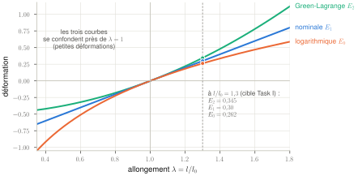\
*Figure B.5 — Les trois mesures de déformation en traction homogène, en fonction de l'allongement $\lambda = l/l_0$. Elles coïncident (même valeur, même pente) près de $\lambda = 1$, puis s'écartent : à la cible de la Task I ($\lambda = 1{,}3$), la déformation nominale vaut 0,30 et la logarithmique 0,262.*

> **Attention.** Quand on te donne une courbe de traction, **demande toujours quelles grandeurs sont sur les axes**. L'information de base est le rapport $l/l_0$ ; toutes les mesures en découlent. La cible « 30 % de déformation ingénieur » de la Task I, c'est $E_1 = 0{,}30$, soit une déformation vraie de 0,262.

**Additivité de la déformation logarithmique.** Deux étirements successifs coaxiaux (mêmes directions principales, comme dans un essai de traction monotone) donnent $\ln(l_2/l_0) = \ln(l_1/l_0) + \ln(l_2/l_1)$, alors que les déformations nominales ne s'additionnent pas ($\tfrac{l_2-l_0}{l_0}\neq\tfrac{l_1-l_0}{l_0}+\tfrac{l_2-l_1}{l_1}$). C'est la raison pratique pour laquelle les lois d'écrouissage sont écrites en déformation logarithmique. En général (directions qui tournent), ce sont les gradients qui se composent, $\underset{\sim}{F} = \underset{\sim}{F}_2\cdot\underset{\sim}{F}_1$, et aucune mesure de déformation ne s'additionne simplement.

### B.6 Transformations infinitésimales

Quand le gradient du déplacement est petit, $\|\underset{\sim}{H}\| = \|\operatorname{Grad}\underline{u}\| \ll 1$, on néglige les termes du second ordre (par exemple le terme $\tfrac12\underset{\sim}{H}^T\cdot\underset{\sim}{H}$ de Green-Lagrange). Le gradient se décompose en une partie symétrique et une partie antisymétrique :

$$
\underset{\sim}{\varepsilon} = \tfrac12\left(\underset{\sim}{H}+\underset{\sim}{H}^T\right),\quad \varepsilon_{ij} = \tfrac12(u_{i,j}+u_{j,i}),
\qquad
\underset{\sim}{\omega} = \tfrac12\left(\underset{\sim}{H}-\underset{\sim}{H}^T\right).
$$

$\underset{\sim}{\varepsilon}$ est le **tenseur des déformations infinitésimales** et $\underset{\sim}{\omega}$ celui des **rotations infinitésimales**. Leur signification :

- allongement relatif d'une fibre : $\dfrac{|d\underline{x}|-|d\underline{X}|}{|d\underline{X}|} \simeq \underline{M}\cdot\underset{\sim}{\varepsilon}\cdot\underline{M}$, donc $\varepsilon_{11}$ est l'allongement relatif selon $\underline{e}_1$ ;
- glissement (diminution de l'angle droit) entre deux fibres initialement orthogonales selon $\underline{e}_1$ et $\underline{e}_2$ : $\gamma \simeq 2\varepsilon_{12}$ ;
- variation relative de volume : $\dfrac{dv-dV}{dV} \simeq \operatorname{trace}\underset{\sim}{\varepsilon} = \operatorname{div}\underline{u}$.

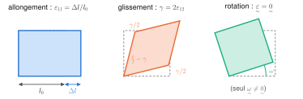\
*Figure B.6 — Sens des composantes de $\underset{\sim}{\varepsilon}$ (déformations exagérées) : $\varepsilon_{11}$ est un allongement relatif, $2\varepsilon_{12} = \gamma$ la diminution de l'angle droit, et une rotation d'ensemble ne crée aucune déformation (seul $\underset{\sim}{\omega}$ est non nul).*

> **Attention.** $\underset{\sim}{\varepsilon}$ n'a de sens comme mesure de déformation **que** si la transformation est infinitésimale, rotations comprises. Une grande rotation de corps rigide donne $\underset{\sim}{E} = 0$ mais $\underset{\sim}{\varepsilon} \neq 0$.

> **Pour la Task I.** Dans ton montage, les deux régimes coexistent :
> - **Barres, projectile, inverseur** : ils restent élastiques, avec des déformations de l'ordre de $10^{-3}$. Le cadre infinitésimal, et même l'**hypothèse des petites perturbations** (HPP : petites déformations, petites rotations, on confond configurations initiale et actuelle), est parfait. C'est ce qui rend l'analyse 1D des barres si simple.
> - **Zone utile de l'éprouvette** : elle atteint 30 % de déformation. Il faut raisonner en **grandes transformations** (déformation logarithmique). Abaqus le fait avec l'option « NLGEOM », activée par défaut en explicite.

### B.7 L'essai de traction en cinématique

Si la déformation est homogène dans la zone utile, avec l'axe 1 le long de l'éprouvette, l'axe 2 dans la largeur et l'axe 3 dans l'épaisseur :

$$
[\underset{\sim}{F}] = \begin{bmatrix}\lambda_1&0&0\\0&\lambda_2&0\\0&0&\lambda_3\end{bmatrix},
\qquad \underset{\sim}{R} = \underset{\sim}{1},\quad \underset{\sim}{U} = \underset{\sim}{F},\quad J = \lambda_1\lambda_2\lambda_3 .
$$

Les déformations logarithmiques principales sont simplement $\varepsilon_i = \ln\lambda_i$, et la variation de volume s'écrit $\ln J = \varepsilon_1+\varepsilon_2+\varepsilon_3$. Si la matière se déforme sans changer de volume ($J=1$) :

$$
\varepsilon_1+\varepsilon_2+\varepsilon_3 = 0 .
$$

C'est le cas, à très peu près, de la déformation plastique des métaux (F.2). Cette relation permet de **calculer la déformation d'épaisseur à partir de ce que voit la caméra en surface** (déformations longitudinale et transverse) : $\varepsilon_3 = -(\varepsilon_1+\varepsilon_2)$.

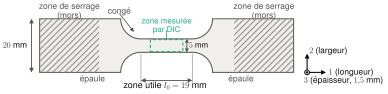\
*Figure B.7 — Éprouvette UT à zone utile de 19 × 5 mm (dimensions de [Roth 2015], fig. 2 ; rayons de congé indicatifs) et axes utilisés dans la fiche : 1 le long de l'éprouvette, 2 dans la largeur, 3 dans l'épaisseur. La DIC mesure une zone centrale, plus courte que la zone utile (E.6).*

### B.8 Vitesses de déformation

**Vitesse et accélération** d'un point matériel :

$$
\underline{v} = \frac{\partial\Phi}{\partial t}(\underline{X},t),\qquad
\underline{a} = \frac{\partial^2\Phi}{\partial t^2} = \frac{\partial\underline{v}}{\partial t} + (\operatorname{grad}\underline{v})\cdot\underline{v} .
$$

Le second terme de $\underline{a}$ (terme convectif) apparaît quand on décrit la vitesse de façon eulérienne, en un point fixe de l'espace. Dans les solides, on raisonne en général en lagrangien et on n'en a pas besoin.

**Gradient des vitesses** :

$$
\underset{\sim}{L} = \operatorname{grad}\underline{v} = \dot{\underset{\sim}{F}}\cdot\underset{\sim}{F}^{-1},
\qquad
\underset{\sim}{D} = \tfrac12\left(\underset{\sim}{L}+\underset{\sim}{L}^T\right),
\qquad
\underset{\sim}{W} = \tfrac12\left(\underset{\sim}{L}-\underset{\sim}{L}^T\right).
$$

$\underset{\sim}{D}$ est le **tenseur taux de déformation** et $\underset{\sim}{W}$ le taux de rotation. Leur sens physique : pour une fibre actuellement dirigée selon le vecteur unitaire $\underline{m}$,

$$
\frac{\dot\lambda}{\lambda} = \underline{m}\cdot\underset{\sim}{D}\cdot\underline{m},
\qquad
\frac{\dot{J}}{J} = \operatorname{trace}\underset{\sim}{D} = \operatorname{div}\underline{v} .
$$

La première relation est la clé : **la composante $D_{11}$ est le taux d'allongement relatif actuel**, c'est-à-dire $\dot\lambda/\lambda = \dfrac{d}{dt}\ln\lambda$. En traction, où les directions principales ne tournent pas, c'est **la dérivée de la déformation logarithmique** : c'est ce qu'on appelle la vitesse de déformation « vraie ».

**Les deux vitesses de déformation d'un essai de traction.** Éprouvette de longueur utile $l_0$, une extrémité fixe, l'autre tirée à la vitesse $v$ :

$$
\dot E_1 = \frac{\dot l}{l_0} = \frac{v}{l_0}\quad\text{(nominale, dite ingénieur)},
\qquad
D_{11} = \dot E_0 = \frac{\dot l}{l} = \frac{v}{l} = \frac{\dot E_1}{1+E_1}\quad\text{(vraie)} .
$$

Conséquences :

- À vitesse $v$ constante, la vitesse nominale est constante, mais la vitesse vraie **diminue** : à $E_1 = 0{,}3$, elle vaut $1/1{,}3 = 77\,\%$ de sa valeur initiale.
- Les « 100, 500 et 1 000 s⁻¹ » de la Task I sont des vitesses **nominales**, au sens $v/l_0$, à préciser avec tes encadrants.

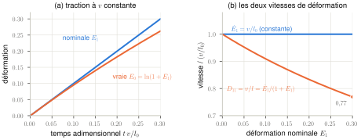\
*Figure B.8 — Traction à vitesse de traverse $v$ constante. (a) La déformation nominale croît linéairement, la déformation vraie de moins en moins vite. (b) La vitesse de déformation nominale reste constante, la vraie diminue : elle ne vaut plus que 77 % de sa valeur initiale à 30 %.*

### B.9 Vitesse imposée, vitesse vue par la zone utile, longueur effective

Une éprouvette réelle n'est pas qu'une zone utile : il y a des **congés** (*fillets*, les arrondis qui raccordent la zone utile aux épaules), des **épaules** (*shoulders*, les parties larges serrées dans les mors) et des zones de serrage. Tout cela se déforme aussi un peu, élastiquement, voire plastiquement dans les congés. Si $\Delta L_{tot}$ est le déplacement relatif des deux mors et $E_{1}^{zu}$ la déformation moyenne de la zone utile, on définit une **longueur effective**

$$
L_{eff} = \frac{\Delta L_{tot}}{E_{1}^{zu}} \;>\; l_0 ,
\qquad\text{d'où}\qquad
\dot E_{1}^{zu} = \frac{v_{mors}}{L_{eff}} < \frac{v_{mors}}{l_0} .
$$

C'est une des raisons pour lesquelles on **mesure la déformation par DIC directement sur la zone utile**, et pas à partir du déplacement des barres ou des mors. [Roth 2015] le fait explicitement, et précise que la déformation déduite de l'onde réfléchie serait de toute façon difficile à interpréter à cause de l'impédance variable de l'inverseur (H.5).

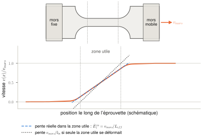\
*Figure B.9 — Profil de vitesse le long d'une éprouvette tirée par un mors (schéma). La vitesse passe de 0 à $v_{mors}$, mais pas seulement dans la zone utile : les congés et, un peu, les épaules se déforment aussi. La pente dans la zone utile, qui est la vraie vitesse de déformation, est donc plus faible que $v_{mors}/l_0$ : tout se passe comme si la longueur était $L_{eff} > l_0$.*

> **Pour la Task I.** Exemple chiffré tiré de [Roth 2015] (éprouvette UT à zone utile de 19 mm) : un projectile à 3,27 m/s donne une vitesse de déformation moyenne mesurée par DIC de 108 s⁻¹, et un projectile à 19,8 m/s donne 951 s⁻¹. Le rapport « vitesse du projectile / vitesse de déformation » vaut donc environ 30 mm et 21 mm, bien plus que 19 mm. On verra en I.5 que l'essentiel de l'écart s'explique par le fait que les deux extrémités de l'éprouvette ne bougent pas exactement à la vitesse du projectile ; le reste vient de la longueur effective. **Relier la vitesse de chargement à la vitesse de déformation réelle fait précisément partie de la Task I.**

### B.10 Ce que mesure la DIC

**Principe.** On peint sur l'éprouvette un mouchetis aléatoire (points noirs sur fond blanc, ou l'inverse). Sur l'image de référence, on découpe une grille de petites fenêtres (*subsets*, par exemple 17 × 17 pixels) dont chacune contient un motif unique. Sur chaque image suivante, un algorithme retrouve la position de chaque motif en maximisant la ressemblance des niveaux de gris : on obtient le **champ de déplacement** en surface, à une fraction de pixel près. Les déformations s'en déduisent en dérivant ce champ, puis en le lissant sur quelques points (*strain filter*). Paramètres utilisés par [Beerli 2026] à haute vitesse : fenêtres de 17 × 17 pixels, pas de 4 pixels, filtre de 5 points, corrélation **incrémentale** (chaque image comparée à la précédente, pour ne pas perdre la corrélation quand la déformation devient grande).

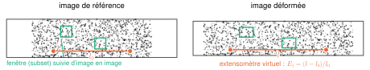\
*Figure B.10 — Principe de la DIC : chaque fenêtre (*subset*) du mouchetis est retrouvée sur l'image déformée, ce qui donne le déplacement de son centre. L'extensomètre virtuel suit deux points et calcule l'allongement relatif de leur distance.*

On obtient ainsi les déformations logarithmiques principales **dans le plan**, $\varepsilon_I$ et $\varepsilon_{II}$. Deux outils reviennent dans les articles :

- **L'extensomètre virtuel** : deux points suivis à la surface, dont on calcule l'allongement relatif. C'est l'analogue numérique de l'extensomètre à couteaux.
- **La déformation équivalente de surface** ([Beerli 2026], éq. 1) :

$$
\bar\varepsilon = \frac{2}{\sqrt3}\sqrt{\varepsilon_I^2+\varepsilon_I\varepsilon_{II}+\varepsilon_{II}^2} .
$$

D'où vient cette formule ? On part de la déformation équivalente de von Mises, $\bar\varepsilon = \sqrt{\tfrac23\,\underset{\sim}{\varepsilon}:\underset{\sim}{\varepsilon}}$ (F.5), et on utilise l'incompressibilité pour la troisième direction, $\varepsilon_{III} = -(\varepsilon_I+\varepsilon_{II})$ :

$$
\tfrac23\left(\varepsilon_I^2+\varepsilon_{II}^2+(\varepsilon_I+\varepsilon_{II})^2\right)
= \tfrac43\left(\varepsilon_I^2+\varepsilon_I\varepsilon_{II}+\varepsilon_{II}^2\right).
$$

En traction uniaxiale isotrope ($\varepsilon_{II} = -\varepsilon_I/2$), on retrouve bien $\bar\varepsilon = \varepsilon_I$.

> **Pour la Task I.** La précision de la DIC dépend du nombre de pixels sur la zone utile et du nombre d'images pendant l'essai. À haute cadence, les caméras rapides réduisent leur résolution : c'est l'un des arbitrages entre les éprouvettes de 19 et 40 mm (I.6 et J.6).

---

## C. Efforts et contraintes

### C.1 Deux familles d'efforts

Les efforts appliqués à un morceau de matière $D$ se classent en deux familles :

- les **efforts à distance**, qui agissent sur chaque point du volume : densité massique $\underline{f}$ (en N/kg), par exemple la pesanteur $\underline{f} = \underline{g}$ ;
- les **efforts de contact**, qui agissent sur la frontière $\partial D$ : densité surfacique $\underline{t}$ (en N/m², donc en Pa), appelée **vecteur-contrainte**.

> **Pour la Task I.** Dans ton éprouvette, la pesanteur est totalement négligeable : $\rho g \approx 7{,}7\times10^4$ N/m³, à comparer à des gradients de contrainte de l'ordre de $10^{9}$ Pa répartis sur quelques centimètres. Seuls comptent les efforts de contact (les mors) et l'**inertie** (D.3).

### C.2 Le théorème de Cauchy : $\underline{t} = \underset{\sim}{\sigma}\cdot\underline{n}$

Trois étapes :

1. **Postulat de Cauchy** : le vecteur-contrainte en un point ne dépend de la surface de coupure que par sa normale, $\underline{t} = \underline{t}(\underline{x},\underline{n},t)$. La courbure de la surface, par exemple, n'intervient pas.
2. **Lemme de Cauchy (action-réaction)** : $\underline{t}(\underline{x},-\underline{n}) = -\underline{t}(\underline{x},\underline{n})$. On écrit le bilan de quantité de mouvement (D.2) sur une tranche très fine, en forme de « cachet d'aspirine », de part et d'autre d'un élément de surface. Quand l'épaisseur tend vers 0, les termes de volume (inertie, pesanteur) disparaissent, et il ne reste que les forces sur les deux faces, de normales $\underline{n}$ et $-\underline{n}$, qui doivent donc s'annuler. Cet argument suppose que l'accélération reste **bornée**. **Il ne s'applique pas à travers une onde de choc**, où la vitesse saute brutalement : c'est ce que traite D.6.
3. **Théorème de Cauchy** : on écrit le même bilan sur un petit tétraèdre dont trois faces sont normales à $-\underline{e}_1$, $-\underline{e}_2$ et $-\underline{e}_3$, et la quatrième, d'aire $S$, a pour normale $\underline{n}$. Les trois premières faces ont des aires $S\,n_1$, $S\,n_2$ et $S\,n_3$. Quand le tétraèdre rétrécit (taille $h$), les forces de surface sont proportionnelles à $h^2$, alors que l'inertie et la pesanteur sont proportionnelles au volume, donc à $h^3$ : elles deviennent négligeables. Il reste $S\,\underline{t}(\underline{n}) + \sum_i S\,n_i\,\underline{t}(-\underline{e}_i) = \underline{0}$, soit, avec le lemme, $\underline{t}(\underline{n}) = \sum_i n_i\,\underline{t}(\underline{e}_i)$. Le vecteur-contrainte est donc **linéaire** en $\underline{n}$ : il existe un tenseur d'ordre 2, le **tenseur des contraintes de Cauchy**, tel que

$$
\underline{t} = \underset{\sim}{\sigma}\cdot\underline{n},\qquad t_i = \sigma_{ij}n_j,\qquad \sigma_{ij} = t_i(\underline{e}_j).
$$

On l'appelle aussi tenseur des contraintes **vraies**, car il est défini sur la configuration **actuelle** : il donne la force réellement appliquée sur un élément de surface actuel.

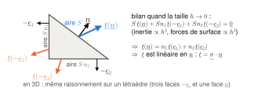\
*Figure C.2 — Le raisonnement de Cauchy, dessiné en 2D : sur un petit triangle, la force sur la face oblique équilibre celles sur les deux faces de coordonnées, dont les aires valent $S\,n_1$ et $S\,n_2$. Quand le triangle rétrécit, l'inertie disparaît devant les forces de surface ; il en résulte que $\underline{t}$ dépend linéairement de $\underline{n}$.*

La conservation du moment cinétique, en l'absence de couples répartis dans le volume, impose sa **symétrie** : $\sigma_{ij} = \sigma_{ji}$. Il n'a donc que 6 composantes indépendantes.

### C.3 Lire les composantes

Sur une facette de normale $\underline{e}_j$, la force surfacique a pour composantes $(\sigma_{1j},\sigma_{2j},\sigma_{3j})$, soit la $j$-ième colonne de la matrice. $\sigma_{jj}$ est la contrainte **normale** et les deux autres sont des **cisaillements** (ou cissions).

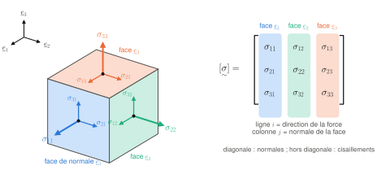\
*Figure C.3a — Les neuf composantes $\sigma_{ij}$ sur un cube élémentaire. Sur la face de normale $\underline{e}_j$ (même couleur que la colonne $j$ de la matrice), la flèche épaisse est la contrainte normale $\sigma_{jj}$ ; les deux flèches fines sont les cisaillements $\sigma_{ij}$ ($i\neq j$), qui agissent dans le plan de la face. Comme $\underset{\sim}{\sigma}$ est symétrique, $\sigma_{12} = \sigma_{21}$, $\sigma_{13} = \sigma_{31}$ et $\sigma_{23} = \sigma_{32}$ : il reste 6 composantes indépendantes.*

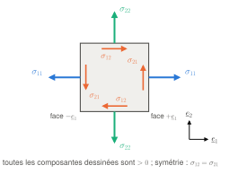\
*Figure C.3b — Le même élément vu dans le plan $(\underline{e}_1,\underline{e}_2)$. Toutes les composantes dessinées sont positives : une contrainte normale positive tire vers l'extérieur ; un cisaillement $\sigma_{ij}$ positif pointe dans le sens $+\underline{e}_i$ sur la face de normale $+\underline{e}_j$. Sur la face opposée, chaque flèche change de sens (action-réaction). Si $\sigma_{12}$ et $\sigma_{21}$ différaient, les cisaillements formeraient un couple qui ferait tourner l'élément.*

Sur une facette quelconque de normale $\underline{n}$, on sépare de même :

$$
\sigma_n = \underline{n}\cdot\underset{\sim}{\sigma}\cdot\underline{n}\quad\text{(contrainte normale)},
\qquad
\tau^2 = \underline{t}\cdot\underline{t} - \sigma_n^2\quad\text{(cisaillement)} .
$$

### C.4 Contraintes principales et cisaillement maximal

Dans la base propre, $[\underset{\sim}{\sigma}] = \operatorname{diag}(\sigma_1,\sigma_2,\sigma_3)$, avec la convention $\sigma_3\le\sigma_2\le\sigma_1$. Sur les facettes principales, le cisaillement est nul.

Fais tourner une facette autour de $\underline{n}_2$ : sa normale fait l'angle $\theta$ avec $\underline{n}_1$, soit $\underline{n} = \cos\theta\,\underline{n}_1 + \sin\theta\,\underline{n}_3$. On trouve

$$
\sigma_n = \frac{\sigma_1+\sigma_3}{2} + \frac{\sigma_1-\sigma_3}{2}\cos2\theta,
\qquad
\tau = -\frac{\sigma_1-\sigma_3}{2}\sin2\theta .
$$

Dans le plan $(\sigma_n,\tau)$, le point décrit un cercle de centre $(\sigma_1+\sigma_3)/2$ et de rayon $(\sigma_1-\sigma_3)/2$ : c'est le grand **cercle de Mohr**. Pour une orientation quelconque de la facette, le point $(\sigma_n,\tau)$ reste à l'intérieur de ce grand cercle. D'où le **théorème du cisaillement maximal** : $\tau_{max} = (\sigma_1-\sigma_3)/2$, atteint sur les facettes qui contiennent $\underline{n}_2$ et sont inclinées à 45° de $\underline{n}_1$ et $\underline{n}_3$.

> **Pour la Task I.** En traction uniaxiale, $\tau_{max} = \sigma/2$, sur des facettes à 45° de l'axe. C'est le cisaillement qui fait glisser les dislocations, d'où la plasticité (partie F).

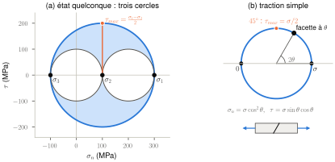\
*Figure C.4 — Cercles de Mohr. (a) Pour $\sigma_1 = 300$, $\sigma_2 = 100$ et $\sigma_3 = -100$ MPa, le point $(\sigma_n,\tau)$ d'une facette quelconque tombe dans la zone bleue, entre le grand cercle et les deux petits ; le cisaillement maximal est le rayon du grand cercle. (b) En traction simple, la facette inclinée de $\theta$ correspond au point d'angle $2\theta$ ; le cisaillement est maximal, égal à $\sigma/2$, sur les facettes à 45°.*

### C.5 États de contrainte remarquables

**Traction simple** selon la direction unitaire $\underline{d}$ :

$$
\underset{\sim}{\sigma} = \sigma\,\underline{d}\otimes\underline{d} .
$$

C'est l'état visé dans la zone utile de ton éprouvette UT. Il peut « se cacher » derrière une matrice pleine. Pour une éprouvette découpée à l'angle $\alpha$ de la direction de laminage (axe 1), $\underline{d} = \cos\alpha\,\underline{e}_1 + \sin\alpha\,\underline{e}_2$, et les composantes dans le repère de la tôle sont

$$
[\underset{\sim}{\sigma}] = \sigma\begin{bmatrix}\cos^2\alpha & \sin\alpha\cos\alpha & 0\\ \sin\alpha\cos\alpha & \sin^2\alpha & 0\\ 0&0&0\end{bmatrix}.
$$

À 45°, par exemple, $\sigma_{11} = \sigma_{22} = \sigma_{12} = \sigma/2$. C'est ce calcul qui permet d'exploiter les essais à 0°, 45° et 90° de la Task II avec un critère anisotrope (F.8).

**Cisaillement simple** : $\underset{\sim}{\sigma} = \tau(\underline{d}_1\otimes\underline{d}_2+\underline{d}_2\otimes\underline{d}_1)$, avec $\underline{d}_1$ et $\underline{d}_2$ orthogonaux. Ses contraintes principales sont $(\tau,0,-\tau)$, sur les bissectrices : c'est une traction et une compression égales, à 45° des directions de cisaillement. C'est l'état visé par l'éprouvette SH.

**Contraintes planes** : $\underset{\sim}{\sigma}\cdot\underline{e}_3 = \underline{0}$, soit $\sigma_{13}=\sigma_{23}=\sigma_{33}=0$. C'est l'hypothèse naturelle pour une **tôle mince** chargée dans son plan, car ses deux faces sont libres. Les critères de tôles (Hill'48, Yld2000-2d) sont souvent écrits dans ce cadre.

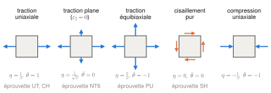\
*Figure C.5 — États de contrainte remarquables dans le plan de la tôle, avec leur triaxialité et leur paramètre de Lode (C.8), et les éprouvettes qui les visent. Flèches bleues : contraintes normales ; flèches orange : cisaillements.*

> **Attention.** Pendant la **striction localisée**, une contrainte hors plan apparaît dans la zone de striction : la contrainte plane n'est plus valable. C'est pour cela que [Roth & Mohr 2014] modélisent l'épaisseur avec 8 éléments sur la demi-épaisseur.

### C.6 Contrainte « vraie » et contrainte « ingénieur »

Le tenseur de Cauchy rapporte la force à la surface **actuelle**. Mais en essai, on connaît la section **initiale** $S_0$ ; mesurer la section actuelle est difficile. On introduit donc d'autres tenseurs de contraintes, obtenus en ramenant la force à la surface initiale grâce à la formule de Nanson (B.3) :

$$
\underset{\sim}{S} = J\,\underset{\sim}{\sigma}\cdot\underset{\sim}{F}^{-T}\quad\text{(Boussinesq, ou 1er Piola-Kirchhoff : contraintes nominales)},
$$

$$
\underset{\sim}{\Pi} = J\,\underset{\sim}{F}^{-1}\cdot\underset{\sim}{\sigma}\cdot\underset{\sim}{F}^{-T}\quad\text{(Piola, ou 2e Piola-Kirchhoff)} .
$$

$\underset{\sim}{S}$ associe à un élément de surface **initial** la force **actuelle** : $\underline{t}\,ds = \underset{\sim}{S}\cdot\underline{N}\,dS$. C'est la « contrainte de l'ingénieur ». Chaque tenseur de contraintes est associé à une vitesse de déformation par la puissance des efforts intérieurs, rapportée au volume initial :

$$
J\,\underset{\sim}{\sigma}:\underset{\sim}{D} = \underset{\sim}{\Pi}:\dot{\underset{\sim}{E}} = \underset{\sim}{S}:\dot{\underset{\sim}{F}} .
$$

On dit que ce sont des couples **conjugués**.

**En traction** (B.7), $\underset{\sim}{F} = \operatorname{diag}(\lambda_1,\lambda_2,\lambda_3)$ et la section vaut $S = \lambda_2\lambda_3 S_0$. On obtient

$$
S_{11} = J\,\frac{\sigma_{11}}{\lambda_1} = \lambda_2\lambda_3\,\sigma_{11} = \frac{F}{S_0},
\qquad \sigma_{11} = \frac{F}{S}.
$$

Si le volume est conservé ($J=1$, donc $\lambda_2\lambda_3 = 1/\lambda_1$) :

$$
\boxed{\;\sigma_{11} = \lambda_1 S_{11} = (1+E_1)\,\frac{F}{S_0}\;}
$$

| Nom dans les articles | Grandeur | Formule en traction homogène |
|---|---|---|
| *engineering stress* | $S_{11}$ (Boussinesq) | $F/S_0$ |
| *true stress* | $\sigma_{11}$ (Cauchy) | $F/S = (1+E_1)\,F/S_0$ |
| *engineering strain* | $E_1$ (nominale) | $\Delta l/l_0$ |
| *true / logarithmic strain* | $E_0$ (Hencky) | $\ln(1+E_1)$ |

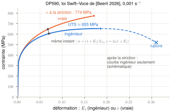\
*Figure C.6 — Courbes vraie et ingénieur du DP590, calculées avec la loi Swift–Voce de [Beerli 2026] (F.6), élasticité comprise. Au même instant, on passe du point ingénieur au point vrai par $\sigma = (1+E_1)\,S_{11}$ et $\varepsilon = \ln(1+E_1)$. La courbe ingénieur passe par un maximum (UTS) au début de la striction ; la courbe vraie n'a plus de sens au-delà, et la fin de la courbe ingénieur est schématique.*

> **Attention.** Deux hypothèses sont cachées dans la formule encadrée :
> - **L'incompressibilité.** Elle est exacte pour la partie plastique, et l'erreur due à la partie élastique est de l'ordre de $(1-2\nu)\sigma/E \approx 0{,}2\,\%$ (E.3), donc négligeable.
> - **L'homogénéité.** Elle n'est vraie **que jusqu'à la striction**. Après, la section n'est plus uniforme et la formule n'a plus de sens. C'est pour cela que [Roth 2015] et [Beerli 2026] tronquent les courbes vraies au maximum de force, et qu'il faut une méthode inverse (simulation) au-delà.

### C.7 Pression, déviateur et contrainte équivalente de von Mises

On veut un scalaire qui dise « à quel point un état de contrainte est sévère » vis-à-vis de la plasticité. Pour un matériau isotrope et insensible à la pression, il ne peut dépendre que des invariants du déviateur (A.2 et A.3). Le choix le plus courant est la **contrainte équivalente de von Mises** :

$$
\sigma_{eq} = \sqrt{\tfrac32\,\underset{\sim}{\sigma}^{dev}:\underset{\sim}{\sigma}^{dev}}
= \sqrt{\tfrac12\left[(\sigma_1-\sigma_2)^2+(\sigma_2-\sigma_3)^2+(\sigma_3-\sigma_1)^2\right]} .
$$

En composantes quelconques : $\sigma_{eq}^2 = \tfrac12\left[(\sigma_{11}-\sigma_{22})^2+(\sigma_{22}-\sigma_{33})^2+(\sigma_{33}-\sigma_{11})^2\right] + 3\left(\sigma_{12}^2+\sigma_{23}^2+\sigma_{31}^2\right)$.

Le facteur $3/2$ est choisi pour que $\sigma_{eq} = \sigma$ en traction simple. En cisaillement simple, $\sigma_{eq} = \sqrt3\,\tau$.

Le critère de **Tresca** utilise plutôt le cisaillement maximal (C.4) : $f = \max_{i,j}(\sigma_i-\sigma_j) - \sigma_0$, où $\sigma_0$ est la limite d'élasticité en traction. En cisaillement, il prévoit la plastification pour $\tau = \sigma_0/2$, contre $\sigma_0/\sqrt3$ pour von Mises. Les deux critères sont insensibles à la pression.

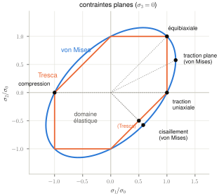\
*Figure C.7a — Critères de von Mises (ellipse) et de Tresca (hexagone) en contraintes planes, normalisés par la limite d'élasticité en traction $\sigma_0$. Les deux coïncident en traction uniaxiale et équibiaxiale ; ils diffèrent le plus en cisaillement ($\sigma_1 = -\sigma_2$), où Tresca prévoit la plastification à $\tau = \sigma_0/2$ et von Mises à $\tau = \sigma_0/\sqrt3$.*

> **Piège de notation.** Certains cours notent $J_2(\underset{\sim}{\sigma})$ la contrainte équivalente de von Mises elle-même. Dans presque tous les articles, $J_2 = \tfrac12\,\underset{\sim}{\sigma}^{dev}:\underset{\sim}{\sigma}^{dev}$ désigne le second invariant du déviateur, et donc $\sigma_{eq} = \sqrt{3J_2}$. Quand [Roth 2015] parle de « *J2-plasticity* », il veut dire « plasticité de von Mises ».

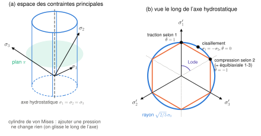\
*Figure C.7b — Dans l'espace des contraintes principales, le critère de von Mises est un cylindre d'axe hydrostatique $\sigma_1 = \sigma_2 = \sigma_3$ : ajouter une pression déplace le point le long de l'axe sans le rapprocher de la surface. Vu le long de cet axe (plan $\pi$), c'est un cercle de rayon $\sqrt{2/3}\,\sigma_0$, et Tresca est l'hexagone inscrit. La position angulaire dans ce plan est l'angle de Lode : $\bar\theta = 1$ en traction, 0 en cisaillement, −1 en compression (ou en traction équibiaxiale, qui lui équivaut à une pression près).*

### C.8 Triaxialité et paramètre de Lode

Ces deux grandeurs décrivent la **nature** d'un état de contrainte, indépendamment de son intensité. Elles sont au centre des modèles de rupture (Hosford–Coulomb, F.10) de [Roth & Mohr 2014] et [Beerli 2026].

- **Triaxialité** : $\eta = \dfrac{\sigma_m}{\sigma_{eq}}$, avec $\sigma_m = \tfrac13\operatorname{trace}\underset{\sim}{\sigma} = -p$. Elle mesure la part de « tension hydrostatique », qui favorise la croissance des cavités et donc la rupture ductile.
- **Paramètre de Lode** : il distingue les états qui ont la même triaxialité mais des formes différentes (traction, cisaillement, compression). On définit d'abord le troisième invariant du déviateur, $J_3 = \det\underset{\sim}{\sigma}^{dev}$, puis

$$
\xi = \frac{27}{2}\,\frac{J_3}{\sigma_{eq}^3}\in[-1,1],
\qquad
\bar\theta = 1-\frac{2}{\pi}\arccos\xi\in[-1,1].
$$

| État | Éprouvette (sujet, Beerli 2026) | $\eta$ | $\bar\theta$ |
|---|---|---|---|
| Cisaillement pur | SH | 0 | 0 |
| Traction uniaxiale | UT ; CH (au bord du trou) | 1/3 | 1 |
| Traction plane (déformation plane) | NT6 (tendance), mini-Nakazima dièdre | $1/\sqrt3\approx0{,}577$ | 0 |
| Traction équibiaxiale | PU (poinçon) | 2/3 | −1 |
| Compression uniaxiale | | −1/3 | −1 |

Exemple de calcul en traction uniaxiale : $\sigma_m = \sigma/3$ et $\sigma_{eq} = \sigma$, donc $\eta = 1/3$ ; $\underset{\sim}{\sigma}^{dev} = \sigma\operatorname{diag}(2/3,-1/3,-1/3)$, donc $J_3 = 2\sigma^3/27$, $\xi = 1$ et $\bar\theta = 1$.

En **contraintes planes**, $\eta$ et $\bar\theta$ ne sont pas indépendants : on a $\xi = -\tfrac{27}{2}\,\eta\left(\eta^2-\tfrac13\right)$. Tu peux le vérifier sur toutes les lignes du tableau.

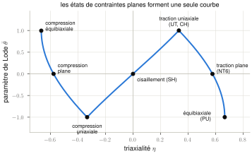\
*Figure C.8 — En contraintes planes, chaque état $(\sigma_1,\sigma_2,0)$ donne un couple $(\eta,\bar\theta)$ situé sur cette unique courbe. Les éprouvettes de la Task II visent ses points remarquables, et les lieux de rupture (F.10) sont souvent tracés le long de cette courbe.*

---

## D. Équations de bilan : ce que la physique impose partout

### D.1 Conservation de la masse

La masse d'un morceau de matière ne change pas : $\rho\,dv = \rho_0\,dV$. Avec $dv = J\,dV$ (B.3) :

$$
\frac{\rho_0}{\rho} = J,\qquad \dot\rho + \rho\operatorname{div}\underline{v} = 0 .
$$

### D.2 Conservation de la quantité de mouvement : la loi de Cauchy

**Forme globale** (loi fondamentale de la dynamique appliquée à un milieu continu) : pour tout sous-domaine matériel $D$, la variation de quantité de mouvement est égale à la somme des efforts extérieurs,

$$
\frac{d}{dt}\int_D\rho\,\underline{v}\,dv = \int_D\rho\,\underline{f}\,dv + \int_{\partial D}\underline{t}\,ds .
$$

**Forme locale.** La masse étant conservée, le membre de gauche vaut $\int_D\rho\,\underline{a}\,dv$. On remplace $\underline{t}$ par $\underset{\sim}{\sigma}\cdot\underline{n}$, on transforme l'intégrale de surface par le théorème de la divergence (A.4), et on obtient $\int_D(\operatorname{div}\underset{\sim}{\sigma}+\rho\underline{f}-\rho\underline{a})\,dv = \underline{0}$. Comme c'est vrai pour **tout** $D$, l'intégrande est nulle en chaque point. C'est la **première loi de Cauchy**, ou équation locale de la dynamique :

$$
\boxed{\;\operatorname{div}\underset{\sim}{\sigma} + \rho\,\underline{f} = \rho\,\underline{a}\;},
\qquad
\frac{\partial\sigma_{ij}}{\partial x_j} + \rho f_i = \rho a_i .
$$

Son sens : en chaque point, la « résultante » des variations de contrainte autour de ce point, plus la force à distance, est ce qui accélère la matière. **Une divergence non nulle des contraintes (en 1D : une contrainte axiale qui varie le long de la barre) ne peut exister que si elle est équilibrée par de l'inertie (ou par une force à distance).**

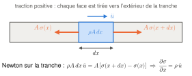\
*Figure D.2 — La loi de Cauchy en 1D : une tranche de barre n'accélère que si la contrainte diffère sur ses deux faces. Une contrainte qui varie le long d'une barre va donc toujours avec de l'inertie.*

On peut aussi l'écrire sur la configuration initiale, avec les contraintes nominales (C.6) et les dérivées par rapport à $\underline{X}$ :

$$
\operatorname{Div}\underset{\sim}{S} + \rho_0\,\underline{f} = \rho_0\,\underline{a} .
$$

En 1D, c'est la forme la plus pratique : $\partial S_{11}/\partial X_1 = \rho_0\,\partial^2 u_1/\partial t^2$.

### D.3 Statique, quasi-statique, dynamique : la notion centrale de la Task I

En **statique** ($\underline{a} = \underline{0}$), les équations se réduisent à

$$
\operatorname{div}\underset{\sim}{\sigma} + \rho\,\underline{f} = \underline{0},\qquad \underset{\sim}{\sigma} = \underset{\sim}{\sigma}^T .
$$

On peut encore utiliser ces équations pour un chargement qui évolue dans le temps, à condition que les termes d'accélération $\rho\underline{a}$ soient **négligeables devant les efforts mis en jeu**. On parle alors d'évolution **quasi-statique**. C'est exactement la question de ton sujet.

**Application exacte à la zone utile.** Prends le volume $V$ de l'éprouvette compris entre deux sections droites, en $x_1 = 0$ (côté entrée) et $x_1 = L$ (côté sortie). On néglige la pesanteur. On intègre la loi de Cauchy sur $V$ et on applique le théorème de la divergence :

$$
\int_{\partial V}\underset{\sim}{\sigma}\cdot\underline{n}\,ds = \int_V\rho\,\underline{a}\,dv .
$$

Les faces latérales sont libres ($\underline{t} = \underline{0}$). Les normales sortantes des deux sections sont $-\underline{e}_1$ et $+\underline{e}_1$. En projetant sur $\underline{e}_1$ :

$$
\boxed{\;F_{\text{sortie}}(t) - F_{\text{entrée}}(t) = \int_V\rho\,a_1\,dv = m\,\langle a_1\rangle\;}
$$

où $F = \int_S\sigma_{11}\,ds$ est la force transmise par une section, $m$ la masse de la tranche et $\langle a_1\rangle$ son accélération moyenne. Ce résultat est **exact** : il ne dépend d'aucune hypothèse de comportement.

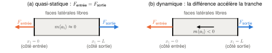\
*Figure D.3 — Bilan exact sur la zone utile. (a) Si l'inertie est négligeable, la force est la même dans toutes les sections : c'est le quasi-statique. (b) Pendant une accélération, les deux forces diffèrent de $m\langle a_1\rangle$. Ici l'entrée est tirée vers $-\underline{e}_1$ ($a_1<0$), donc $F_{\text{entrée}} > F_{\text{sortie}}$, comme pendant la montée en charge (J.3).*

> **Pour la Task I.** **Toute la Task I est contenue dans cette égalité.** Les forces aux deux extrémités de la zone utile sont égales, et on peut alors parler d'**une** contrainte $F/S$ dans l'éprouvette, si et seulement si l'inertie de la zone utile est négligeable devant les forces transmises. La masse est petite (environ 1 g pour une zone utile de 19 × 5 × 1,5 mm, environ 5 g pour 40 × 10 × 1,5 mm), mais les accélérations d'un essai dynamique peuvent être énormes (jusqu'à $10^6$ m/s² pendant la montée en charge). La partie J chiffre cet effet.

### D.4 Théorème des puissances virtuelles et énergie cinétique

On multiplie la loi de Cauchy par un champ de vitesses **virtuel** $\underline{v}^\star$ (quelconque, régulier) et on intègre sur $D$. Pour le terme de contrainte, on intègre par parties avec le théorème de la divergence :

$$
\int_D(\operatorname{div}\underset{\sim}{\sigma})\cdot\underline{v}^\star\,dv = \int_{\partial D}(\underset{\sim}{\sigma}\cdot\underline{n})\cdot\underline{v}^\star\,ds - \int_D\underset{\sim}{\sigma}:\operatorname{grad}\underline{v}^\star\,dv ,
$$

et, $\underset{\sim}{\sigma}$ étant symétrique, $\underset{\sim}{\sigma}:\operatorname{grad}\underline{v}^\star = \underset{\sim}{\sigma}:\underset{\sim}{D}^\star$ (partie symétrique). On obtient, pour tout $\underline{v}^\star$ :

$$
\underbrace{-\int_D\underset{\sim}{\sigma}:\underset{\sim}{D}^\star\,dv}_{P^i\ \text{(efforts intérieurs)}}
+\underbrace{\int_{\partial D}\underline{t}\cdot\underline{v}^\star\,ds}_{P^c\ \text{(contact)}}
+\underbrace{\int_D\rho\,\underline{f}\cdot\underline{v}^\star\,dv}_{P^e\ \text{(à distance)}}
=\underbrace{\int_D\rho\,\underline{a}\cdot\underline{v}^\star\,dv}_{P^a\ \text{(accélération)}}.
$$

C'est la **formulation variationnelle** (ou « faible ») des équations du mouvement, et c'est **la base de la méthode des éléments finis** : on la discrétise (K.1).

Avec la vitesse réelle, $\underline{v}^\star = \underline{v}$, on obtient le **théorème de l'énergie cinétique** : $P^i + P^e + P^c = \dot K$ avec $K = \tfrac12\int\rho\,\underline{v}\cdot\underline{v}\,dv$. $\underset{\sim}{\sigma}:\underset{\sim}{D}$ est une puissance volumique (W/m³). Abaqus s'appuie sur ce bilan pour afficher les énergies (K.5).

### D.5 Conservation de l'énergie

Le premier principe de la thermodynamique s'écrit localement

$$
\rho\,\dot e = \underset{\sim}{\sigma}:\underset{\sim}{D} - \operatorname{div}\underline{q} + \rho\,r .
$$

L'énergie interne massique $e$ augmente par la puissance mécanique reçue ($\underset{\sim}{\sigma}:\underset{\sim}{D}$), par la chaleur qui arrive par conduction ($-\operatorname{div}\underline{q}$, où $\underline{q}$ est le vecteur flux de chaleur) et par les sources internes $r$ (rayonnement, effet Joule). La loi de **Fourier**, $\underline{q} = -k_{th}\operatorname{grad}T$ ($k_{th}$ est la conductivité thermique ; l'indice évite la confusion avec la résistance à la déformation $k$ de la partie F), ferme le problème thermique : la chaleur va du chaud vers le froid. On s'en servira pour l'échauffement adiabatique (partie G).

### D.6 Discontinuités : ce qui remplace Cauchy à travers un front d'onde

Un front d'onde est une surface qui se déplace dans la matière, et à travers laquelle vitesse et contrainte sautent brutalement. Ce n'est pas une surface matérielle : la matière la traverse. La loi de Cauchy locale n'y est pas applicable (les dérivées n'existent pas), mais les bilans globaux restent vrais.

**Démonstration en 1D.** Un front avance vers les $x$ croissants à la vitesse $c$ dans une barre de section $A$. On note « + » l'état devant le front (pas encore atteint) et « − » l'état derrière. Pendant $dt$, le front balaie une tranche de longueur $c\,dt$, donc de masse $\rho A c\,dt$, dont la vitesse passe de $v^+$ à $v^-$. Les forces qui agissent sur cette tranche sont $+A\sigma^+$ (la matière de devant la tire vers l'avant) et $-A\sigma^-$ (la matière de derrière la tire vers l'arrière). Le théorème de la quantité de mouvement appliqué à la tranche donne

$$
\rho A c\,dt\,(v^- - v^+) = A(\sigma^+-\sigma^-)\,dt
\quad\Longrightarrow\quad
\boxed{\;[\![\sigma]\!] = -\rho\,c\,[\![v]\!]\;},\qquad [\![f]\!] = f^+ - f^- .
$$

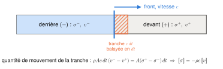\
*Figure D.6 — Un front d'onde avance à la vitesse $c$. Pendant $dt$, il fait passer une tranche de longueur $c\,dt$ de l'état « devant » (+) à l'état « derrière » (−) ; le théorème de la quantité de mouvement appliqué à cette tranche donne la relation de saut.*

**Forme générale.** En 3D, pour une surface de normale $\underline{n}$ (orientée vers le côté « + ») qui avance à la vitesse normale $w_n$, on note $U = \underline{v}\cdot\underline{n} - w_n$ la vitesse normale de la matière par rapport au front. Les bilans de masse et de quantité de mouvement donnent

$$
[\![\rho U]\!] = 0,
\qquad
[\![\underset{\sim}{\sigma}]\!]\cdot\underline{n} - \rho U\,[\![\underline{v}]\!] = \underline{0} .
$$

Avec $U\approx-c$, on retrouve la formule 1D.

- En **statique**, ou à travers une surface **matérielle** ($U = 0$, par exemple l'interface collée entre deux pièces), il reste $[\![\underset{\sim}{\sigma}]\!]\cdot\underline{n} = \underline{0}$ : **le vecteur-contrainte est continu**. Seules ses 3 composantes sont continues, pas les 6 composantes de $\underset{\sim}{\sigma}$.
- À travers un **front d'onde** ($U\neq0$), un saut de contrainte est nécessairement accompagné d'un saut de vitesse, proportionnel au « débit de masse » $\rho U$ qui traverse le front. **C'est de cette équation qu'on tire la relation fondamentale $\sigma = \mp\rho c\,v$ des ondes** (H.4).

### D.7 Le problème aux limites et le problème de fermeture

**Fermeture** : en chaque point, on a 4 équations universelles (masse et quantité de mouvement) pour 10 inconnues (la masse volumique $\rho$, les 3 composantes de $\Phi$ et les 6 de $\underset{\sim}{\sigma}$). Il manque 6 équations : c'est la **loi de comportement**, propre à chaque matériau (parties E et F). C'est elle qui distingue l'acier du caoutchouc.

**Conditions aux limites** : en chaque point de la frontière et pour chaque direction, on impose **soit** une composante du déplacement (condition de Dirichlet), **soit** une composante du vecteur-contrainte (condition de Neumann), jamais les deux.

> **Pour la Task I.** Dans le modèle éléments finis du SHPB de [Roth 2015], on trouve :
> - une **vitesse imposée** : l'histoire de vitesse mesurée expérimentalement, appliquée à l'extrémité libre de la barre d'entrée ;
> - des **conditions de symétrie** : demi-modèle, avec un déplacement normal nul sur le plan de symétrie ;
> - des **surfaces libres** ($\underline{t} = \underline{0}$) ;
> - des **contacts** : paliers rigides sans frottement, et contact avec frottement (coefficient 0,2) entre la barre d'entrée et l'inverseur ;
> - des **liaisons parfaites** (*tie*) entre l'éprouvette et les mors ;
> - des **conditions initiales** : tout est au repos à $t = 0$.

---

## E. Élasticité

### E.1 Les trois briques du comportement

On schématise le comportement uniaxial avec trois éléments :

| Brique | Symbole | Loi | Ce qu'elle représente |
|---|---|---|---|
| Élasticité | ressort | $F = k\,\Delta l$ | déformation réversible, instantanée |
| Viscosité | amortisseur | $F = \eta\,\dot{\Delta l}$ | réponse qui dépend de la **vitesse** |
| Plasticité | patin sur un plan rugueux | rien ne bouge tant que $\lvert F\rvert < F_0$ ; glissement quelconque (dans le sens de $F$) si $\lvert F\rvert = F_0$ | déformation **permanente** au-delà d'un **seuil** |

Un métal se comporte comme une combinaison des trois, dite **élastoviscoplastique** : un ressort (l'élasticité) en série avec un patin (le seuil plastique), lui-même doublé d'un amortisseur (l'effet de vitesse). Les aciers de ta Task I sont élastoplastiques avec une « petite » viscosité, et c'est justement cette viscosité, c'est-à-dire l'effet de la vitesse, qu'on veut mesurer.

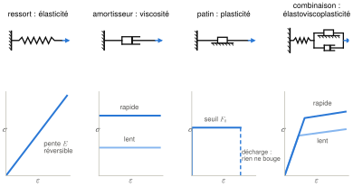\
*Figure E.1 — Les trois briques et leur réponse en traction : le ressort est réversible ; l'amortisseur répond à la vitesse (courbes lente et rapide) ; le patin ne bouge qu'au seuil $F_0$ et garde sa position à la décharge. Leur combinaison donne un seuil qui monte avec la vitesse : c'est cet effet que le projet veut mesurer.*

### E.2 Élasticité linéaire isotrope

Dans le cadre infinitésimal, sans contrainte initiale ni effet thermique, la loi de Hooke s'écrit

$$
\underset{\sim}{\sigma} = \lambda\,(\operatorname{trace}\underset{\sim}{\varepsilon})\,\underset{\sim}{1} + 2\mu\,\underset{\sim}{\varepsilon}
\qquad\Longleftrightarrow\qquad
\underset{\sim}{\varepsilon} = \frac{1+\nu}{E}\,\underset{\sim}{\sigma} - \frac{\nu}{E}\,(\operatorname{trace}\underset{\sim}{\sigma})\,\underset{\sim}{1}.
$$

On la note aussi $\underset{\sim}{\sigma} = \underset{\approx}{\Lambda}:\underset{\sim}{\varepsilon}$, où $\underset{\approx}{\Lambda}$ est le **tenseur des modules d'élasticité** (d'ordre 4). $\lambda$ et $\mu$ sont les **coefficients de Lamé**, $E$ le **module de Young** et $\nu$ le **coefficient de Poisson**. Relations utiles :

$$
\mu = \frac{E}{2(1+\nu)},\qquad
\lambda = \frac{\nu E}{(1+\nu)(1-2\nu)},\qquad
\kappa = \frac{E}{3(1-2\nu)},\qquad
\lambda+2\mu = \frac{E(1-\nu)}{(1+\nu)(1-2\nu)}.
$$

L'élasticité isotrope agit séparément sur les deux parties d'un tenseur : $\underset{\sim}{\sigma}^{dev} = 2\mu\,\underset{\sim}{\varepsilon}^{dev}$ (d'où le nom de **module de cisaillement** pour $\mu$) et $\operatorname{trace}\underset{\sim}{\sigma} = 3\kappa\operatorname{trace}\underset{\sim}{\varepsilon}$ (**module de compressibilité** $\kappa$). La stabilité du matériau impose $\mu > 0$ et $\kappa > 0$, soit $E > 0$ et $-1 < \nu < 1/2$.

> **Attention.** La même lettre $\lambda$ sert pour l'**allongement** (B.5), pour le **coefficient de Lamé**, et les articles utilisent $\dot\lambda$ pour le **multiplicateur plastique** (F.4). Le contexte permet toujours de trancher.

Valeurs typiques, à comparer avec celles de [Beerli 2026] (tableau 4) :

| | $\rho$ (kg/m³) | $E$ (GPa) | $\nu$ | $\lambda$ (GPa) | $\mu$ (GPa) | $k_{th}$ (W/m/K) | $C$ (J/kg/K) |
|---|---|---|---|---|---|---|---|
| Acier (valeurs usuelles) | 7 800 | 200 | 0,27 à 0,3 | 115 | 77 | 60 | 500 |
| Aluminium (valeurs usuelles) | 2 700 | 70 | 0,33 | 51 | 26 | 237 | 900 |
| Aciers DP ([Beerli 2026]) | 7 850 | 190 à 200 | 0,33 | | | 49 | 420 |

L'élasticité linéaire ne vaut que pour des déformations de l'ordre de $10^{-3}$ à $10^{-2}$ au plus. Pour un acier, $E = 200$ GPa et la limite d'élasticité dépasse rarement 2 GPa : on a toujours $\sigma_0 \ll E$.

### E.3 L'essai de traction élastique

On cherche la solution sous la forme d'un champ de contraintes uniaxial et homogène, $\underset{\sim}{\sigma} = \sigma\,\underline{e}_1\otimes\underline{e}_1$ (axe 1 le long de l'éprouvette, comme en B.7). Il est uniforme, donc il vérifie l'équilibre ($\operatorname{div}\underset{\sim}{\sigma} = \underline{0}$) ; les faces latérales sont libres ; et sur les faces extrêmes, la condition aux limites impose $\sigma = F/S$. La loi de Hooke inverse donne alors

$$
\varepsilon_{11} = \frac{\sigma}{E},\qquad \varepsilon_{22} = \varepsilon_{33} = -\nu\frac{\sigma}{E},\qquad \frac{S-S_0}{S_0} \simeq 2\varepsilon_{22} = -2\nu\,\varepsilon_{11},\qquad \operatorname{trace}\underset{\sim}{\varepsilon} = (1-2\nu)\frac{\sigma}{E}.
$$

$E$ est le rapport entre la contrainte axiale et la déformation axiale, $\nu$ le rapport (changé de signe) entre les déformations latérale et axiale. La section diminue en traction, et le volume augmente légèrement (de $(1-2\nu)\sigma/E$).

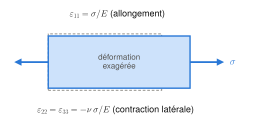\
*Figure E.3 — Traction élastique (déformations très exagérées) : la barre s'allonge de $\sigma/E$ et se contracte de $\nu\,\sigma/E$ dans les deux autres directions.*

Deux remarques liées à ton montage :

- L'état uniforme n'existe que dans une **zone utile**. La difficulté majeure de l'essai est d'accrocher l'éprouvette et de transmettre une charge aussi uniaxiale que possible, sans flexion parasite. Dans un SHPB avec inverseur, l'**excentricité** entre les barres crée justement de la flexion ([Roth 2015], éq. 3, voir H.9).
- Le cadre infinitésimal est valable tant que $\lvert\sigma/E\rvert \ll 1$. C'est toujours vrai en élasticité pour un métal.

### E.4 Contraintes planes et déformations planes

- **Contraintes planes** ($\sigma_{i3} = 0$) : il existe une déformation d'épaisseur $\varepsilon_{33} = -\dfrac{\nu}{E}(\sigma_{11}+\sigma_{22}) = -\dfrac{\nu}{1-\nu}(\varepsilon_{11}+\varepsilon_{22})$. C'est l'hypothèse naturelle pour une tôle mince.
- **Déformations planes** ($\varepsilon_{i3} = 0$) : il existe une contrainte dans la direction bloquée, $\sigma_{33} = \nu(\sigma_{11}+\sigma_{22})$.

> **Attention.** La « **traction plane** » des tôles (éprouvettes NT6, essais Nakazima dièdres) est un état de déformation plane dont la direction bloquée est la **largeur** ($\varepsilon_{largeur}\approx0$), tandis que l'épaisseur reste libre (contraintes planes). Il en résulte une contrainte transverse $\sigma_{largeur}\approx\nu\,\sigma_{axe}$ en élasticité, et $\approx\sigma_{axe}/2$ en plasticité (incompressible). C'est l'état « traction plane » du tableau de C.8.

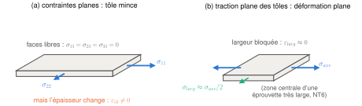\
*Figure E.4 — (a) Contraintes planes : une tôle mince chargée dans son plan a ses deux faces libres ; les contraintes hors plan sont nulles, mais l'épaisseur varie. (b) Traction plane des tôles : dans la zone centrale d'une éprouvette très large, la largeur ne peut pas se contracter ; il apparaît une contrainte transverse, d'environ $\sigma_{axe}/2$ en plasticité.*

### E.5 Contrainte uniaxiale ou déformation uniaxiale : quel module ?

C'est un point clé pour les ondes (partie H) et pour le pas de temps en explicite (partie K).

- Dans une **barre mince**, les faces latérales sont libres de se contracter : l'état est de **contrainte uniaxiale**, et le module qui relie $\sigma_{11}$ à $\varepsilon_{11}$ est $E$.
- Dans un **milieu massif**, ou pour une onde dont la longueur est petite devant la section, la matière ne peut pas se contracter latéralement : l'état est de **déformation uniaxiale** ($\varepsilon_{22} = \varepsilon_{33} = 0$), et la loi de Hooke donne $\sigma_{11} = (\lambda+2\mu)\,\varepsilon_{11}$.

Pour un acier ($\nu = 0{,}3$), $\lambda+2\mu \approx 1{,}35\,E$. On verra que cela donne deux vitesses d'onde différentes, $\sqrt{E/\rho}$ et $\sqrt{(\lambda+2\mu)/\rho}$.

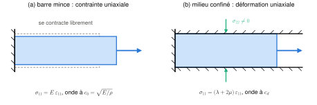\
*Figure E.5 — (a) Barre mince : la section se contracte librement et le module est $E$. (b) Matière confinée latéralement (milieu massif, ou onde très courte devant la section) : la contraction est empêchée, des contraintes latérales apparaissent, et le module apparent devient $\lambda+2\mu\approx1{,}35\,E$.*

### E.6 Le principe de Saint-Venant

**Énoncé** : si l'on remplace une distribution d'efforts appliquée sur une petite partie de la frontière par une autre de **même torseur** (même force résultante et même moment), les champs de contraintes et de déplacements sont pratiquement inchangés **suffisamment loin** de cette partie. **Restriction importante** : la zone chargée doit avoir **deux** dimensions petites devant la dimension principale de la structure. C'est le cas des extrémités d'une barre ou d'une éprouvette élancée.

> **Pour la Task I.** C'est ce qui justifie le dessin des éprouvettes : peu importe comment les mors serrent exactement les épaules, un champ de traction uniforme s'établit dans la zone utile si celle-ci est **assez élancée**. En pratique, les perturbations s'amortissent sur une distance de l'ordre de la largeur. Les deux zones utiles de la Task I ont un élancement voisin (19 × 5 mm et 40 × 10 mm, soit environ 4). C'est aussi pour cela que la DIC mesure la déformation sur une zone **centrale**, plus courte que la zone utile ([Beerli 2026] : 30 × 9 mm pour l'éprouvette UT de 40 × 10 mm, 12 × 4,5 mm pour la petite UT de 15 × 5 mm).

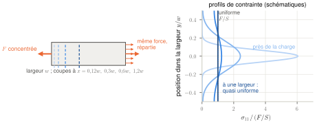\
*Figure E.6 — Principe de Saint-Venant (profils schématiques). Une force concentrée en bout de bande crée près de son point d'application une contrainte très non uniforme, qui s'étale en s'éloignant. À une distance de l'ordre de la largeur, la contrainte est pratiquement uniforme et vaut $F/S$, quelle que soit la façon dont la force est appliquée.*

### E.7 Thermoélasticité : deux résultats utiles

- **Refroidissement thermoélastique.** Un solide élastique qui se dilate sans échange de chaleur se refroidit légèrement, comme un gaz qui se détend. En élasticité linéaire isotrope, l'équation de la chaleur contient un terme de couplage, $\rho C\,\dot T = -3\kappa\alpha T_0\operatorname{trace}\dot{\underset{\sim}{\varepsilon}} + k_{th}\Delta T$, où $\alpha$ est le coefficient de dilatation thermique. En traction adiabatique, $\operatorname{trace}\underset{\sim}{\varepsilon} = (1-2\nu)\,\varepsilon$ (E.3) et $3\kappa(1-2\nu) = E$, d'où

$$
\Delta T = -\frac{E\,\alpha\,T_0}{\rho C}\,\varepsilon .
$$

  Pour un acier ($E = 200$ GPa, $\alpha = 10^{-5}$ K⁻¹, $T_0 = 300$ K) et $\varepsilon = 0{,}1\,\%$, on trouve environ −0,15 K. C'est négligeable devant l'échauffement plastique, qui atteint des dizaines de kelvins (partie G).
- **Modules adiabatiques et isothermes.** Pour la même raison, un module mesuré en conditions adiabatiques (essai rapide, onde) n'est pas exactement le module isotherme. Pour les métaux, l'écart est très faible (moins de 1 % sur $E$). Tu peux donc utiliser le module élastique statique pour calculer les vitesses d'onde, ou, mieux, les vitesses d'onde **mesurées** sur les barres, qui intègrent tout.

---

## F. Plasticité

Cette partie donne la théorie de l'écoulement plastique au niveau nécessaire pour lire [Roth & Mohr 2014] et [Beerli 2026], et pour paramétrer la loi de l'éprouvette dans tes simulations.

### F.1 La courbe de traction, étape par étape

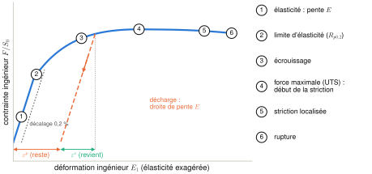\
*Figure F.1 — Courbe de traction ingénieur typique (schéma ; la pente élastique est exagérée pour être lisible). Les étapes numérotées sont détaillées ci-dessous. En pointillés orange, une décharge : elle suit une droite de pente $E$, rend la déformation élastique $\varepsilon^e$ et laisse la déformation plastique $\varepsilon^p$.*

1. **Élasticité** : droite de pente $E$, réversible.
2. **Limite d'élasticité** : début de la déformation permanente. Si la transition est progressive, on prend par convention $R_{p0,2}$, la contrainte pour 0,2 % de déformation **plastique**. Certains aciers présentent un **pic** suivi d'un **palier de Lüders** : des bandes de déformation traversent l'éprouvette à contrainte à peu près constante. [Beerli 2026] observe une limite d'élasticité marquée sur ses cinq aciers DP. Ce phénomène est souvent très sensible à la vitesse.
3. **Écrouissage** : la contrainte vraie continue d'augmenter avec la déformation, parce que les dislocations se multiplient et se gênent mutuellement.
4. **Force maximale** (UTS, *ultimate tensile strength*) : à partir de là commence la **striction diffuse** (F.9). La courbe ingénieur redescend alors que la contrainte vraie continue d'augmenter.
5. **Striction localisée**, puis **rupture**.

Si l'on décharge en cours d'essai, la décharge suit une droite de pente $E$ et il reste une déformation permanente : c'est la déformation plastique.

Exemples ([Beerli 2026], tableau 3, 0,001 s⁻¹, direction de laminage) : DP590, $\sigma_y = 375$ MPa et UTS = 660 MPa ; DP1000, $\sigma_y = 752$ MPa et UTS = 1 011 MPa. La déformation ingénieur à rupture vaut 0,31 pour le DP590, mais seulement 0,11 pour le DP1000 et 0,10 pour le DP1470.

### F.2 Décomposition élastique/plastique et incompressibilité plastique

En petites déformations, on écrit $\underset{\sim}{\varepsilon} = \underset{\sim}{\varepsilon}^e + \underset{\sim}{\varepsilon}^p$. La contrainte ne dépend que de la partie élastique, $\underset{\sim}{\sigma} = \underset{\approx}{\Lambda}:\underset{\sim}{\varepsilon}^e$ (E.2). En grandes transformations, on utilise une décomposition **multiplicative**, $\underset{\sim}{F} = \underset{\sim}{F}^e\cdot\underset{\sim}{F}^p$ : on imagine qu'on déforme d'abord plastiquement, puis élastiquement, et les gradients se composent comme deux transformations successives (B.5). Pour les métaux, les déformations élastiques restent petites (moins de 1 %) : en pratique, on raisonne comme en petites déformations élastiques superposées à une grande déformation plastique.

**Incompressibilité plastique.** La plasticité des métaux se fait par **glissement** de plans cristallins (mouvement des dislocations). Un glissement est un cisaillement, et un cisaillement simple ne change pas le volume : son gradient $\underset{\sim}{F} = \underset{\sim}{1} + \gamma\,\underline{e}_1\otimes\underline{e}_2$ a un déterminant égal à 1. Donc

$$
\operatorname{trace}\dot{\underset{\sim}{\varepsilon}}^p = 0,
\qquad\text{soit en traction :}\qquad \varepsilon^p_{l}+\varepsilon^p_{w}+\varepsilon^p_{t} = 0 ,
$$

où $l$, $w$ et $t$ désignent la longueur, la largeur et l'épaisseur.

### F.3 Surface de charge (fonction de charge)

On généralise le patin (E.1) à trois dimensions : on définit une **fonction de charge**

$$
f(\underset{\sim}{\sigma}, \ldots) = \bar\sigma(\underset{\sim}{\sigma}) - k(\ldots) \le 0 .
$$

- $\bar\sigma$ est une **contrainte équivalente**, une sorte de norme du tenseur des contraintes : von Mises (C.7) pour un matériau isotrope, Hill'48 ou Yld2000 pour une tôle anisotrope (F.8).
- $k$ est la **résistance à la déformation** (*deformation resistance* ou *flow stress*). Elle dépend de l'histoire (écrouissage), de la vitesse et de la température (F.6 et F.7).
- $f < 0$ : domaine **élastique**. $f = 0$ : la matière peut plastifier. $f > 0$ : impossible pour un modèle indépendant de la vitesse.

Dans l'espace des contraintes, $f = 0$ est une surface : la **surface de charge** (*yield surface*). Sa **forme** décrit l'anisotropie. Sa **taille**, $k$, grandit avec l'écrouissage : si la forme ne change pas, on parle d'**écrouissage isotrope** (*self-similar hardening* dans [Beerli 2026]). La **convexité** de $f$ est exigée pour la stabilité de l'écoulement.

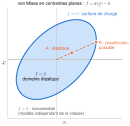\
*Figure F.3a — Surface de charge de von Mises en contraintes planes. Un chargement proportionnel part de l'origine, reste élastique (A) tant que $f<0$, et peut plastifier quand il atteint la surface (B). Dans un modèle indépendant de la vitesse, $f$ ne peut pas devenir positif : si l'on continue à charger, c'est la surface qui grandit (écrouissage, F.6).*

> **Pour la Task I.** La question scientifique de ton projet est de savoir si la **forme** de cette surface change avec la vitesse de déformation, ce qui reviendrait à un écrouissage « non homothétique » en fonction de $\dot{\bar\varepsilon}^p$.

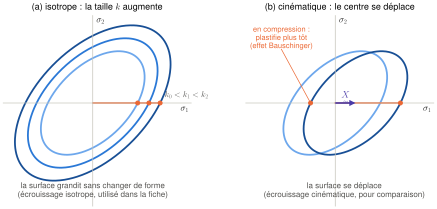\
*Figure F.3b — Deux façons dont la surface de charge peut évoluer. (a) Écrouissage isotrope : elle grandit en gardant sa forme ($k_0<k_1<k_2$) ; c'est l'hypothèse de [Beerli 2026] et de cette fiche. (b) Écrouissage cinématique, pour comparaison : elle se translate (tenseur de rappel $\underset{\sim}{X}$), et après une traction, la plastification en compression arrive plus tôt (effet Bauschinger). La question du projet est de savoir si la forme change avec la vitesse.*

### F.4 Loi d'écoulement

La fonction de charge dit **quand** on plastifie. Il faut une deuxième loi pour dire **dans quelle direction** la matière s'écoule :

$$
\dot{\underset{\sim}{\varepsilon}}^p = \dot\lambda\,\frac{\partial g}{\partial\underset{\sim}{\sigma}},
\qquad
f\le0,\quad \dot\lambda\ge0,\quad \dot\lambda\,f = 0 .
$$

- $g$ est le **potentiel d'écoulement** (*flow potential*) et $\dot\lambda$ le **multiplicateur plastique**.
- Les trois conditions de droite (conditions de Kuhn-Tucker) disent : pas d'écoulement dans le domaine élastique, et un écoulement possible seulement sur la surface. C'est exactement la loi du patin, écrite en 3D. Pendant l'écoulement, $f$ reste nul ($\dot f = 0$, condition de cohérence), ce qui permet de calculer $\dot\lambda$.
- **Écoulement associé** : $g = f$. La vitesse de déformation plastique est **normale** à la surface de charge (règle de normalité).
- **Écoulement non associé** : $g \neq f$. C'est le choix de [Roth & Mohr 2014] et [Beerli 2026] : un Hill'48 pour $f$ (calé sur les limites d'élasticité) et un autre Hill'48 pour $g$ (calé sur les coefficients de Lankford). C'est le « *yield and flow potential* » du titre de ton projet.

**Exemple : von Mises associé.** On a $\partial\sigma_{eq}/\partial\underset{\sim}{\sigma} = \tfrac32\,\underset{\sim}{\sigma}^{dev}/\sigma_{eq}$, donc

$$
\dot{\underset{\sim}{\varepsilon}}^p = \frac32\,\dot\lambda\,\frac{\underset{\sim}{\sigma}^{dev}}{\sigma_{eq}} .
$$

Cette vitesse est **déviatorique** : l'incompressibilité plastique est automatiquement respectée. En traction selon $\underline{e}_1$, $\underset{\sim}{\sigma}^{dev} = \sigma\,\operatorname{diag}(2/3,-1/3,-1/3)$, donc $\dot{\underset{\sim}{\varepsilon}}^p \propto \operatorname{diag}(1,-1/2,-1/2)$ : la largeur et l'épaisseur se contractent autant l'une que l'autre.

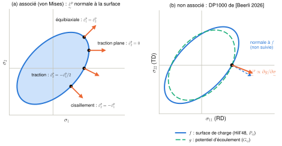\
*Figure F.4 — (a) Règle de normalité pour von Mises : la vitesse de déformation plastique est perpendiculaire à la surface. On y lit les rapports de déformation : −1/2 en traction, 0 dans la direction transverse en traction plane (d'où son nom), −1 en cisaillement. (b) Écoulement non associé du DP1000 de [Beerli 2026] : la surface de charge $f$ et le potentiel $g$ (deux Hill'48, tableau 4) ont des formes différentes. En traction selon RD, la déformation suit la normale à $g$, d'où $r_0 = -G_{12}/(1+G_{12})\approx0{,}64$ ; une loi associée donnerait $r_0 = -P_{12}/(1+P_{12})\approx1{,}27$.*

### F.5 Déformation plastique équivalente

On a besoin d'un scalaire qui mesure « la quantité de plasticité accumulée ». On le définit par l'égalité des puissances plastiques ([Roth & Mohr 2014] éq. 8, [Beerli 2026] éq. 7) :

$$
\underset{\sim}{\sigma}:\dot{\underset{\sim}{\varepsilon}}^p = \bar\sigma\,\dot{\bar\varepsilon}^p,
\qquad \bar\varepsilon^p = \int_0^t\dot{\bar\varepsilon}^p\,dt .
$$

Pour von Mises associé, en utilisant F.4 :

$$
\underset{\sim}{\sigma}:\dot{\underset{\sim}{\varepsilon}}^p = \tfrac32\,\dot\lambda\,\frac{\underset{\sim}{\sigma}^{dev}:\underset{\sim}{\sigma}^{dev}}{\sigma_{eq}} = \dot\lambda\,\sigma_{eq}
\quad\Rightarrow\quad
\dot{\bar\varepsilon}^p = \dot\lambda = \sqrt{\tfrac23\,\dot{\underset{\sim}{\varepsilon}}^p:\dot{\underset{\sim}{\varepsilon}}^p} .
$$

(Le premier signe égal utilise $\underset{\sim}{\sigma}:\underset{\sim}{\sigma}^{dev} = \underset{\sim}{\sigma}^{dev}:\underset{\sim}{\sigma}^{dev}$, puisque la partie sphérique est orthogonale au déviateur.)

En traction uniaxiale, $\bar\varepsilon^p = \varepsilon^p_{11}$ (déformation logarithmique plastique axiale). C'est ce qui permet de caler la loi d'écrouissage $k(\bar\varepsilon^p)$ directement sur la courbe « contrainte vraie – déformation plastique vraie » d'un essai UT, avec $\varepsilon^p_{11} = \varepsilon_{11} - \sigma/E$. Pour un écoulement non associé, [Beerli 2026] (éq. 8) obtient $\dot{\bar\varepsilon}^p = \dot\lambda\,g/\bar\sigma$.

### F.6 Écrouissage isotrope : Swift, Voce et le mélange

Trois lois classiques pour $k(\bar\varepsilon^p)$ ([Roth & Mohr 2014] éq. 10–12, [Beerli 2026] éq. 10) :

$$
k_S = A\,(\bar\varepsilon^p+\varepsilon_0)^n\quad\text{(Swift : croissance en puissance, ne sature jamais)}
$$

$$
k_V = k_0 + Q\left(1-e^{-\beta\bar\varepsilon^p}\right)\quad\text{(Voce : tend vers } k_0+Q\text{)}
$$

$$
k_{SV} = \alpha\,k_S + (1-\alpha)\,k_V,\qquad 0\le\alpha\le1\quad\text{(Swift–Voce mixte)} .
$$

Sens des paramètres : $A$ fixe le niveau de Swift, $n$ sa courbure, $\varepsilon_0$ décale l'origine (pour que $k_S(0)$ ne soit pas nul) ; $k_0$ est la limite d'élasticité de Voce, $Q$ l'écrouissage total qu'elle peut apporter, $\beta$ la vitesse à laquelle elle sature.

**Pourquoi un mélange ?** En traction uniaxiale, on ne mesure l'écrouissage que jusqu'à la striction, soit de 5 à 18 % de déformation pour les DP. Swift et Voce peuvent s'ajuster aussi bien l'un que l'autre sur cette plage, mais ils **divergent** fortement aux grandes déformations, qui sont celles de la striction et de la rupture. Le poids $\alpha$ est donc calé sur des essais qui vont beaucoup plus loin : l'éprouvette NT20, par analyse inverse, dans [Beerli 2026] (§3.4).

Paramètres de [Beerli 2026] (tableau 4) :

| | $A$ (MPa) | $\varepsilon_0$ | $n$ | $k_0$ (MPa) | $Q$ (MPa) | $\beta$ | $\alpha$ |
|---|---|---|---|---|---|---|---|
| DP590 | 1 126 | 0,00197 | 0,206 | 376 | 404 | 18,1 | 0,7 |
| DP1000 | 1 395 | 1×10⁻⁶ | 0,0892 | 739 | 301 | 102 | 0,5 |

**Vérification** (calcul fait avec ces paramètres, voir F.9) : la loi prédit un UTS de 655 MPa pour le DP590 (660 mesuré) et de 1 002 MPa pour le DP1000 (1 011 mesuré). C'est un bon exercice pour te familiariser avec ces lois.

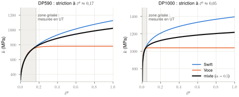\
*Figure F.6 — Swift, Voce et le mélange de [Beerli 2026] pour le DP590 et le DP1000. Dans la zone grisée (jusqu'à la striction), les trois lois sont presque confondues, car elles sont calées sur l'essai UT. Au-delà, Swift continue de monter et Voce sature : le poids $\alpha$ ne peut être calé que sur des essais qui vont plus loin (NT20).*

> **Attention.** La lettre $\beta$ désigne ici le paramètre de Voce, à ne pas confondre avec le coefficient de Taylor–Quinney $\beta_{TQ}$ (partie G).

### F.7 Effet de la vitesse de déformation

On passe du patin à un **patin + amortisseur** : la résistance dépend de la vitesse, $k = k(\bar\varepsilon^p,\dot{\bar\varepsilon}^p,T)$. L'origine physique est le franchissement **thermiquement activé** des obstacles par les dislocations : plus on va vite, moins l'agitation thermique a le temps d'aider, et plus il faut de contrainte. Dans les aciers DP, c'est surtout la **ferrite** qui est sensible à la vitesse, la martensite beaucoup moins. D'où une sensibilité qui diminue quand la teneur en martensite augmente ([Beerli 2026], §5.3).

Deux façons de quantifier cette sensibilité :

- la **sensibilité logarithmique** $m = \dfrac{\partial\ln\sigma}{\partial\ln\dot\varepsilon}$ ;
- le **facteur d'augmentation dynamique** $DIF = \sigma(\dot\varepsilon)/\sigma(\dot\varepsilon_{ref})$. [Beerli 2026] mesure $DIF = 1{,}09$ sur la limite d'élasticité du DP590 entre 0,001 et 100 s⁻¹, et 1,04 pour le DP1470.

**Johnson–Cook.** Sous la forme de [Roth & Mohr 2014] (éq. 9, 13, 14), la résistance est le **produit** de trois fonctions :

$$
k = k_\varepsilon[\bar\varepsilon^p]\;k_{\dot\varepsilon}[\dot{\bar\varepsilon}^p]\;k_T[T],
\qquad
k_{\dot\varepsilon} = \begin{cases}1 & \dot{\bar\varepsilon}^p<\dot\varepsilon_0\\[2pt] 1+C\ln\dfrac{\dot{\bar\varepsilon}^p}{\dot\varepsilon_0} & \dot{\bar\varepsilon}^p\ge\dot\varepsilon_0\end{cases},
\qquad
k_T = 1-\left(\frac{T-T_r}{T_m-T_r}\right)^{m}.
$$

- $k_\varepsilon$ est l'écrouissage (le Swift–Voce de F.6 : c'est le « *mixed Swift–Voce and Johnson–Cook* » de ton sujet).
- $C$ mesure l'effet de la vitesse, au-dessus de la vitesse de référence $\dot\varepsilon_0$ : chaque décade de vitesse multiplie $k$ par environ $1 + 2{,}3\,C$. Exemple : le $DIF$ de 1,09 sur 5 décades correspond à $C \approx 0{,}09/\ln(10^5) \approx 0{,}008$.
- $T_r$ et $T_m$ sont la température de référence et la température de fusion, $m$ un exposant : $k_T$ vaut 1 à $T_r$ et 0 à la fusion.

[Beerli 2026] remplace les deux derniers facteurs par un réseau de neurones : $k = k_{SV}(\bar\varepsilon^p)\,k_{NN}(\bar\varepsilon^p,\dot{\bar\varepsilon}^p,T)$, avec $k_{NN}$ compris entre 0,5 et 2 (éq. 9–15).

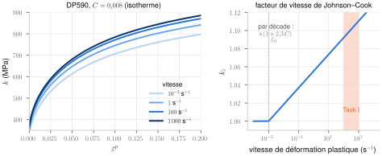\
*Figure F.7 — Effet de la vitesse selon Johnson–Cook, avec $C = 0{,}008$ (valeur qui redonne le $DIF$ de 1,09 mesuré entre 0,001 et 100 s⁻¹), appliqué au Swift–Voce du DP590, sans effet thermique. Chaque décade de vitesse relève la courbe d'environ 2 % ; la Task I est dans la bande orangée.*

> **Pour la Task I.** Une sensibilité positive à la vitesse **stabilise** l'éprouvette : une zone qui commence à se déformer plus vite durcit davantage, ce qui repousse la localisation. L'échauffement fait l'inverse (partie G). Dans tes simulations, il faut à terme une loi dépendante de la vitesse pour l'éprouvette : [Roth 2015] a utilisé une loi indépendante de la vitesse, ce qui suffit pour étudier la flexion et les oscillations, mais pas pour comparer finement aux essais.

### F.8 Anisotropie des tôles

Une tôle laminée n'a pas les mêmes propriétés selon la **direction de laminage** (RD), la **direction transverse** (TD) et l'**épaisseur** (ND). On la caractérise par des essais UT à l'angle $\alpha$ de RD.

- **Rapports de limites d'élasticité** : $\sigma_\alpha/\sigma_0$.
- **Coefficients de Lankford** (grâce à l'incompressibilité de F.2, on peut les mesurer par DIC en surface, sans l'épaisseur) :

$$
r_\alpha = \frac{\dot\varepsilon^p_w}{\dot\varepsilon^p_t} = \frac{-\dot\varepsilon^p_w}{\dot\varepsilon^p_l+\dot\varepsilon^p_w} .
$$

$r = 1$ correspond au cas isotrope ; $r > 1$ indique une tôle qui résiste à l'amincissement.

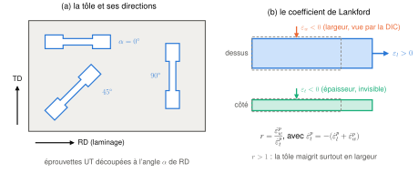\
*Figure F.8 — (a) Directions de la tôle et éprouvettes découpées à 0°, 45° et 90° de la direction de laminage. (b) Coefficient de Lankford : la DIC voit la longueur et la largeur ; l'épaisseur se déduit de l'incompressibilité plastique.*

**Hill'48, sous la forme de [Beerli 2026]** (éq. 3–5). Avec le vecteur des contraintes de A.5, on écrit

$$
\bar\sigma_{Hill48} = \sqrt{(\mathbf{P}\boldsymbol\sigma)\cdot\boldsymbol\sigma},
\qquad
\mathbf{P} = \begin{bmatrix}
1 & P_{12} & -(1+P_{12}) & 0 & 0 & 0\\
P_{12} & P_{22} & -(P_{22}+P_{12}) & 0 & 0 & 0\\
-(1+P_{12}) & -(P_{22}+P_{12}) & 1+2P_{12}+P_{22} & 0 & 0 & 0\\
0&0&0&P_{33}&0&0\\
0&0&0&0&3&0\\
0&0&0&0&0&3
\end{bmatrix}.
$$

Chaque ligne du bloc $3\times3$ a une somme nulle : ajouter une pression ne change rien, le critère est insensible à la pression. Le terme 1 en haut à gauche normalise le critère sur la traction en RD ($\bar\sigma = \sigma$ pour $\boldsymbol\sigma = [\sigma,0,\ldots]$). Pour $P_{12} = -1/2$, $P_{22} = 1$ et $P_{33} = 3$, on retrouve exactement von Mises (C.7). Le potentiel $g = \sqrt{(\mathbf{G}\boldsymbol\sigma)\cdot\boldsymbol\sigma}$ a la même structure, avec $G_{12}$, $G_{22}$ et $G_{33}$.

**Calcul d'un coefficient de Lankford.** En traction selon RD, $\boldsymbol\sigma = [\sigma,0,0,0,0,0]$. La direction d'écoulement est $\partial g/\partial\boldsymbol\sigma = \mathbf{G}\boldsymbol\sigma/g \propto [1,\,G_{12},\,-(1+G_{12}),0,0,0]$, donc $r_0 = \dot\varepsilon^p_{22}/\dot\varepsilon^p_{33} = -G_{12}/(1+G_{12})$. En procédant de même pour 90° et 45° (avec $\sigma_{11}=\sigma_{22}=\sigma_{12}=\sigma/2$, C.5) :

$$
\frac{\sigma_{90}}{\sigma_0} = \frac{1}{\sqrt{P_{22}}},\qquad
r_0 = \frac{-G_{12}}{1+G_{12}},\qquad
r_{90} = \frac{-G_{12}}{G_{12}+G_{22}},\qquad
r_{45} = \frac{G_{33}}{2(1+2G_{12}+G_{22})}-\frac12 .
$$

Contrôle avec le DP590 ($G_{12} = -0{,}49$, $G_{22} = 0{,}93$, $G_{33} = 2{,}49$, $P_{22} = 0{,}98$) : on trouve $r_0 = 0{,}96$, $r_{90} = 1{,}11$, $r_{45} = 0{,}81$ et $\sigma_{90}/\sigma_0 = 1{,}01$. Les valeurs mesurées sont 0,98, 1,12, 0,83 et 1,005 ([Beerli 2026], tableau 3).

**Pourquoi un écoulement non associé ?** Avec un seul Hill'48 associé, rapports de contraintes et coefficients de Lankford sont liés par les mêmes coefficients : on ne peut pas ajuster les deux à la fois. Les DP ont des contraintes presque isotropes (moins de 5 % d'écart) mais des coefficients de Lankford qui varient beaucoup (de 0,66 à 1,13 pour le DP1000). Il faut donc deux fonctions distinctes.

> **Pour la suite du projet.** Le tableau 3 de [Beerli 2026] montre déjà des $r_0$ qui changent avec la vitesse : 0,98 à 0,001 s⁻¹ contre 1,15 à 100 s⁻¹ pour le DP590. La question ouverte est de savoir si c'est un vrai effet matériau ou une incertitude de mesure, car la mesure est difficile à haute vitesse. C'est l'une des raisons pour lesquelles la **qualité des données dynamiques**, donc la Task I, compte.

### F.9 Striction : le critère de Considère

**Démonstration.** La force vaut $F = \sigma S$. Avec l'incompressibilité, $S\,l = S_0\,l_0$, donc $dS/S = -dl/l = -d\varepsilon$ ($\varepsilon$ logarithmique). La force passe par un maximum quand

$$
dF = S\,d\sigma + \sigma\,dS = 0
\quad\Longleftrightarrow\quad
\boxed{\;\frac{d\sigma}{d\varepsilon} = \sigma\;}
$$

La striction diffuse commence quand la **pente d'écrouissage vraie** devient égale à la **contrainte vraie**. Avant, un léger rétrécissement local est « réparé » par l'écrouissage (la zone amincie durcit plus qu'elle ne perd de section) ; après, il s'amplifie. Pour une loi puissance $\sigma = K\varepsilon^n$, on obtient $\varepsilon_u = n$ : le coefficient $n$ est la déformation uniforme.

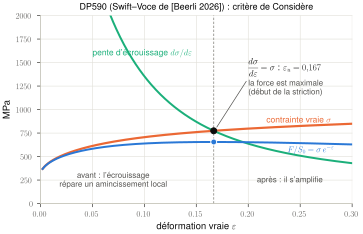\
*Figure F.9 — Critère de Considère pour le DP590 : la striction commence quand la pente d'écrouissage $d\sigma/d\varepsilon$ (vert) passe sous la contrainte vraie $\sigma$ (orange), ici à $\varepsilon_u\approx0{,}167$. C'est exactement là que la force, donc $F/S_0$ (bleu), passe par son maximum.*

**Application aux aciers de [Beerli 2026]** (calculée avec le Swift–Voce de F.6, en négligeant l'élasticité) :

| | $\varepsilon_u$ (vraie) | $E_{1,u}$ (ingénieur) | $\sigma$ vraie à $\varepsilon_u$ | UTS prédit (mesuré) |
|---|---|---|---|---|
| DP590 | 0,167 | 0,181 | 774 MPa | 655 MPa (660) |
| DP1000 | 0,050 | 0,051 | 1 053 MPa | 1 002 MPa (1 011) |

> **Pour la Task I.** La cible de 30 % de déformation ingénieur est **bien au-delà de la striction** pour ces aciers, et même au-delà de la rupture pour les plus résistants (10 à 11 % pour le DP1000 et le DP1470). Au-delà de la striction :
> - la déformation se concentre dans une zone dont la taille est fixée par la **largeur et l'épaisseur**, pas par la longueur utile. La déformation ingénieur moyenne dépend donc de la longueur de base : 30 % sur 19 mm et 30 % sur 40 mm ne correspondent **pas** au même état local. C'est pour cela que [Roth & Mohr 2014] précisent la longueur d'extensomètre (17,5 mm) quand ils donnent un allongement à rupture ;
> - la vitesse de déformation **locale** explose : de 285 à plus de 9 800 s⁻¹ dans l'éprouvette NT20 de [Roth 2015], de 300 à 1 400 s⁻¹ pour une vitesse globale de 50 s⁻¹ dans [Beerli 2026] (fig. 6d).
>
> Demande à tes encadrants comment la cible de 30 % est définie : sur quelle longueur de base, et s'il s'agit surtout de dimensionner la **course** du montage pour les matériaux les plus ductiles.

**Effet de la vitesse et de la température sur la striction.** En conditions adiabatiques, $d\sigma/d\varepsilon = \partial k/\partial\varepsilon + (\partial k/\partial T)\,(dT/d\varepsilon)$, avec $dT/d\varepsilon \approx \beta_{TQ}\,\sigma/(\rho C) \approx 200$ K par unité de déformation (partie G) et $\partial k/\partial T < 0$. L'adoucissement thermique réduit la pente effective, donc la striction arrive **plus tôt**. C'est ce qu'observe [Beerli 2026] (§4.2.1) : la déformation à l'UTS diminue quand la vitesse augmente.

**Striction diffuse, puis localisée.** Dans une tôle, la striction diffuse (réduction de la largeur et de l'épaisseur sur une zone de l'ordre de la largeur) est suivie d'une **striction localisée** : une bande étroite où seule l'épaisseur diminue. La rupture suit ([Roth 2015], fig. 4 : « *the pronounced change in strain rate is due to through thickness necking* »).

### F.10 Rupture ductile

Pour plus tard (Tasks II et III). [Beerli 2026] (éq. 16–20) utilise un **indicateur d'endommagement**

$$
D = \int_0^{\bar\varepsilon^p}\frac{d\bar\varepsilon^p}{\varepsilon_f^{pr}\left[\eta,\bar\theta,\dot{\bar\varepsilon}^p,T\right]} ,
$$

où $\varepsilon_f^{pr}$ est la déformation à rupture pour un chargement proportionnel (où $\eta$ et $\bar\theta$ restent constants). La rupture s'amorce quand $D = 1$ : chaque incrément de déformation « consomme » une fraction de la ductilité disponible dans l'état de contrainte du moment.

Pour $\varepsilon_f^{pr}$, on utilise le modèle de **Hosford–Coulomb** :

$$
\varepsilon_f^{HC} = b\,(1+c)^{1/n}\left(\left\{\tfrac12\left[(f_1-f_2)^a+(f_2-f_3)^a+(f_1-f_3)^a\right]\right\}^{1/a} + c\,(2\eta+f_1+f_3)\right)^{-1/n},
$$

$$
f_1 = \tfrac23\cos\!\left[\tfrac\pi6(1-\bar\theta)\right],\qquad
f_2 = \tfrac23\cos\!\left[\tfrac\pi6(3+\bar\theta)\right],\qquad
f_3 = -\tfrac23\cos\!\left[\tfrac\pi6(1+\bar\theta)\right].
$$

Les $f_i$ sont les contraintes principales (normalisées par $\sigma_{eq}$, à la triaxialité près) écrites en fonction du paramètre de Lode. Le premier terme est une contrainte équivalente de Hosford (exposant $a$), le second une contrainte normale (terme de Coulomb, poids $c$) ; $b$ fixe le niveau de ductilité et $n = 0{,}1$. Dans [Beerli 2026], $a$, $b$ et $c$ dépendent de la vitesse et de la température par un réseau de neurones.

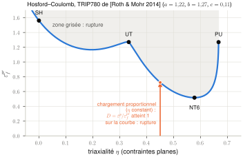\
*Figure F.10 — Lieu de rupture de Hosford–Coulomb en contraintes planes, avec les paramètres quasi statiques du TRIP780 de [Roth & Mohr 2014] (ceux des DP de [Beerli 2026] dépendent de la vitesse). La ductilité est la plus faible en traction plane. Pour un chargement proportionnel (flèche), l'indicateur $D$ vaut $\bar\varepsilon^p/\varepsilon_f^{pr}$ et atteint 1 quand la flèche touche la courbe.*

Comme $\eta$ et $\bar\theta$ ne se mesurent pas directement, on simule chaque essai et on extrait leur histoire au point où la rupture s'amorce : c'est l'**approche hybride expérimentale-numérique** de [Dunand & Mohr 2010].

---

## G. Thermique : l'échauffement adiabatique

### G.1 D'où vient la chaleur

On part du premier principe (D.5), $\rho\dot e = \underset{\sim}{\sigma}:\underset{\sim}{D} - \operatorname{div}\underline{q}$, et on détaille ses termes pour un métal élastoplastique :

- la puissance mécanique se partage en une partie élastique et une partie plastique : $\underset{\sim}{\sigma}:\underset{\sim}{D} \approx \underset{\sim}{\sigma}:\dot{\underset{\sim}{\varepsilon}}^e + \underset{\sim}{\sigma}:\dot{\underset{\sim}{\varepsilon}}^p$ ;
- l'énergie interne augmente de trois façons : l'énergie élastique stockée (qui absorbe exactement $\underset{\sim}{\sigma}:\dot{\underset{\sim}{\varepsilon}}^e$), l'énergie **stockée** dans la microstructure par les dislocations (environ 10 % de la puissance plastique), et l'échauffement $\rho C\dot T$.

La part de la puissance plastique qui n'est pas stockée est **dissipée en chaleur**. On note $\beta_{TQ}$ cette fraction : c'est le **coefficient de Taylor–Quinney**, environ 0,9 pour les métaux. [Beerli 2026] prend $\beta_{TQ} = 0{,}9$ pour les DP (éq. 21) ; [Roth & Mohr 2014] le notent $\eta_k$ (éq. 15). En négligeant le couplage thermoélastique (E.7) et avec la loi de Fourier, il reste l'**équation de la chaleur** :

$$
\rho\,C\,\dot T = \beta_{TQ}\,\underset{\sim}{\sigma}:\dot{\underset{\sim}{\varepsilon}}^p + k_{th}\,\Delta T .
$$

### G.2 Limite adiabatique

Si l'essai est trop rapide pour que la chaleur ait le temps de partir, le terme de conduction est négligeable. Avec $\underset{\sim}{\sigma}:\dot{\underset{\sim}{\varepsilon}}^p = \bar\sigma\,\dot{\bar\varepsilon}^p$ (F.5) :

$$
\Delta T = \frac{\beta_{TQ}}{\rho\,C}\int\bar\sigma\,d\bar\varepsilon^p .
$$

L'intégrale est l'aire sous la courbe contrainte vraie – déformation plastique : c'est le travail plastique par unité de volume. Ordres de grandeur, calculés avec les lois de F.6 ($\rho = 7\,850$ kg/m³, $C = 420$ J/kg/K, $\beta_{TQ} = 0{,}9$) :

| | jusqu'à la striction | jusqu'à $\varepsilon = 0{,}262$ (30 % ingénieur, si c'était atteint uniformément) |
|---|---|---|
| DP590 | environ 30 K | environ 51 K |
| DP1000 | environ 13 K | environ 78 K |

Dans la striction, les déformations locales sont bien plus grandes : [Beerli 2026] mesure à la caméra infrarouge jusqu'à 110 °C au centre d'une éprouvette NT6 en DP590. [Roth & Mohr 2014] mesurent 80 K par thermocouple à vitesse intermédiaire, et prédisent $dT/d\bar\varepsilon^p \approx 220$ à 270 K par unité de déformation.

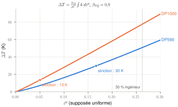\
*Figure G.2 — Échauffement adiabatique calculé avec les lois de F.6 ($\beta_{TQ} = 0{,}9$, $\rho = 7\,850$ kg/m³, $C = 420$ J/kg/K), en supposant la déformation uniforme. Les points marquent la striction ; au-delà, la déformation se concentre et l'échauffement local est bien plus fort.*

### G.3 Isotherme ou adiabatique ?

La chaleur diffuse sur une distance $\ell$ en un temps $t_d \sim \ell^2/a$, où $a = k_{th}/(\rho C)$ est la **diffusivité thermique** (c'est ce qu'on obtient en comparant les deux termes de l'équation de la chaleur, $\rho C\,T/t$ et $k_{th}\,T/\ell^2$). Avec les valeurs de [Beerli 2026], $a \approx 1{,}5\times10^{-5}$ m²/s. Pour une tôle, la chaleur doit surtout partir par la longueur vers les épaules, ce qui donne $\ell \approx 10$ à 20 mm et $t_d \approx 7$ à 27 s.

| Vitesse | Durée jusqu'à 30 % | Comparaison à $t_d$ | Régime |
|---|---|---|---|
| 0,001 s⁻¹ | 300 s | $\gg t_d$ | quasi **isotherme** |
| 1 s⁻¹ | 0,3 s | $\ll t_d$ | déjà presque **adiabatique** |
| 100 à 1 000 s⁻¹ | 3 à 0,3 ms | $\lll t_d$ | **adiabatique** |

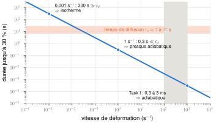\
*Figure G.3 — Durée d'un essai jusqu'à 30 % en fonction de la vitesse, comparée au temps de diffusion de la chaleur hors de la zone utile. Dès 1 s⁻¹, l'essai est bien plus court que la diffusion : il est adiabatique, et à plus forte raison dans la Task I.*

[Roth & Mohr 2014] (éq. 16) représentent la transition par une fonction de pondération $\omega(\dot{\bar\varepsilon}^p)$ qui passe de 0 (isotherme) à 1 (adiabatique) : $dT = \omega\,\eta_k\,\bar\sigma\,d\bar\varepsilon^p/(\rho C_p)$. [Beerli 2026] fait des calculs thermomécaniques **couplés** (éléments C3D8RT), avec conduction.

### G.4 Pourquoi c'est important

- Deux effets **s'opposent** à haute vitesse : le durcissement dû à la vitesse et l'adoucissement thermique. Si on ne sépare pas les deux, on sous-estime la sensibilité réelle à la vitesse. [Beerli 2026] l'invoque pour expliquer que l'UTS du DP1470 est 2 % **plus faible** à 100 s⁻¹ qu'en quasi-statique (§5.3).
- Un modèle sans effet de la température ne reproduit pas la partie après le maximum de force des essais rapides ([Roth & Mohr 2014], §4.3).
- Avec de l'adoucissement thermique, la **convergence en maillage** n'est plus garantie après la localisation ([Beerli 2026], §3.5).

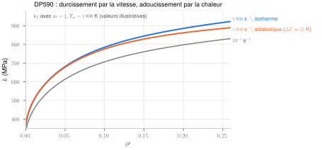\
*Figure G.4 — Les deux effets de la vitesse pour le DP590 à 1 000 s⁻¹ : Johnson–Cook relève la courbe (bleu), l'échauffement adiabatique la rabaisse (orange). Le facteur thermique $k_T$ utilise des valeurs illustratives ($m = 1$, $T_m = 1\,800$ K), pas un étalonnage.*

> **Pour la Task I.** Pour la question de l'**équilibre**, la thermique est un effet de second ordre. Pour **comparer tes simulations aux essais**, en revanche, elle compte.

---

## H. Ondes élastiques et plastiques en 1D

### H.1 Pourquoi des ondes ?

En statique, une force appliquée à une extrémité est « ressentie » partout instantanément, puisque $\operatorname{div}\underset{\sim}{\sigma} = \underline{0}$ en tout point. En réalité, pour qu'un point se mette en mouvement, il faut l'**accélérer**, donc qu'une différence de contrainte agisse sur lui (loi de Cauchy, D.2). Cette différence n'existe que là où la perturbation est déjà arrivée. **L'information mécanique se propage donc à vitesse finie** : c'est une onde. La matière, elle, ne fait que se déplacer un peu.

> **Pour la Task I.** Tant que la durée de l'essai est grande devant le temps de parcours des ondes dans l'éprouvette, les allers-retours ont le temps d'égaliser les contraintes : on est quasi statique. Quand les deux durées deviennent comparables, ce n'est plus le cas. Toute la Task I consiste à savoir de quel côté on se trouve.

### H.2 L'équation des ondes dans une barre élastique

**Hypothèses** : barre mince (section petite devant la longueur d'onde), donc état de **contrainte uniaxiale** et module $E$ (E.5) ; barre élastique et petites déformations (HPP), donc pas de distinction entre $x$ et $X$ ; déplacement axial $u(x,t)$ ; pesanteur négligée.

La loi de Cauchy (D.2) projetée sur l'axe, avec la loi de Hooke $\sigma = E\,\partial u/\partial x$, donne :

$$
\frac{\partial\sigma}{\partial x} = \rho\,\frac{\partial^2u}{\partial t^2}
\quad\Longrightarrow\quad
\boxed{\;\frac{\partial^2u}{\partial t^2} = c_0^2\,\frac{\partial^2u}{\partial x^2},\qquad c_0 = \sqrt{\frac{E}{\rho}}\;}
$$

On peut aussi la retrouver en écrivant la loi de Newton sur une tranche de longueur $dx$ : $\rho A\,dx\,\ddot u = A\,[\sigma(x+dx)-\sigma(x)]$.

| Matériau | $c_0$ | Source |
|---|---|---|
| Acier (valeurs usuelles) | 5 064 m/s | $E = 200$ GPa, $\rho = 7\,800$ kg/m³ |
| Aluminium (valeurs usuelles) | 5 092 m/s | $E = 70$ GPa, $\rho = 2\,700$ kg/m³ |
| Projectile du banc ETH | 4 720 m/s (mesuré) | [Beerli 2026] |
| Barre d'entrée en acier maraging | 4 871 m/s (mesuré), soit $E\approx190$ GPa pour $\rho\approx8\,000$ kg/m³ | [Beerli 2026] |
| Barre de sortie de [Roth 2015] | 5 175 m/s (mesuré) | [Roth 2015] |

Temps de parcours élastique dans l'acier : **3,75 µs pour 19 mm** (7,5 µs aller-retour) et **7,9 µs pour 40 mm** (15,8 µs aller-retour).

### H.3 La solution de d'Alembert

La solution générale est

$$
u(x,t) = f(x-c_0t) + g(x+c_0t) ,
$$

avec $f$ et $g$ quelconques (on le vérifie en remplaçant dans l'équation). $f$ est une onde qui avance vers les $x$ croissants : la valeur $f(x-c_0t)$ est la même en $x$ à l'instant $t$ et en $x+c_0\,dt$ à l'instant $t+dt$. $g$ avance vers les $x$ décroissants. Chacune garde **exactement sa forme** en se déplaçant : la théorie 1D est **non dispersive**. Et comme l'équation est linéaire, tout état de la barre est la **superposition** d'ondes dans les deux sens.

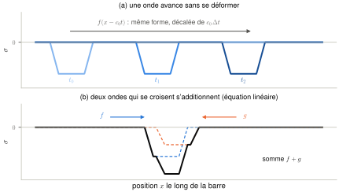\
*Figure H.3 — (a) Solution de d'Alembert : une impulsion avance à $c_0$ sans changer de forme. (b) Deux impulsions qui se croisent s'additionnent, puis continuent chacune leur chemin.*

> **Pour la Task I.** Une jauge collée à la distance $a$ de l'interface voit le même signal qu'à l'interface, décalé de $a/c_0$. On peut donc « transporter » le signal jusqu'à l'éprouvette. C'est le décalage $\Delta t_s$ de [Roth & Mohr 2014] (éq. 1) et les signaux « *transported* » de [Beerli 2026] (fig. 6a). En pratique, on corrige en plus la **dispersion** (H.8).

### H.4 La relation contrainte–vitesse, déduite des sauts

C'est la relation la plus utile de toute la Task I. On l'obtient avec deux ingrédients, pour un front qui avance vers les $x$ croissants à la vitesse $c$, dans une barre au repos et non chargée devant lui ($v^+ = 0$, $\sigma^+ = 0$).

**1. Le saut de quantité de mouvement** (D.6) : $[\![\sigma]\!] = -\rho c\,[\![v]\!]$, soit $(0-\sigma^-) = -\rho c\,(0-v^-)$, d'où

$$
\sigma^- = -\rho\,c\,v^- .
$$

**2. La compatibilité cinématique.** La matière ne se déchire pas, donc le déplacement reste continu à travers le front à chaque instant. En dérivant $[\![u]\!] = 0$ le long du front qui avance à la vitesse $c$ : $[\![\partial u/\partial t]\!] + c\,[\![\partial u/\partial x]\!] = 0$, soit $[\![v]\!] = -c\,[\![\varepsilon]\!]$, c'est-à-dire $v^- = -c\,\varepsilon^-$.

En combinant les deux, $\sigma^- = \rho c^2\varepsilon^-$, donc

$$
\boxed{\;c^2 = \frac{1}{\rho}\,\frac{[\![\sigma]\!]}{[\![\varepsilon]\!]}\;}
$$

**La vitesse d'un front est fixée par la raideur « vue » par le saut.** Pour un saut élastique, $[\![\sigma]\!]/[\![\varepsilon]\!] = E$ et on retrouve $c_0$. Pour un petit saut dans une zone plastique, c'est la **pente d'écrouissage** qui compte (H.10).

**Résumé**, avec la convention traction positive :

| Onde qui avance vers les $x$ croissants | Onde qui avance vers les $x$ décroissants |
|---|---|
| $\sigma = -\rho c\,v$ et $\varepsilon = -v/c$ | $\sigma = +\rho c\,v$ et $\varepsilon = +v/c$ |

Dans les deux cas, $\lvert\sigma\rvert = \rho c\,\lvert v\rvert$.

**Interprétation.** Une onde de traction qui part vers la droite correspond à de la matière qui bouge vers la gauche, comme quand on tire sur une corde par son extrémité gauche.

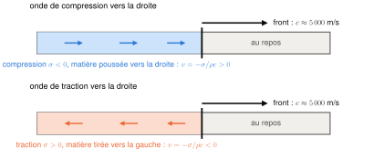\
*Figure H.4 — Le front avance à environ 5 000 m/s, la matière bouge à quelques m/s. Derrière un front qui va vers la droite, la matière va dans le même sens si l'onde est de compression, en sens inverse si elle est de traction : $\sigma = -\rho c\,v$.*

> **Attention.** Ne confonds pas **vitesse de l'onde** $c$ (environ 5 000 m/s, la vitesse du signal) et **vitesse matérielle** $v$ (1 à 40 m/s, la vitesse des points). Leur rapport est la déformation, $\lvert v\rvert/c = \lvert\varepsilon\rvert$, de l'ordre de $10^{-3}$.

**Ordre de grandeur** : $\rho c_0 \approx 39$ MPa par m/s dans l'acier. Une vitesse matérielle de 10 m/s correspond donc à environ 390 MPa dans une barre. Dans l'aluminium, $\rho c_0 \approx 14$ MPa par m/s.

### H.5 Impédance, réflexion, transmission

En multipliant par la section $A$, on passe aux forces :

$$
F = \mp Z\,v,\qquad Z = \rho\,c\,A = A\sqrt{E\rho}\quad\text{(impédance mécanique, en N·s/m).}
$$

L'impédance mesure la force qu'il faut pour imposer une vitesse donnée au bout d'une barre. Pour une barre de Ø 20 mm en acier maraging, $Z \approx 12\,200$ N·s/m.

**Interface entre deux barres** (impédances $Z_1$ puis $Z_2$). L'interface est une surface matérielle : la force est continue (D.6) et la vitesse aussi, puisque la matière ne se sépare pas. Une onde incidente $F_I$ (vers la droite, $v_I = -F_I/Z_1$) donne une onde réfléchie $F_R$ (vers la gauche, $v_R = +F_R/Z_1$) et une onde transmise $F_T$ (vers la droite, $v_T = -F_T/Z_2$). On écrit $F_I + F_R = F_T$ et $v_I + v_R = v_T$ ; en éliminant $F_T$ :

$$
\frac{F_R}{F_I} = \frac{Z_2-Z_1}{Z_1+Z_2},
\qquad
\frac{F_T}{F_I} = \frac{2Z_2}{Z_1+Z_2}.
$$

| Situation | Réflexion | Ce qui se passe |
|---|---|---|
| $Z_2 = Z_1$ | aucune | l'onde ne « voit » pas l'interface |
| **Bout libre** ($Z_2 = 0$) | $F_R = -F_I$ | une compression revient en **traction** ; la vitesse du bout **double** ($v = 2v_I$) |
| **Bout encastré** ($Z_2\to\infty$) | $F_R = +F_I$ | la force double, la vitesse est nulle |
| $Z_2 \ll Z_1$ | presque tout est réfléchi | c'est l'éprouvette vue depuis la barre |

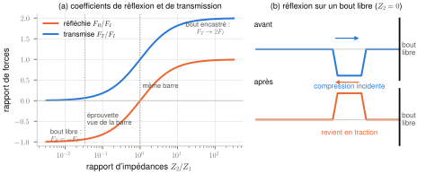\
*Figure H.5 — (a) Fractions réfléchie et transmise à une interface, en fonction du rapport d'impédances. L'éprouvette, environ 30 fois moins impédante que la barre, réfléchit presque tout. (b) Sur un bout libre, une compression revient en traction.*

> **Pour la Task I.** Trois applications :
> - **L'éprouvette est un quasi « bout libre »** pour la barre. Sa section (7,5 à 15 mm²) est 20 à 40 fois plus petite que celle d'une barre de Ø 20 mm (314 mm²), et en plasticité sa raideur apparente chute encore (H.10). [Roth 2015] constate que plus de 80 % de l'onde incidente est réfléchie.
> - **[Beerli 2026] garde l'impédance constante dans la zone de serrage** : la barre s'élargit à 30 mm mais sa hauteur est réduite à 11 mm, soit 330 mm² contre 314 mm² pour la section ronde. L'écart de 5 % ne réfléchit qu'environ 2,5 % de l'onde.
> - **Chez [Roth 2015], la section de l'inverseur varie** : ces variations d'impédance créent un pic de vitesse d'environ 50 µs au début de l'essai (de 20 à 22 m/s).

### H.6 L'impact du projectile

Un projectile de longueur $L_{st}$ et d'impédance $Z_{st}$ frappe à la vitesse $V$ une barre au repos d'impédance $Z_b$. À l'impact, deux ondes de compression partent de l'interface : l'une avance dans la barre, l'autre remonte le projectile. L'interface prend une vitesse $v^\ast$. Côté barre, l'onde vers la droite donne $F = -Z_b\,v^\ast$ ; côté projectile, l'onde vers la gauche fait passer la vitesse de $V$ à $v^\ast$, avec $F = Z_{st}\,(v^\ast - V)$. L'égalité des forces donne

$$
v^\ast = \frac{Z_{st}}{Z_{st}+Z_b}\,V = \frac{V}{2}\ \text{si } Z_{st} = Z_b,
\qquad
\lvert\sigma_I\rvert = \rho c\,\frac{V}{2},
\qquad
T = \frac{2L_{st}}{c_{st}} .
$$

La durée $T$ vient de l'onde qui remonte le projectile : elle se réfléchit sur son extrémité libre et revient à l'interface après $2L_{st}/c_{st}$. Le projectile est alors arrêté et se sépare de la barre, et l'impulsion s'arrête. C'est l'inverse de l'éq. 2 de [Roth 2015].

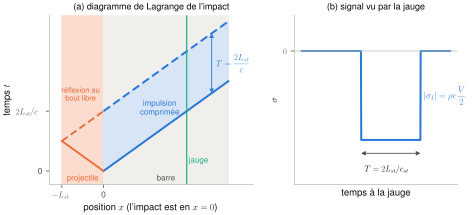\
*Figure H.6 — (a) Diagramme de Lagrange de l'impact : deux ondes de compression partent de l'interface ; celle du projectile se réfléchit sur son bout libre et revient décharger l'interface après $2L_{st}/c$. (b) La jauge voit donc une impulsion rectangulaire de durée $T = 2L_{st}/c_{st}$ et d'amplitude $\rho c\,V/2$.*

| Système | Projectile | Durée d'impulsion |
|---|---|---|
| Banc ETH [Beerli 2026] | 5 m, $c = 4\,720$ m/s | **2,12 ms** |
| [Roth 2015], projectile long | 3,80 m, $c = 4\,725$ m/s | 1,61 ms |
| [Roth 2015], projectile court | 1,20 m | 0,51 ms |

Contrôle : dans [Roth 2015], un projectile à 20,56 m/s donne $F_I = Z\,V/2 \approx 11\,900\times10{,}28 \approx 122$ kN, et l'article annonce 126 kN.

> **Pour la Task I.** **Limite sur la vitesse** : la contrainte dans les barres vaut environ 19,5 MPa par m/s de projectile (acier maraging). 40 m/s donnent environ 780 MPa. Les barres en maraging traité le supportent (limite d'élasticité typique de l'ordre de 2 GPa, à vérifier sur la fiche matière), mais **la vitesse maximale du lanceur est à demander à tes encadrants**.

Le projectile et la barre du banc ETH n'ont pas exactement la même vitesse d'onde (4 720 contre 4 871 m/s). Pour le même diamètre et une densité voisine, le désaccord d'impédance est d'environ 3 %, d'où une réflexion de l'ordre de 1,5 % : négligeable.

**Mise en forme de l'impulsion (*pulse shaping*).** Un front d'impulsion très raide excite les hautes fréquences (donc la dispersion, H.8) et impose de fortes accélérations à l'éprouvette (J.3). On peut intercaler entre le projectile et la barre un petit disque déformable, souvent en cuivre : en s'écrasant plastiquement, il allonge le temps de montée et arrondit le front. La contrepartie est qu'une montée plus lente consomme une partie de la durée d'essai. Les articles ne précisent pas si le banc ETH en utilise un ; sa montée mesurée est d'environ 40 µs.

### H.7 Suivre les ondes : diagramme de Lagrange et durée de mesure valide

L'outil indispensable pour raisonner sur un banc de Hopkinson est le **diagramme de Lagrange** : la position $x$ le long des barres en abscisse, le temps $t$ en ordonnée. Chaque front d'onde y est une droite de pente $\pm1/c$. À chaque interface, tu dessines une onde réfléchie et une onde transmise, avec les coefficients de H.5. Tu lis alors directement quand une onde arrive sur une jauge ou sur l'éprouvette.

**Exemple : la durée de mesure valide** ([Roth 2015], éq. 1). La jauge de sortie est à la distance $a$ de l'éprouvette, sur une barre de sortie de longueur $L$ :

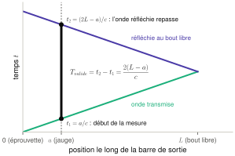\
*Figure H.7a — Durée de mesure valide sur la barre de sortie : l'onde transmise atteint la jauge à $t_1$ ; réfléchie au bout libre, elle repasse sur la jauge à $t_2$. Entre les deux, la jauge ne voit que l'onde qui vient de l'éprouvette.*

L'onde transmise part de l'éprouvette à $t = 0$, atteint la jauge à $t_1 = a/c$, continue jusqu'au bout libre, s'y réfléchit (la traction revient en compression) et repasse sur la jauge à $t_2 = (2L-a)/c$. Ensuite, la jauge voit deux ondes superposées et la mesure n'est plus exploitable. D'où

$$
T_{valide} = t_2 - t_1 = \frac{2(L-a)}{c} .
$$

- [Roth 2015] : $2(4{,}35-0{,}403)/5\,175 = 1{,}53$ ms.
- Banc ETH [Beerli 2026] : barre de 5,99 m, jauges à 0,40 m, soit **2,33 ms**.

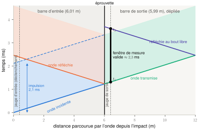\
*Figure H.7b — Diagramme de Lagrange du banc ETH, avec la barre de sortie « dépliée » à droite de l'éprouvette ($c\approx4\,870$ m/s, longueurs de [Beerli 2026], inverseur et éprouvette de longueur négligée). L'impulsion de 2,1 ms (bleu) atteint l'éprouvette vers 1,2 ms ; elle est presque entièrement réfléchie (orange) et en partie transmise (vert). Toute l'onde transmise passe sur la jauge de sortie avant le retour de sa réflexion (violet) : l'impulsion tient dans la fenêtre valide d'environ 2,3 ms.*

[Roth 2015] place la barre de sortie **parallèlement au-dessus** de la barre d'entrée, avec une seule inversion. Le système est environ deux fois plus court qu'un banc de Kolsky classique pour la même durée valide, ce qui rend possibles les essais « intermédiaires » vers 100 s⁻¹.

### H.8 Dispersion

La théorie 1D suppose une contrainte uniforme dans la section, donc une longueur d'onde grande devant le diamètre. Mais quand la barre s'allonge, elle se contracte latéralement (effet Poisson), et ce mouvement latéral demande lui aussi de l'inertie. Pour les **hautes fréquences** (longueur d'onde comparable au diamètre), cette inertie latérale ralentit l'onde : c'est la **dispersion** (théorie de Pochhammer–Chree). Chaque fréquence se propage à sa propre vitesse, et un signal change de forme en avançant.

Conséquences :

- Un front raide s'étale et se couvre d'**oscillations** (*ringing*) : [Beerli 2026] mesure 3 % d'oscillations sur l'onde incidente, avec une montée de 40 µs.
- Le signal à la jauge n'est pas exactement celui de l'interface : il faut **corriger la dispersion** (logiciel DAVID dans [Roth 2015]) en plus du décalage temporel.
- Un événement brutal comme la rupture contient beaucoup de hautes fréquences : [Roth & Mohr 2014] notent que la force mesurée ne chute pas brutalement à la rupture, à cause de la faible vitesse des hautes fréquences.
- Dans son modèle éléments finis, [Roth 2015] met $\nu = 0$ dans la barre d'entrée **pour supprimer la dispersion géométrique** : sans effet Poisson, pas d'inertie latérale. Avec $\nu = 0$, on a aussi $\lambda = 0$, donc $\lambda+2\mu = E$ : les deux vitesses de E.5 coïncident.

Ordre de grandeur : une montée de 40 µs correspond à une longueur d'onde d'environ 0,2 m, dix fois le diamètre. Le corps du signal est donc peu dispersé ; ce sont les « coins » qui le sont.

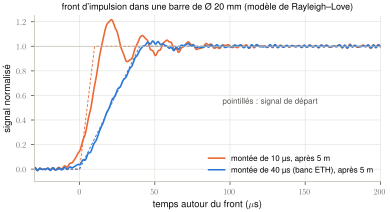\
*Figure H.8 — Front d'une impulsion après 5 m dans une barre d'acier de Ø 20 mm, calculé avec le modèle de Rayleigh–Love (qui approche Pochhammer–Chree aux basses fréquences). Un front de 10 µs se couvre d'oscillations d'environ 20 % ; un front de 40 µs, comme celui du banc ETH, n'en garde qu'environ 4 %, l'ordre de grandeur des 3 % mesurés par [Beerli 2026].*

### H.9 Flexion parasite

La barre de sortie étant au-dessus de la barre d'entrée, l'effort passe avec une **excentricité** $e = R_{in}+R_{out}$ ([Roth 2015], éq. 3). Il en résulte un moment de flexion et des **ondes de flexion**, qui sont dispersives et plus lentes que les ondes de traction. Parades :

- deux jauges diamétralement opposées : en flexion, l'une s'allonge quand l'autre se raccourcit, donc leur moyenne élimine la flexion ([Roth 2015]) ;
- des guides qui empêchent le mouvement hors plan de l'inverseur ;
- une zone de serrage de hauteur réduite pour diminuer l'excentricité ([Beerli 2026]).

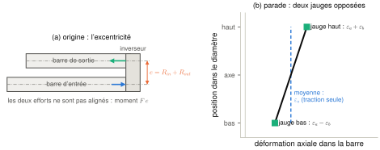\
*Figure H.9 — (a) Dans le LID, l'effort passe de la barre d'entrée à la barre de sortie avec une excentricité $e$ : la barre de sortie subit un moment de flexion. (b) La flexion ajoute une déformation qui varie linéairement dans le diamètre ; deux jauges diamétralement opposées la voient avec des signes contraires, et leur moyenne ne garde que la traction.*

[Roth 2015] vérifie par simulation que l'éprouvette ne fléchit pas plastiquement : les déformations plastiques en haut et en bas de l'éprouvette sont confondues. Le moment élastique dans la barre de sortie reste faible, d'environ 1,2 N·m.

### H.10 Ondes plastiques

Une fois que l'éprouvette a plastifié, un petit incrément de contrainte ne « voit » plus $E$ mais la **pente d'écrouissage** $h = d\sigma/d\varepsilon$ (contrainte vraie, déformation logarithmique). D'après H.4, la vitesse des incréments plastiques est (théorie de von Kármán et Taylor)

$$
c_p(\varepsilon) = \sqrt{\frac{h(\varepsilon)}{\rho}}\ \ll\ c_0 .
$$

Valeurs calculées avec les lois de [Beerli 2026] (F.6) :

| Matériau | $\varepsilon$ | $h$ (GPa) | $c_p$ (m/s) | aller-retour 19 mm | aller-retour 40 mm |
|---|---|---|---|---|---|
| DP590 | 0,01 | 7,3 | 960 | 39 µs | 83 µs |
| DP590 | 0,05 | 2,6 | 570 | 66 µs | 139 µs |
| DP590 | 0,167 (striction) | 0,77 | 310 | 121 µs | 255 µs |
| DP1000 | 0,01 | 9,7 | 1 110 | 34 µs | 72 µs |
| DP1000 | 0,03 | 2,2 | 530 | 71 µs | 150 µs |
| DP1000 | 0,05 (striction) | 1,05 | 365 | 104 µs | 218 µs |

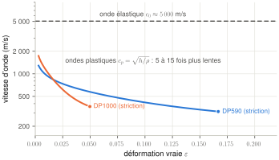\
*Figure H.10 — Vitesse des ondes plastiques $c_p = \sqrt{h/\rho}$ calculée avec les lois de F.6, jusqu'à la striction. Elle est 5 à 15 fois plus faible que la vitesse élastique et diminue à mesure que l'écrouissage s'essouffle.*

**Interprétation.** Les ondes élastiques égalisent l'éprouvette en quelques microsecondes. Mais une fois plastifiée, toute **variation** du chargement (fin de la montée, oscillation, pic de vitesse) ne se rééquilibre qu'au rythme des ondes plastiques, 5 à 15 fois plus lentes. À comparer à la durée totale d'un essai à 1 000 s⁻¹ jusqu'à 30 % : 300 µs.

**Pour la culture.** Il existe une **vitesse d'impact critique** au-delà de laquelle la déformation se concentre immédiatement près de l'extrémité frappée et rompt la barre, sans que le reste se déforme. Elle vaut environ $V_c = \sigma_y/(\rho c_0) + \int_0^{\varepsilon_u}c_p\,d\varepsilon$ : la vitesse que peut porter l'onde élastique jusqu'à la limite d'élasticité, plus celle que peuvent porter les ondes plastiques jusqu'à la striction. Le calcul avec les lois de F.6 donne environ 100 m/s pour le DP590 et 60 m/s pour le DP1000. C'est une théorie idéalisée (barre infinie, impact instantané, pas d'effet de vitesse), mais elle montre qu'à 40 m/s on n'en est plus très loin.

### H.11 Ondes en 3D (utile pour la simulation)

Dans un milieu massif, deux types d'ondes coexistent :

- ondes de **dilatation** (longitudinales, déformation uniaxiale) : $c_d = \sqrt{(\lambda+2\mu)/\rho}$, soit environ 5 900 m/s dans l'acier ;
- ondes de **cisaillement** (transversales) : $c_s = \sqrt{\mu/\rho}$, soit environ 3 100 m/s.

$c_d > c_0$ (E.5). En explicite, c'est $c_d$ qui fixe le pas de temps stable (K.3).

---

## I. Le SHPB en traction avec inverseur

### I.1 Le principe de Kolsky (barres de Hopkinson en compression)

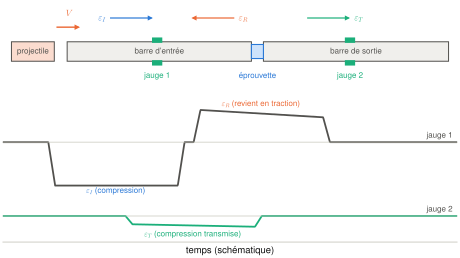\
*Figure I.1 — Barres de Hopkinson en compression (schéma) et signaux typiques des jauges : la jauge 1 voit passer l'onde incidente $\varepsilon_I$, puis l'onde réfléchie $\varepsilon_R$ ; la jauge 2 voit l'onde transmise $\varepsilon_T$.*

Le projectile crée une onde incidente $\varepsilon_I$. À l'éprouvette, une partie est réfléchie ($\varepsilon_R$) et une partie transmise ($\varepsilon_T$). Les barres restent élastiques, donc leurs jauges donnent forces et vitesses aux deux faces de l'éprouvette grâce à H.4. Convention : traction positive ; l'onde incidente et l'onde transmise vont vers la droite ($v = -c\,\varepsilon$), l'onde réfléchie vers la gauche ($v = +c\,\varepsilon$). Sur la face 1 (côté entrée), les ondes incidente et réfléchie se superposent ; sur la face 2, il n'y a que l'onde transmise :

$$
v_1 = -c\,\varepsilon_I + c\,\varepsilon_R = -c\,(\varepsilon_I-\varepsilon_R),\quad F_1 = EA\,(\varepsilon_I+\varepsilon_R),
\qquad
v_2 = -c\,\varepsilon_T,\quad F_2 = EA\,\varepsilon_T,
$$

$$
\dot E_s = \frac{v_2-v_1}{L_s} = \frac{c}{L_s}\,(\varepsilon_I-\varepsilon_R-\varepsilon_T).
$$

**Si l'équilibre est atteint**, $F_1 = F_2$, donc $\varepsilon_I+\varepsilon_R = \varepsilon_T$, et les formules se simplifient en

$$
\dot E_s = -\frac{2c}{L_s}\,\varepsilon_R,
\qquad
S_s = \frac{EA}{A_s}\,\varepsilon_T .
$$

C'est l'analyse « à une onde » classique : très utilisée, mais **valable uniquement à l'équilibre**. L'analyse « à trois ondes » calcule $F_1$ et $F_2$ séparément et permet de **vérifier** l'équilibre.

### I.2 Faire de la traction avec des barres de compression : l'inverseur (LID)

Un SHPB travaille naturellement en compression. Pour tirer sur une tôle, [Dunand et al. 2013] ont proposé un **dispositif d'inversion de charge** (*Load Inversion Device*, LID), avec deux barres de sortie et une double inversion. [Roth 2015] le simplifie : une seule inversion et **une seule barre de sortie, en traction**, placée au-dessus de la barre d'entrée.

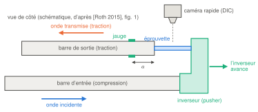\
*Figure I.2 — Le dispositif d'inversion de [Roth 2015] (principe, vue de côté). La barre d'entrée pousse l'inverseur vers la droite ; l'inverseur tire l'épaule droite de l'éprouvette, dont l'épaule gauche est serrée au bout de la barre de sortie. L'éprouvette et la barre de sortie sont donc en traction, et l'onde transmise remonte la barre de sortie jusqu'à sa jauge.*

L'inverseur (*pusher*) est poussé vers la droite par la barre d'entrée et **tire** dans le même sens l'épaule de l'éprouvette qui lui est fixée. L'autre épaule est serrée au bout de la barre de sortie, qui est donc mise en **traction**. L'onde transmise remonte la barre de sortie, vers la gauche, jusqu'à la jauge.

### I.3 Le banc automatisé de l'ETH

[Beerli 2026], §2.5 et fig. 4–6. C'est vraisemblablement le « SHPB automatisé » de ta Task I : fais-le confirmer.

| Élément | Caractéristiques |
|---|---|
| Lanceur | pneumatique automatisé, tube de 7,5 m ; retour du projectile par air comprimé |
| Projectile | acier, Ø 20 mm, **5 m**, $c = 4\,720$ m/s, soit une impulsion d'environ **2,1 ms** |
| Barre d'entrée | acier maraging, Ø 20 mm, 6,01 m, $c = 4\,871$ m/s ; jauge à 400 mm de l'impact (déclenchement de l'acquisition) |
| Inverseur | transforme la compression en traction ; serrage **par formes** (trois surfaces d'appui par épaule, qui s'emboîtent), **sans vis** ; éprouvettes jusqu'à 3,5 mm d'épaisseur et plus de 2 000 MPa de résistance |
| Barre de sortie | acier maraging, Ø 20 mm, 5,99 m ; jauges à 400 mm de l'éprouvette, acquisition à 400 kHz ; serrage élargi à 30 mm avec une hauteur de 11 mm (impédance constante) ; **durée valide 2,33 ms** |
| Caméras | Photron SA-Z (100 à 200 kHz) ; caméra infrarouge FLIR X6801sc |
| Arrêt | amortisseur hydraulique ; cycle complet de moins d'une minute par essai |

\
*Figure I.3 — Disposition du banc automatisé de [Beerli 2026] (longueurs à l'échelle, épaisseurs exagérées) : tube de lancement de 7,5 m, projectile de 5 m, barre d'entrée de 6,01 m et barre de sortie de 5,99 m, parallèle et au-dessus, avec les jauges à 0,4 m.*

L'acier **maraging** est un acier à très haute limite d'élasticité après traitement thermique : c'est ce qui permet aux barres de rester élastiques même à grande vitesse de projectile.

Deux points de [Beerli 2026] concernent directement ta Task I :

- **Validation par simulation** : l'équilibre est jugé en comparant la force de la jauge virtuelle de sortie et les forces calculées dans des **coupes aux deux extrémités de l'éprouvette**. Les trois signaux coïncident à mieux que 1 % pour une NT20 tirée à 1,4 m/s (50 s⁻¹ environ).
- **Choix de géométrie** : « *Only for the high strain rate uniaxial tension tests, a smaller geometry is chosen to maintain quasi-static equilibrium* ». Ils utilisent une petite UT (15 × 5 mm) à grande vitesse, au lieu de l'UT de 40 × 10 mm. **Ta Task I quantifie précisément ce compromis**, pour 19 et 40 mm.

### I.4 Ce qu'on mesure vraiment

- **La force**, par la jauge de la barre de sortie ([Roth 2015], éq. 4) : $F(t) = E_{out}A_{out}\,\varepsilon_T(t)$, après transport du signal jusqu'à l'interface et correction de la dispersion. **C'est la force côté sortie de l'éprouvette, et seulement elle.**
- **Le déplacement et la déformation**, par DIC sur la zone utile (extensomètre virtuel, B.10), et non à partir de l'onde réfléchie, qui serait difficile à interpréter à cause de l'impédance variable de l'inverseur ([Roth 2015]).

**Principe d'une jauge de déformation.** C'est une fine piste résistive collée sur la barre. Quand la barre s'allonge, la piste s'allonge et s'amincit, et sa résistance augmente : $\Delta R/R = K\,\varepsilon$, avec un facteur de jauge $K\approx2$. La jauge est montée dans un pont de Wheatstone, qui transforme cette petite variation en une tension proportionnelle à $\varepsilon$. Pour $\varepsilon$ de l'ordre de $10^{-4}$ à $10^{-3}$, $\Delta R/R$ ne vaut que $2\times10^{-4}$ à $2\times10^{-3}$ : le signal doit être amplifié, et il est sensible au bruit électrique, d'où le filtrage (100 kHz dans [Roth 2015]). Comme la jauge mesure la déformation de surface, deux jauges opposées sont nécessaires pour éliminer la flexion (H.9).

> **Pour la Task I.** **Conséquence capitale** : expérimentalement, on ne mesure **pas** la force côté entrée de l'éprouvette. Pour calculer une contrainte $F/S$, on **suppose** que les forces d'entrée et de sortie sont égales. C'est exactement l'hypothèse que la Task I doit justifier : par la simulation d'abord, où l'on a accès aux deux forces, puis par des vérifications indirectes sur les essais.

### I.5 La vitesse de chargement réelle de l'éprouvette

Un modèle 1D simple, construit avec H.4 à H.6, explique la plus grande partie de l'écart observé en B.9. On assimile l'inverseur à un prolongement de la barre d'entrée, et on note $F_s$ la force dans l'éprouvette.

**Côté entrée.** L'onde incidente de compression arrive avec la force $F_I = -Z_{in}V/2$ et la vitesse matérielle $v_I = V/2$. Au bout, la barre ne supporte que la réaction de l'éprouvette : la force totale y vaut $F_I + F_R = -F_s$. L'onde réfléchie a donc la force $F_R = -F_s + Z_{in}V/2$ et la vitesse $v_R = F_R/Z_{in}$ (onde vers la gauche). La vitesse du bout est la somme :

$$
v_{in} = v_I + v_R = V - \frac{F_s}{Z_{in}} .
$$

Si l'éprouvette n'offrait aucune résistance ($F_s = 0$), on retrouverait le bout libre de H.5 : la vitesse double, de $V/2$ à $V$.

**Côté sortie.** L'éprouvette tire le bout de la barre de sortie avec la force $F_s$, ce qui y lance une onde, donc une vitesse matérielle dans le sens de la traction :

$$
v_{out} = \frac{F_s}{Z_{out}} .
$$

**Vitesse relative des deux épaules** :

$$
\boxed{\;v_{rel} = v_{in}-v_{out} \approx V - F_s\left(\frac{1}{Z_{in}}+\frac{1}{Z_{out}}\right),
\qquad
\dot E_1^{zu} \approx \frac{v_{rel}}{L_{eff}}\;}
$$

**Contrôle avec [Roth 2015]**, où $F_s \approx 4$ kN et $Z \approx 11\,900$ N·s/m, soit $F_s/Z \approx 0{,}34$ m/s :

- vitesse de l'inverseur : 2,9 − 0,34 ≈ 2,56 m/s (l'article donne 2,6 à 2,8 m/s) ; 20,56 − 0,34 ≈ 20,2 m/s (l'article donne 20 à 22 m/s) ;
- vitesse relative : 3,27 − 0,67 ≈ 2,6 m/s pour 108 s⁻¹, soit $L_{eff}\approx24$ mm ; 19,8 − 0,67 ≈ 19,1 m/s pour 951 s⁻¹, soit $L_{eff}\approx20$ mm. On est proche des 19 mm de la zone utile, et l'écart restant est la « vraie » longueur effective (congés, épaules, serrage).

**Ce que ça implique pour tes 6 cas** (UT en acier de 1,5 mm à 1 000 MPa : $F_s \approx 7{,}5$ kN pour 5 mm de large, 15 kN pour 10 mm) :

- la correction $2F_s/Z$ vaut environ 1,2 m/s (19 mm) et 2,5 m/s (40 mm) ;
- **à 100 s⁻¹, elle est du même ordre que la vitesse nominale** (1,9 et 4 m/s) : le projectile doit aller nettement plus vite que $\dot E_1 l_0$ ;
- $F_s$ varie pendant l'essai (élasticité, écrouissage, striction), donc $v_{rel}$ aussi : **à basse vitesse, la vitesse de déformation n'est pas naturellement constante**. À 1 000 s⁻¹, la correction est faible (3 à 6 %).

\
*Figure I.5 — Vitesse de projectile nécessaire selon le modèle 1D de I.5, pour les deux géométries. L'écart entre les tirets (vitesse nominale $\dot E_1 l_0$) et les traits pleins est la correction $2F_s/Z$ : elle compte peu à 1 000 s⁻¹, mais augmente d'environ 60 % la vitesse nécessaire à 100 s⁻¹.*

> **Attention.** C'est un modèle idéal : inverseur assimilé à un tronçon de barre, serrages parfaits, pas de flexion. Il donne un **premier ordre de grandeur** pour choisir la vitesse du projectile. La simulation complète du banc donne la vraie réponse, et c'est l'un des livrables de la Task I.

### I.6 Les limites pratiques du banc

| Limite | D'où elle vient | Ordre de grandeur (banc ETH) |
|---|---|---|
| **Durée de chargement** | impulsion de durée $2L_{st}/c_{st}$ ; fenêtre valide de la barre de sortie (H.7) | 2,1 ms d'impulsion, 2,33 ms valides. **Déformation maximale : $\dot E_1\times T$, soit environ 21 % à 100 s⁻¹** |
| Contrainte dans les barres | $\rho c V/2$ | environ 19,5 MPa par m/s ; environ 830 MPa à 42 m/s |
| Course de l'inverseur | $\Delta l = 0{,}3\,l_0$ + parties élastiques | 5,7 mm (19 mm) et 12 mm (40 mm) |
| Images DIC | cadence × durée | à 1 000 s⁻¹ jusqu'à 30 % (0,3 ms) : 30 images à 100 kHz, 60 à 200 kHz |
| Champ de la caméra | résolution × taille de pixel ([Beerli 2026], tableau 1) | 512 px × 50 µm = 25,6 mm à 200 kHz, **trop court pour 40 mm** ; 640 px × 70 µm = 44,8 mm à 100 kHz |
| Montée en charge | forme de l'impulsion | environ 40 µs, avec 3 % d'oscillations |
| Flexion | excentricité des barres | faible si les jauges sont doublées |

> **À vérifier avec tes encadrants.** Avec un projectile de 5 m, on ne peut pas dépasser environ 21 % de déformation ingénieur à 100 s⁻¹ nominal, puisque 30 % demanderaient 3 ms de chargement. Soit la cible de 30 % ne s'applique pas à 100 s⁻¹, soit le banc que tu utiliseras a un autre projectile. Ne tire pas de conclusion sans avoir les vraies caractéristiques du banc.

\
*Figure I.6 — Déformation ingénieur atteinte en fonction du temps, à vitesse nominale constante. L'impulsion d'un projectile de 5 m dure 2,1 ms : à 100 s⁻¹, on s'arrête vers 21 %, en dessous de la cible de 30 %.*

---

## J. L'équilibre quasi-statique : le cœur de la Task I

### J.1 Ce qu'on appelle « équilibre » : quatre conditions à ne pas confondre

1. **Équilibre des forces** : $F_{\text{entrée}}(t)\approx F_{\text{sortie}}(t)$. D'après D.3, cela revient à dire que l'inertie de la zone utile est négligeable. C'est la condition pour qu'**une seule** contrainte $F/S$ ait un sens dans toute la zone utile.
2. **Homogénéité** de la déformation (et de sa vitesse) le long de la zone utile, avant la striction. Sans elle, on ne mesure pas un état « matériau » mais une moyenne d'états différents.
3. **Vitesse de déformation à peu près constante**. Sans elle, on ne sait pas à quelle vitesse attribuer la courbe.
4. **Pas de flexion parasite** (H.9), qui fausserait la force lue par les jauges.

Ces quatre conditions sont liées, mais pas équivalentes : on peut par exemple avoir des forces égales et une vitesse de déformation qui dérive. Un « bon » essai les vérifie toutes, sur la plage de déformation qu'on exploite.

### J.2 Premier mécanisme : les ondes transitoires

Au début de l'essai, la face de sortie ne « sait » rien tant que la première onde ne l'a pas atteinte. Ensuite, chaque aller-retour réduit l'écart entre les deux faces. Comme la barre est beaucoup plus impédante que l'éprouvette, l'onde se réfléchit presque entièrement à chaque extrémité (H.5), et la contrainte « monte » dans l'éprouvette par paliers successifs. On appelle **traversée** un passage de l'onde d'une face à l'autre, de durée $L/c_0$ (3,75 µs pour 19 mm, 7,9 µs pour 40 mm, H.2).

La règle empirique souvent citée, issue des essais de compression (Davies & Hunter 1963 ; Ravichandran & Subhash 1994), est qu'il faut **environ 3 à 4 traversées** pour que les deux faces soient à peu près à la même contrainte, si le chargement monte progressivement. C'est un ordre de grandeur, pas une loi établie pour ton montage.

**Quand la limite d'élasticité est-elle atteinte ?** On idéalise la montée en charge par une rampe : la vitesse de déformation passe linéairement de 0 à $\dot E$ en un temps $t_r$, puis reste constante. En intégrant,

$$
E(t) = \frac{\dot E\,t^2}{2\,t_r}\quad (t\le t_r),
\qquad
E(t) = \dot E\left(t-\frac{t_r}{2}\right)\quad (t\ge t_r).
$$

La limite d'élasticité est atteinte quand $E(t) = \varepsilon_y = \sigma_y/E$. On en déduit l'instant $t_y$, puis le nombre de traversées élastiques $t_y/(L/c_0)$ qui ont eu lieu avant.

**Estimation pour tes 6 cas.** Acier DP1000 ($\sigma_y = 752$ MPa, donc $\varepsilon_y\approx0{,}0038$), $t_r = 40$ µs (valeur mesurée par [Beerli 2026]) :

| | 100 s⁻¹ | 500 s⁻¹ | 1 000 s⁻¹ |
|---|---|---|---|
| Instant où la limite d'élasticité est atteinte | 58 µs (après la rampe) | 25 µs (pendant la rampe) | 17 µs (pendant la rampe) |
| Traversées élastiques avant, **19 mm** | 15 | 6,5 | 4,6 |
| Traversées élastiques avant, **40 mm** | 7,3 | 3,1 | **2,2** |
| Déformation atteinte pendant la montée ($\dot E\,t_r/2$) | 0,2 % | 1 % | 2 % |

Deux conséquences :

- À haute vitesse, **toute la partie élastique et la limite d'élasticité se jouent pendant la montée en charge**, avec peu de traversées. C'est la grandeur la moins fiable d'un essai dynamique, surtout avec l'éprouvette longue.
- Après la plastification, les ajustements se font au rythme des **ondes plastiques** (H.10), soit environ 70 µs (19 mm) et 150 µs (40 mm) par aller-retour pour le DP1000 à 3 %. Un essai à 1 000 s⁻¹ jusqu'à 30 % dure 300 µs : cela laisse environ 4 allers-retours plastiques pour 19 mm, et **2** pour 40 mm. Si l'éprouvette rompt vers 11 % d'allongement, l'essai ne dure même que 110 µs.

### J.3 Second mécanisme : l'inertie de la zone utile quand la vitesse change

Supposons la déformation déjà homogène (après quelques traversées), et la face de sortie presque immobile. On mesure ici la position $x$ depuis la face de sortie, dans le sens où l'inverseur tire, et on compte les vitesses positivement dans ce sens. Si la déformation est homogène, la vitesse varie linéairement le long de la zone utile, de 0 à la sortie à $v_{rel}$ à l'entrée :

$$
v(x,t) = v_{rel}(t)\,\frac{x}{L},\qquad a(x,t) = \dot v_{rel}(t)\,\frac{x}{L}.
$$

L'égalité exacte de D.3, écrite dans ce repère, donne (avec $A$ la section et $m = \rho A L$ la masse de la zone utile)

$$
F_{\text{entrée}} - F_{\text{sortie}} = \int_0^L\rho A\,\frac{\dot v_{rel}\,x}{L}\,dx = \frac{m}{2}\,\dot v_{rel},
$$

et comme $v_{rel} = \dot E\,L$ (B.9), on a $\dot v_{rel} = \ddot E\,L$, d'où

$$
\boxed{\;\Delta\sigma = \frac{F_{\text{entrée}}-F_{\text{sortie}}}{A} \approx \frac12\,\rho\,L^2\,\ddot E\;}
$$

**Ce que dit cette formule :**

- Si la vitesse de chargement est **constante** ($\ddot E = 0$), ce mécanisme ne crée **aucun** déséquilibre, quelle que soit la vitesse. C'est pour cela qu'on cherche une impulsion aussi « rectangulaire » que possible.
- Le déséquilibre naît quand la vitesse **change** : pendant la montée en charge, pendant les oscillations, et plus tard dans la striction (où la déformation se concentre et où les vitesses locales changent).
- Il croît comme $L^2$. À $\dot E$ et temps de montée donnés, l'éprouvette de 40 mm cumule deux handicaps qui se multiplient : une masse par unité de section 2,1 fois plus grande, et une accélération 2,1 fois plus forte (il faut atteindre une vitesse double dans le même temps). Son $\Delta\sigma$ est donc environ 4,4 fois plus grand.
- Le signe : quand la vitesse augmente, la force d'entrée dépasse la force de sortie. La force mesurée (celle de sortie, I.4) **sous-estime** alors la contrainte côté entrée.

Pour fixer les idées, la masse d'une zone utile de 1,5 mm d'épaisseur vaut environ 1,1 g (19 × 5 mm) et 4,7 g (40 × 10 mm).

**Ordres de grandeur pendant une montée de 40 µs** ($\ddot E\approx\dot E/t_r$, $\rho = 7\,850$ kg/m³) :

| | 100 s⁻¹ | 500 s⁻¹ | 1 000 s⁻¹ |
|---|---|---|---|
| $\Delta\sigma$, 19 mm | 4 MPa | 18 MPa | 35 MPa |
| $\Delta\sigma$, 40 mm | 16 MPa | 78 MPa | **157 MPa** |

\
*Figure J.3 — (a) Si la déformation est homogène et la face de sortie immobile, vitesse et accélération varient linéairement le long de la zone utile ; l'inertie correspondante vaut $(m/2)\,\dot v_{rel}$. (b) Déséquilibre $\Delta\sigma$ estimé pendant une montée de 40 µs (tableau ci-dessus) : il est 4,4 fois plus grand pour la 40 mm et croît avec la vitesse.*

Il faut comparer ces valeurs à une contrainte d'écoulement de l'ordre de 1 000 MPa, mais **surtout à la contrainte instantanée**, bien plus faible pendant la phase élastique. Pour le pic de vitesse de [Roth 2015] (2 m/s de plus sur un pic d'environ 50 µs, soit une montée en environ 25 µs), on trouve un écart de 45 N (0,6 %) sur une éprouvette de 19 mm et de 190 N (1,3 %) sur une de 40 mm.

> **Attention.** Ces calculs sont des estimations de coin de table : profil linéaire supposé, rampe idéalisée, pas de congés, pas d'effet de la striction. Ils servent à savoir **quoi regarder** dans tes simulations, pas à conclure à leur place.

### J.4 Un critère quantitatif

Dans une simulation, on dispose des forces dans des coupes aux deux extrémités de la zone utile. On suit par exemple l'écart relatif

$$
R(t) = \frac{2\,\lvert F_{\text{entrée}}(t)-F_{\text{sortie}}(t)\rvert}{F_{\text{entrée}}(t)+F_{\text{sortie}}(t)} ,
$$

c'est-à-dire la différence des deux forces rapportée à leur moyenne. On déclare l'éprouvette « en équilibre » à partir de l'instant (ou de la déformation) où $R$ reste sous un seuil. Un seuil de quelques pourcents (souvent 5 %) est courant en compression. [Beerli 2026] obtient moins de 1 % sur sa NT20 à 50 s⁻¹. **Le seuil à retenir est à fixer avec tes encadrants.**

Au tout début de l'essai, les deux forces sont presque nulles et $R$ n'a pas de sens (on divise par presque zéro) : on ne regarde $R$ qu'à partir d'une force minimale, par exemple quelques pourcents de la force maximale.

Il faut compléter ce critère par :

- la **force « mesurable »**, celle de la jauge virtuelle de la barre de sortie, transportée jusqu'à l'interface. C'est la seule que l'expérience fournit ;
- l'**homogénéité**, avec des déformations locales (des extensomètres virtuels comme en DIC) à plusieurs positions le long de la zone utile ;
- la **constance** de la vitesse de déformation au centre.

**Illustration avec un modèle 1D.** Pour voir ces mécanismes à l'œuvre, on peut simuler la seule zone utile comme une barre 1D élastoplastique (DP1000, loi Swift–Voce de F.6, indépendante de la vitesse), placée entre deux barres d'impédance $Z$ : à la sortie, $v = F/Z$ ; à l'entrée, $v = V\,r(t) - F/Z$, avec une rampe $r(t)$ de 40 µs et la vitesse de projectile $V$ de I.5. Le calcul (différences finies explicites, 100 éléments) prend quelques secondes. Il néglige les congés, la géométrie 3D, l'effet de la vitesse sur le matériau et tout amortissement : il montre des **tendances**, pas des valeurs à retenir. C'est un bon exercice à refaire toi-même avant de passer à Abaqus.

\
*Figure J.4a — Contraintes aux deux faces de la zone utile à 1 000 s⁻¹ (modèle 1D). Pendant la montée (zone grisée), la face d'entrée est en avance sur la face de sortie, qui est celle que mesure la jauge. L'écart se referme vers 25 µs pour la 19 mm et vers 60 µs pour la 40 mm.*

\
*Figure J.4b — Critère $R$ tracé en fonction de la déformation (modèle 1D). Les points marquent la déformation à partir de laquelle $R$ reste sous 5 % : environ 0,1 % et 0,3 % à 100 s⁻¹, 0,9 % (19 mm) et 3,8 % (40 mm) à 1 000 s⁻¹. Le pic du début correspond à l'arrivée de la première onde, quand la face de sortie n'est pas encore chargée.*

\
*Figure J.4c — Vitesse de déformation locale, rapportée à la vitesse nominale, le long de la zone utile et au cours du temps (modèle 1D). Blanc : égale à la nominale ; rouge : plus rapide ; bleu : plus lente. Même quand les forces sont égales ($R<5$ %), la déformation n'est pas homogène : des ondes plastiques lentes font des allers-retours, avec des écarts de l'ordre de ±15 % pour la 19 mm et de ±40 à 50 % pour la 40 mm. Sans amortissement ni effet de la vitesse, le modèle 1D exagère probablement leur persistance, mais la leçon reste : l'homogénéité (condition 2 de J.1) se vérifie à part, avec des extensomètres virtuels.*

### J.5 Pourquoi c'est si important

- Sans équilibre, $F/S$ ne représente pas la contrainte dans l'éprouvette, et la courbe n'est pas une courbe « matériau ».
- On ne mesure que la force **de sortie** (I.4) : l'équilibre est l'hypothèse qui la rend représentative de toute la zone utile.
- **Pour la suite du projet** : si l'équilibre est vérifié, on peut simuler **seulement l'éprouvette**, en lui imposant les déplacements mesurés par DIC, au lieu de simuler tout le banc. C'est ce que font [Roth & Mohr 2014] (§5.1 : « *quasi-static loading conditions prevail in all experiments [...] As a consequence, the modeling of the full specimen (or even the entire SHPB system) could be omitted* »). L'identification inverse des paramètres des modèles, prévue dans la suite du projet (Task III), demande des centaines de simulations : elle n'est praticable qu'à cette condition.

### J.6 Le compromis 19 mm / 40 mm

| Critère | Avantage à | Pourquoi |
|---|---|---|
| Traversées d'onde avant la limite d'élasticité | 19 mm | environ 2 fois plus de traversées (J.2) |
| Déséquilibre inertiel ($\propto L^2\ddot E$) | 19 mm | environ 4,4 fois plus faible (J.3) |
| Vitesse et course à fournir pour un $\dot E$ donné | 19 mm | moitié ; le 40 mm demande jusqu'à 40 m/s et 12 mm de course |
| Correction $F_s/Z$ sur la vitesse (I.5) | 19 mm | section plus petite, donc force plus faible |
| Champ de la caméra à haute cadence | 19 mm | tient dans les 25,6 mm disponibles à 200 kHz ; le 40 mm impose 100 kHz, donc deux fois moins d'images |
| Pixels DIC dans la zone utile (précision de $\varepsilon_w$, donc de $r$) | 40 mm | zone plus grande, plus de pixels sur la largeur et la longueur |
| Sensibilité de la déformation ingénieur à la striction | 40 mm | la striction occupe une fraction plus petite de la longueur de base (F.9) |
| Même géométrie qu'en quasi-statique ([Beerli 2026] : UT de 40 × 10 mm) | 40 mm | comparaison directe entre vitesses, sans effet de géométrie |

Il n'y a donc pas de géométrie « meilleure » dans l'absolu : la 19 mm est favorable à l'équilibre, la 40 mm à la mesure et à la comparaison avec le quasi-statique. La Task I doit dire, pour chaque vitesse, si la 40 mm reste acceptable.

\
*Figure J.6 — Les deux éprouvettes à la même échelle, avec les champs de la caméra rapide ([Beerli 2026], tableau 1). À 200 kHz, le champ de 25,6 mm couvre la zone utile de 19 mm, mais pas celle de 40 mm, qui impose de passer à 100 kHz (champ de 44,8 mm).*

### J.7 Tableau de faisabilité à compléter par tes simulations

Hypothèses : acier de 1,5 mm d'épaisseur à environ 1 000 MPa, largeurs de 5 et 10 mm, banc de [Beerli 2026] (impulsion de 2,1 ms), modèle 1D de I.5. **Ce sont des estimations à remplacer par tes résultats.**

Comment les colonnes sont calculées :

- vitesse nominale : $v = \dot E\,l_0$ (B.9) ;
- vitesse du projectile : $V\approx v + 2F_s/Z$ (I.5), avec $F_s\approx 7{,}5$ kN (19 mm) et 15 kN (40 mm), $Z\approx12\,200$ N·s/m ;
- contrainte dans les barres : $\rho c V/2\approx19{,}5$ MPa par m/s de projectile (H.6) ;
- course : $0{,}3\,l_0$ ; durée : $0{,}3/\dot E$ ; nombre d'images : durée × cadence de la caméra.

**Vitesses et efforts**

| Cas | Vitesse nominale ($\dot E\,l_0$) | Projectile estimé ($v+2F_s/Z$) | Contrainte dans les barres | Course pour 30 % |
|---|---|---|---|---|
| 19 mm, 100 s⁻¹ | 1,9 m/s | environ 3,1 m/s | 60 MPa | 5,7 mm |
| 19 mm, 500 s⁻¹ | 9,5 m/s | environ 10,7 m/s | 210 MPa | 5,7 mm |
| 19 mm, 1 000 s⁻¹ | 19 m/s | environ 20 m/s | 390 MPa | 5,7 mm |
| 40 mm, 100 s⁻¹ | 4 m/s | environ 6,5 m/s | 130 MPa | 12 mm |
| 40 mm, 500 s⁻¹ | 20 m/s | environ 22 m/s | 440 MPa | 12 mm |
| 40 mm, 1 000 s⁻¹ | 40 m/s | environ 42 m/s | 830 MPa | 12 mm |

**Durées et mesure**

| Cas | Durée jusqu'à 30 % | 30 % atteignables en 2,1 ms ? | Images DIC à 100 kHz | Images DIC à 200 kHz |
|---|---|---|---|---|
| 19 mm, 100 s⁻¹ | 3 ms | non (environ 21 %) | 210 (sur 2,1 ms) | 420 |
| 19 mm, 500 s⁻¹ | 0,6 ms | oui | 60 | 120 |
| 19 mm, 1 000 s⁻¹ | 0,3 ms | oui | 30 | 60 |
| 40 mm, 100 s⁻¹ | 3 ms | non (environ 21 %) | 210 (sur 2,1 ms) | champ trop petit |
| 40 mm, 500 s⁻¹ | 0,6 ms | oui | 60 | champ trop petit |
| 40 mm, 1 000 s⁻¹ | 0,3 ms | oui, si le lanceur atteint 42 m/s | 30 | champ trop petit |

### J.8 Les leviers pour améliorer l'équilibre

Chaque levier a un prix, qu'il faut mettre en regard du gain :

- **Raccourcir la zone utile** : $\Delta\sigma\propto L^2$ et plus de traversées. Prix : moins de pixels DIC, plus de sensibilité à la striction.
- **Allonger la montée en charge** : $\ddot E\approx\dot E/t_r$ diminue. En compression, on le fait avec une **mise en forme de l'impulsion** (*pulse shaper*), un petit disque de métal mou (cuivre, par exemple) placé sur la face d'impact : il s'écrase et arrondit le front de l'onde. Prix : le début de l'essai se fait à vitesse variable. À discuter avec tes encadrants pour le banc avec inverseur.
- **Réduire les oscillations** de l'impulsion (qualité de l'impact, alignement, *pulse shaper* aussi) : elles créent des $\ddot E$ non nuls pendant tout l'essai.
- **N'exploiter la courbe qu'à partir d'une certaine déformation** : c'est la solution de base. On déclare la courbe valable à partir de la déformation où $R$ reste sous le seuil, et on ne l'utilise pas avant.

### J.9 Ce que la Task I doit produire

Pour chaque combinaison géométrie × vitesse :

1. **L'équilibre** : $R(t)$, et la déformation à partir de laquelle il reste sous le seuil.
2. **La vitesse de chargement nécessaire** (du projectile, ou de l'inverseur) pour obtenir la vitesse de déformation visée **dans la zone utile**, et son évolution au cours de l'essai.
3. **La course et la durée** pour atteindre 30 %, et leur compatibilité avec le banc.
4. Après les essais : la **comparaison essais-simulations** (forces, déformations DIC, vitesses), les conditions d'essai recommandées et l'**évaluation de la qualité des données** (à partir de quelle déformation elles sont exploitables).

Une présentation possible est une carte à six cases, qui donne pour chaque cas la déformation d'équilibre, la vitesse de projectile, la déformation maximale atteignable et un verdict (exploitable, exploitable après X %, non exploitable).

---

## K. La simulation dynamique explicite

### K.1 Des puissances virtuelles aux éléments finis

On découpe l'éprouvette (et les barres) en **éléments**, reliés par des **nœuds**. Dans chaque élément, le déplacement est interpolé à partir des déplacements des nœuds par des **fonctions de forme** $N_a$ (des polynômes qui valent 1 au nœud $a$ et 0 aux autres) :

$$
\underline{u}(\underline{X},t) = \sum_a N_a(\underline{X})\,\underline{u}_a(t).
$$

On écrit ensuite le théorème des puissances virtuelles (D.4) pour des vitesses virtuelles de la même forme. Cette écriture intégrale de l'équilibre s'appelle la **forme faible** (par opposition à la forme ponctuelle $\operatorname{div}\underset{\sim}{\sigma} = \rho\,\underline{a}$). On obtient un système d'équations différentielles sur les déplacements nodaux, rangés dans un grand vecteur $\mathbf{u}$ :

$$
\mathbf{M}\,\ddot{\mathbf{u}} = \mathbf{F}_{ext} - \mathbf{F}_{int},
\qquad
\mathbf{M} = \int\rho\,\mathbf{N}^T\mathbf{N}\,dV,\qquad
\mathbf{F}_{int} = \int\mathbf{B}^T\boldsymbol{\sigma}\,dV .
$$

$\mathbf{M}$ est la **matrice de masse**, $\mathbf{N}$ la matrice des fonctions de forme, $\mathbf{B}$ celle de leurs dérivées (elle transforme les déplacements nodaux en déformations), $\boldsymbol{\sigma}$ les contraintes rangées en vecteur (A.5). $\mathbf{F}_{int}$ est la version discrète de $\int\underset{\sim}{\sigma}:\underset{\sim}{D}^\star\,dv$. **Ce n'est rien d'autre que la loi de Cauchy sous forme faible** : forces extérieures moins forces intérieures égale masse fois accélération, nœud par nœud.

\
*Figure K.1 — Discrétisation 1D : chaque fonction de forme $N_a$ vaut 1 à son nœud et 0 aux autres ; le déplacement approché est une ligne brisée qui passe par les valeurs nodales $u_a$.*

La loi de comportement intervient dans le calcul de $\boldsymbol{\sigma}$, aux **points d'intégration** de chaque élément : à partir de l'incrément de déformation, on met à jour les contraintes et les variables internes (déformation plastique, température).

### K.2 Implicite ou explicite ?

| | Implicite (Abaqus/Standard) | Explicite (Abaqus/Explicit) |
|---|---|---|
| Principe | à chaque pas, on **résout** l'équilibre (itérations de Newton) | on **avance** dans le temps par différences centrées, sans résoudre de système |
| Pas de temps | grand | **très petit** (condition de stabilité) |
| Coût d'un pas | élevé (inversion d'une grande matrice) | très faible (masse diagonale) |
| Adapté à | quasi-statique, problèmes lents | **dynamique rapide, ondes, contacts**, grandes déformations |

Le schéma explicite des **différences centrées** calcule les vitesses aux demi-pas et les déplacements aux pas entiers :

$$
\dot{\mathbf{u}}^{\,n+1/2} = \dot{\mathbf{u}}^{\,n-1/2} + \Delta t\,\mathbf{M}^{-1}\left(\mathbf{F}_{ext}-\mathbf{F}_{int}\right)^n,
\qquad
\mathbf{u}^{\,n+1} = \mathbf{u}^{\,n} + \Delta t\,\dot{\mathbf{u}}^{\,n+1/2} .
$$

\
*Figure K.2 — Schéma des différences centrées : l'accélération au pas $n$ met à jour la vitesse au demi-pas suivant, qui met à jour le déplacement au pas suivant. Aucun système n'est résolu.*

En explicite, on remplace $\mathbf{M}$ par une matrice **diagonale** (la masse de chaque élément est répartie sur ses nœuds, *lumped mass*). Son inverse est alors immédiat, et chaque pas ne coûte qu'un calcul des forces intérieures. En contrepartie, le pas de temps doit être très petit.

Le schéma explicite résout naturellement les ondes : l'information se propage d'élément en élément à chaque pas, exactement comme une onde. C'est pour cela qu'il est adapté au SHPB.

### K.3 La condition de stabilité

Le pas de temps doit être plus petit que le temps que met l'onde **la plus rapide** à traverser le **plus petit** élément (condition de Courant) :

$$
\Delta t \lesssim \frac{L_e^{min}}{c_d},\qquad c_d = \sqrt{\frac{\lambda+2\mu}{\rho}}\approx5\,900\ \text{m/s (acier)} .
$$

Physiquement, une onde ne doit pas « sauter » un élément en un pas, sinon le calcul diverge. On utilise $c_d$ et non $c_0$ : dans un élément 3D, la déformation latérale est gênée à l'échelle de l'élément, et l'onde la plus rapide est l'onde de dilatation (H.11). Abaqus calcule ce pas automatiquement et l'affiche dans le fichier `.sta` : on ne le choisit pas, on le subit.

\
*Figure K.3 — Condition de stabilité : pendant un pas de temps, le front de l'onde la plus rapide ne doit pas traverser plus d'un élément.*

| Taille d'élément | Pas de temps | Nombre de pas pour 2,3 ms |
|---|---|---|
| 0,1 mm (zone utile de [Beerli 2026] : 16 éléments sur 1,5 mm) | environ 17 ns | environ 135 000 |
| 0,5 mm (éprouvette de [Roth 2015]) | environ 85 ns | environ 27 000 |
| 5 mm (barres) | environ 850 ns | environ 2 700 |

> **Attention.** C'est le **plus petit élément du modèle** (celui de l'éprouvette) qui fixe le pas de **tout** le modèle, barres de 6 m comprises. C'est pour cela que la finesse du maillage de l'éprouvette coûte cher dans une simulation de banc complet.

### K.4 Les modèles des articles : ton point de départ

| | [Roth 2015] | [Beerli 2026] |
|---|---|---|
| Logiciel | Abaqus/Explicit | Abaqus/Explicit 2023 |
| Modèle | banc complet, demi-symétrie | banc complet, demi-symétrie |
| Éléments | C3D8R | C3D8R (barres), C3D8RT (éprouvettes seules, thermomécanique) |
| Maillage | barre d'entrée : 5 mm (axial) × 2 mm ; inverseur et barre de sortie : 2 × 1 mm ; éprouvette : 0,5 mm, 4 éléments dans l'épaisseur | barres : 5 mm ; éprouvette seule : 0,1 mm, 16 éléments dans l'épaisseur |
| Barres | élastiques ; entrée : $E = 179$ GPa, $\nu = 0$ ; sortie : 214 GPa, $\nu = 0{,}3$ ; inverseur : 210 GPa | élastiques linéaires |
| Éprouvette | von Mises, écrouissage isotrope, **indépendant de la vitesse** ; suppression des éléments à $\bar\varepsilon^p = 0{,}7$ | von Mises, écrouissage isotrope (type DP1000), indépendant de la vitesse (étude du serrage) |
| Chargement | histoire de vitesse **mesurée**, imposée au bout de la barre d'entrée | |
| Liaisons | paliers rigides sans frottement ; frottement 0,2 entre barre et inverseur ; *tie* aux mors | |
| Jugement de l'équilibre | pas dans cet article (renvoi à [Dunand et al. 2013], jusqu'à 15 m/s) | **jauge virtuelle de sortie et coupes aux deux faces de l'éprouvette** |

**Vocabulaire du tableau.**

- **C3D8R** : élément **C**ontinu **3D** à **8** nœuds (une brique), à intégration **R**éduite (un seul point d'intégration au centre). C'est l'élément standard d'Abaqus/Explicit. **C3D8RT** : le même, avec en plus la température comme inconnue aux nœuds, pour les calculs thermomécaniques couplés.
- **Demi-symétrie** : la géométrie et le chargement sont symétriques par rapport à un plan ; on ne modélise qu'une moitié, et on bloque sur ce plan le déplacement normal. Le calcul coûte deux fois moins cher.
- **Tie** : liaison qui colle deux surfaces maillées différemment (les nœuds de l'une suivent l'autre). Elle modélise ici un serrage parfait de l'éprouvette dans les mors.
- **Paliers** : les supports qui guident les barres. « Rigides sans frottement » veut dire qu'ils empêchent les barres de sortir de l'axe sans les freiner.
- **Suppression des éléments** (*element deletion*) : un élément qui atteint le critère de rupture est retiré du calcul, ce qui fait apparaître une fissure.
- **Jauge virtuelle** : l'élément de la barre maillée situé à la position de la vraie jauge ; on en sort la déformation axiale pour la traiter exactement comme le signal expérimental.

### K.5 Les pièges

- **Mass scaling** (augmenter artificiellement la masse pour agrandir le pas de temps). Il **change l'inertie et les vitesses d'onde** ($c\propto1/\sqrt\rho$) : c'est précisément ce que tu étudies. **À proscrire dans la Task I.** [Roth & Mohr 2014] et [Beerli 2026] ne l'utilisent que pour les simulations lentes et intermédiaires.
- **Chargement brutal.** Imposer d'un coup une vitesse finie crée une accélération infinie, donc un choc artificiel. Impose l'histoire de vitesse mesurée (comme [Roth 2015]), une rampe douce (amplitude *SMOOTH STEP* dans Abaqus), ou modélise l'impact du projectile.
- **Hourglass** (modes en sablier). Avec un seul point d'intégration, un C3D8R peut se déformer selon certains modes (en « sablier ») sans que ce point ne voie de déformation : ces modes ne coûtent aucune énergie et peuvent croître sans contrôle. Abaqus ajoute une rigidité artificielle pour les bloquer. Vérifie que l'énergie correspondante (ALLAE) reste petite devant l'énergie interne (ALLIE), de l'ordre de quelques pourcents au plus.
- **Viscosité volumique** (*bulk viscosity*). Abaqus/Explicit ajoute par défaut un amortissement numérique qui lisse les fronts d'onde. Garde les valeurs par défaut, mais sache qu'il existe quand tu regardes les oscillations.
- **Convergence en maillage.** Raffine en divisant la taille des éléments par deux jusqu'à ce que le résultat bouge de moins de 0,5 % (critère de [Dunand & Mohr 2010]). Après la localisation, et surtout avec l'adoucissement thermique, la convergence n'est plus garantie ([Beerli 2026]).
- **Fréquence de sortie.** Les forces de coupe et les jauges virtuelles doivent être enregistrées assez souvent : au moins à la fréquence d'acquisition réelle (400 kHz sur le banc ETH), idéalement plus, pour voir les oscillations sans repliement (un signal échantillonné trop lentement fait apparaître de fausses basses fréquences).
- **Filtrage.** Un filtre rend les courbes « belles » en masquant justement le déséquilibre. Regarde d'abord les signaux bruts. Si les essais sont filtrés (passe-bas à 100 kHz dans [Roth 2015]), applique le **même** filtre aux simulations avant de comparer.
- **Bilan d'énergie.** Surveille l'énergie totale (ETOTAL, à peu près constante), cinétique (ALLKE), interne (ALLIE), le travail extérieur (ALLWK) et la dissipation plastique (ALLPD). Dans l'éprouvette, le rapport énergie cinétique / énergie interne est un bon indicateur de l'importance de l'inertie.
- **Unités.** Abaqus n'a pas d'unités : tout doit être cohérent. En mm, N, s et MPa, la masse est en tonnes et la masse volumique de l'acier vaut $7{,}85\times10^{-9}$ t/mm³. C'est une source d'erreur très fréquente.
- **Précision.** Avec plus de $10^5$ incréments, les erreurs d'arrondi s'accumulent : travaille en **double précision** (recommandé par [Dunand & Mohr 2010]).
- **Loi de l'éprouvette.** Commence avec une loi indépendante de la vitesse (comme [Roth 2015]) pour isoler les effets d'ondes, puis ajoute l'effet de la vitesse (Johnson–Cook, F.7) et, si besoin, la thermique (G).

\
*Figure K.5 — Pourquoi les C3D8R ont besoin d'un contrôle du sablier (dessin en 2D). Dans le mode en sablier, les nœuds bougent mais la déformation au point d'intégration central reste nulle : ce mode ne coûte aucune énergie. Un cisaillement réel, lui, est vu par le point d'intégration.*

### K.6 Comment évaluer l'équilibre dans une simulation : méthode

1. Définis des **coupes** (Abaqus : *integrated output section* ou *free body cut*) aux deux extrémités de la zone utile, et éventuellement au milieu. Abaqus y calcule la force résultante $F = \int_S\sigma_{11}\,ds$.
2. Sors la déformation de la **jauge virtuelle** de la barre de sortie (élément à 400 mm de l'éprouvette), calcule $F = E A\varepsilon$ et décale-la dans le temps de $a/c$ pour la ramener à l'interface (H.4).
3. Trace $F_{\text{entrée}}$, $F_{\text{sortie}}$, $F_{jauge}$ et $R(t)$, en fonction du temps **et** de la déformation ingénieur de la zone utile.
4. Place des **extensomètres virtuels** (deux nœuds dont on suit l'écartement, comme en DIC) à plusieurs positions pour vérifier l'homogénéité, et trace $\dot E(t)$ au centre.
5. **Le test le plus parlant** : reconstruis la courbe contrainte-déformation « comme en expérience » ($F_{jauge}/S_0$ en fonction de la déformation de l'extensomètre virtuel) et compare-la à la loi que tu as donnée au matériau, à la même vitesse. L'écart entre les deux est exactement l'erreur de la méthode expérimentale.
6. Fais varier la géométrie (19 et 40 mm), la vitesse (100, 500 et 1 000 s⁻¹), et éventuellement le temps de montée.

\
*Figure K.6 — Sorties à prévoir dans le modèle : forces dans des coupes aux deux extrémités de la zone utile, extensomètres virtuels le long de la zone utile, et déformation de la jauge virtuelle sur la barre de sortie, à la position de la vraie jauge.*

---

## L. Correspondance des notations : fiche et articles

Les articles n'utilisent pas les mêmes lettres que cette fiche, et une même lettre y désigne parfois plusieurs choses. Ce tableau fait le lien.

| Grandeur | Dans cette fiche | Dans les articles ([Roth], [Beerli]) | Attention |
|---|---|---|---|
| Contrainte de Cauchy (« vraie ») | $\underset{\sim}{\sigma}$ | $\boldsymbol\sigma$ (gras), *true stress* | |
| Contrainte nominale (« ingénieur ») | $\underset{\sim}{S}$ (Boussinesq), $S_{11} = F/S_0$ | *engineering stress* | |
| Déformation nominale | $E_1$ | *engineering strain* | |
| Déformation logarithmique | $E_0 = \ln\underset{\sim}{U}$ ; $\varepsilon$ en traction | $\varepsilon$, *true / logarithmic strain* | |
| Taux de déformation | $\underset{\sim}{D}$ ; $\dot E_1$ pour la vitesse nominale | $\dot\varepsilon$, *strain rate* | selon le contexte, *strain rate* désigne la vitesse nominale ou la vraie |
| Contrainte équivalente de von Mises | $\sigma_{eq}$ ou $\bar\sigma$ | $\bar\sigma$ | certains cours la notent $J_2(\underset{\sim}{\sigma})$ ; ailleurs, $J_2 = \tfrac12\underset{\sim}{\sigma}^{dev}:\underset{\sim}{\sigma}^{dev}$ et $\bar\sigma = \sqrt{3J_2}$ (C.7) |
| Limite d'élasticité | $\sigma_0$ (critères), $\sigma_y$ (courbes) | $\sigma_y$ | |
| Résistance à la déformation | $k$ | $k[\bar\varepsilon_p,\dot{\bar\varepsilon}_p,T]$ | |
| Déformation plastique équivalente | $\bar\varepsilon^p$ | $\bar\varepsilon_p$ | exposant ou indice selon l'auteur |
| Allongement ; coefficient de Lamé ; multiplicateur plastique | $\lambda$ ; $\lambda$ ; $\dot\lambda$ | $\dot\lambda$ | même lettre pour trois choses : le contexte tranche |
| Module de cisaillement | $\mu$ | $G$ | $G$ est aussi la matrice du potentiel de Hill'48 (F.8) |
| Module de compressibilité | $\kappa$ | $K$ | [Beerli 2026] note $\kappa$ la **conductivité** |
| Conductivité thermique | $k_{th}$ | $\kappa$ | à ne pas confondre avec la résistance $k$ |
| Chaleur massique | $C$ | $C_p$ | pour un solide, les chaleurs à pression et à volume constants sont quasi égales |
| Coefficient de Taylor–Quinney | $\beta_{TQ}$ | $\beta_{TQ}$ ([Beerli]) ; $\eta_k$ ([Roth & Mohr 2014]) | |
| Paramètre de Voce | $\beta$ | $\beta$ | ne pas confondre avec $\beta_{TQ}$ |
| Triaxialité | $\eta$ | $\eta$ | ne pas confondre avec le $\eta_k$ de Taylor–Quinney |
| Paramètre de Lode | $\bar\theta$ | $\bar\theta$, $\theta$ | $\theta$ seul désigne parfois l'angle de Lode, pas le paramètre normé |
| Tenseur d'élasticité | $\underset{\approx}{\Lambda}$ | $\mathbb{C}$ | |
| Impédance | $Z = \rho c A$ | $Z$ | parfois définie sans la section : $\rho c$ |

---

## M. Ordres de grandeur à garder en tête

| Grandeur | Valeur typique | Où c'est expliqué |
|---|---|---|
| Vitesse d'onde en barre (acier, alu) | environ 5 000 m/s (mesuré : 4 720 à 5 175 m/s) | H.2 |
| Vitesse d'onde de dilatation (acier) | environ 5 900 m/s | H.11 |
| Vitesse des ondes plastiques (DP) | 300 à 1 100 m/s | H.10 |
| $\rho c_0$ (acier) | environ 39 MPa par m/s | H.4 |
| Impédance d'une barre de Ø 20 mm en acier | environ 12 000 N·s/m | H.5 |
| Aller-retour élastique dans 19 / 40 mm | 7,5 / 15,8 µs | H.2 |
| Aller-retour plastique dans 19 / 40 mm (DP à quelques %) | 40 à 250 µs | H.10 |
| Durée d'impulsion (projectile de 5 m) | environ 2,1 ms | H.6 |
| Durée valide (barre de sortie du banc ETH) | 2,33 ms | H.7 |
| Montée en charge mesurée | environ 40 µs | I.3 |
| Durée d'un essai jusqu'à 30 % à 100 / 500 / 1 000 s⁻¹ | 3 / 0,6 / 0,3 ms | J.7 |
| Vitesse nominale 19 mm / 40 mm à 1 000 s⁻¹ | 19 / 40 m/s | J.7 |
| Masse d'une zone utile (1,5 mm d'épaisseur) | environ 1,1 g (19 × 5 mm) / 4,7 g (40 × 10 mm) | J.3 |
| Déséquilibre inertiel pendant la montée à 1 000 s⁻¹ (19 / 40 mm) | environ 35 / 160 MPa | J.3 |
| Déformation élastique à la limite d'élasticité | 0,2 à 0,6 % | E.2 |
| Déformation uniforme (striction) des DP | 5 à 18 % | F.9 |
| Échauffement adiabatique jusqu'à la striction | 13 à 30 K (plus de 100 K localement) | G.2 |
| Pas de temps explicite (éléments de 0,1 mm) | environ 17 ns | K.3 |

---

## N. Glossaire français / anglais

| Français | Anglais |
|---|---|
| Déformation nominale (ingénieur) / logarithmique (vraie) | Engineering strain / true, logarithmic strain |
| Contrainte nominale / vraie | Engineering stress / true stress |
| Vitesse de déformation | Strain rate |
| Gradient de la transformation | Deformation gradient |
| Tenseur taux de déformation | Rate of deformation tensor |
| Vecteur-contrainte | Traction vector |
| Contrainte équivalente | Equivalent stress |
| Limite d'élasticité | Yield stress, yield strength |
| Contrainte d'écoulement, résistance à la déformation | Flow stress, deformation resistance |
| Écrouissage | Strain hardening, work hardening |
| Surface de charge | Yield surface |
| Potentiel d'écoulement | Flow potential |
| Loi d'écoulement (non) associée | (Non-)associated flow rule |
| Multiplicateur plastique | Plastic multiplier |
| Déformation plastique équivalente | Equivalent plastic strain |
| Striction diffuse / localisée | Diffuse / localized necking |
| Zone utile ; congé ; épaule | Gauge section ; fillet ; shoulder |
| Direction de laminage / transverse | Rolling direction (RD) / transverse direction (TD) |
| Coefficient de Lankford | Lankford ratio, r-value |
| Triaxialité ; paramètre de Lode | Stress triaxiality ; Lode angle parameter |
| Échauffement adiabatique ; coefficient de Taylor–Quinney | Adiabatic heating ; Taylor–Quinney coefficient |
| Adoucissement thermique | Thermal softening |
| Barres de Hopkinson | Split Hopkinson pressure bar (SHPB), Kolsky bar ; SHTB en traction |
| Dispositif d'inversion de charge | Load inversion device (LID) |
| Projectile ; barre d'entrée ; barre de sortie | Striker ; input (incident) bar ; output (transmitted) bar |
| Onde incidente / réfléchie / transmise | Incident / reflected / transmitted wave |
| Impédance mécanique | Mechanical impedance |
| Temps de montée ; mise en forme de l'impulsion | Rise time ; pulse shaping |
| Oscillations parasites | Ringing |
| Équilibre des forces | Force equilibrium |
| Corrélation d'images numériques ; mouchetis | Digital image correlation (DIC) ; speckle pattern |
| Extensomètre virtuel | Virtual extensometer |
| Jauge de déformation | Strain gauge |
| Pas de temps stable ; mise à l'échelle des masses | Stable time increment ; mass scaling |
| Intégration réduite ; modes en sablier | Reduced integration ; hourglass modes |

---

## O. Questions pour vérifier que c'est acquis

Essaie de répondre avant d'ouvrir la réponse.

1. Pourquoi 30 % de déformation ingénieur ne font-ils que 26,2 % de déformation vraie ?

Parce que $E_0 = \ln(1+E_1) = \ln 1{,}3 = 0{,}262$. La déformation vraie rapporte chaque incrément à la longueur **actuelle**, qui augmente (B.5).

2. À vitesse de traverse constante, la vitesse de déformation vraie augmente-t-elle ou diminue-t-elle ?

Elle diminue : $D_{11} = v/l$ et $l$ augmente. À 30 %, elle vaut 77 % de sa valeur initiale (B.8).

3. Pourquoi peut-on mesurer un coefficient de Lankford sans mesurer l'épaisseur ?

Par l'incompressibilité plastique : $\varepsilon^p_t = -(\varepsilon^p_l+\varepsilon^p_w)$, et ces deux déformations se mesurent en surface par DIC (F.2, F.8).

4. D'où vient l'égalité « F_sortie − F_entrée = m⟨a⟩ » et que dit-elle ?

De la loi de Cauchy intégrée sur la zone utile, avec le théorème de la divergence et des faces latérales libres (D.3). Elle dit que les deux forces ne sont égales que si l'inertie de la zone utile est négligeable : c'est la définition même du quasi-statique.

5. Quelle est la différence entre la vitesse d'une onde et la vitesse de la matière ?

L'onde se déplace à $c\approx5\,000$ m/s ; la matière à $v$, quelques m/s. On a $\lvert\sigma\rvert = \rho c\lvert v\rvert$ et $\lvert v\rvert/c = \lvert\varepsilon\rvert$ (H.4).

6. De quelle équation de bilan déduit-on σ = −ρcv ?

Du saut de quantité de mouvement à travers un front, $[\![\underset{\sim}{\sigma}]\!]\cdot\underline{n} - \rho U[\![\underline{v}]\!] = \underline{0}$ (D.6), appliqué à un front qui avance dans une matière au repos, avec $U\approx-c$ (H.4).

7. Que devient une onde de compression qui arrive sur un bout libre ? Pourquoi l'éprouvette se comporte-t-elle presque comme un bout libre pour la barre ?

Elle revient en traction, et la vitesse du bout double. L'éprouvette a une impédance 20 à 40 fois plus faible (section bien plus petite), et encore plus faible en plasticité (H.5).

8. Pourquoi, dans le banc avec inverseur, la vitesse de l'éprouvette est-elle à peu près celle du projectile ?

L'onde incidente porte une vitesse $V/2$, qui double sur le quasi bout libre : $v_{in}\approx V - F_s/Z_{in}$. Côté sortie, le bout de la barre recule de $F_s/Z_{out}$ (I.5).

9. Pourquoi ne peut-on pas dépasser environ 21 % de déformation à 100 s⁻¹ avec un projectile de 5 m ?

L'impulsion dure $2L_{st}/c_{st}\approx2{,}1$ ms, et la déformation maximale vaut à peu près $\dot E\times T = 100\times0{,}0021 = 0{,}21$ (H.6, I.6). À vérifier sur le vrai banc.

10. Pourquoi l'onde plastique est-elle bien plus lente que l'onde élastique, et pourquoi ça compte ?

Parce que $c_p = \sqrt{h/\rho}$ et que la pente d'écrouissage $h$ vaut quelques GPa, contre 200 GPa pour $E$. Après la plastification, l'éprouvette ne se rééquilibre qu'au rythme de ces ondes lentes (H.10, J.2).

11. Si la vitesse de chargement était parfaitement constante, l'éprouvette serait-elle en équilibre ?

Une fois les transitoires passés et la déformation homogène, oui pour le mécanisme inertiel : $\Delta\sigma\approx\tfrac12\rho L^2\ddot E = 0$. Ce qui crée le déséquilibre, c'est la **variation** de vitesse : la montée en charge, les oscillations, la striction (J.3).

12. Pourquoi l'analyse « à une onde » du SHPB n'est-elle valable qu'à l'équilibre ?

Parce qu'elle utilise la seule onde transmise pour calculer la contrainte, ce qui suppose $F_1 = F_2$ (I.1).

13. Pourquoi la limite d'élasticité est-elle la grandeur la moins fiable d'un essai à 1 000 s⁻¹ ?

Elle est atteinte pendant la montée en charge, après seulement 2 à 5 traversées élastiques, là où l'accélération (donc le déséquilibre inertiel) est maximale (J.2, J.3).

14. Avec n = 0,15, à quelle déformation apparaît la striction ? Que dire d'une cible de 30 % ?

$\varepsilon_u = n = 0{,}15$ (vraie), soit $E_1 = e^{0{,}15}-1 = 0{,}16$. Une cible de 30 % est bien au-delà de la striction : la déformation ingénieur y dépend de la longueur de base (F.9).

15. Pourquoi l'échauffement adiabatique peut-il masquer une partie de l'effet de vitesse ?

Parce que l'adoucissement thermique (de l'ordre de 13 à 30 K jusqu'à la striction dans un DP, plus localement) compense en partie le durcissement dû à la vitesse (G.4).

16. Pourquoi faut-il proscrire le mass scaling dans les simulations de la Task I ?

Parce qu'il modifie l'inertie et les vitesses d'onde, qui sont précisément l'objet de l'étude (K.5).

17. Pourquoi le pas de temps d'une simulation explicite du banc complet est-il fixé par l'éprouvette et non par les barres ?

Parce que la condition de stabilité $\Delta t\lesssim L_e/c_d$ porte sur le plus petit élément du modèle, qui est dans l'éprouvette : environ 17 ns pour des éléments de 0,1 mm (K.3).

18. Si l'équilibre est vérifié, qu'est-ce que ça change pour la suite du projet ?

On peut simuler seulement l'éprouvette, avec les déplacements DIC comme conditions aux limites, au lieu du banc complet. C'est ce qui rend l'identification inverse de la Task III praticable (J.5).

---

## P. Où trouver quoi

### P.1 Dans les articles

| Article | À lire pour la Task I |
|---|---|
| [Roth 2015] | **Tout** (8 pages) : principe du LID, durée valide (éq. 1–2), excentricité (éq. 3), mesure de force (éq. 4), modèle éléments finis, vitesse de chargement, flexion |
| [Beerli 2026] | §2.2 (éprouvettes, dont la petite UT « pour garder l'équilibre »), **§2.5 (banc automatisé, validation de l'équilibre, fig. 4–6)**, §3.5 (modèles éléments finis) ; le reste pour les Tasks II et III |
| [Roth & Mohr 2014] | §2.4 (SHPB avec LID), §4 (Johnson–Cook, thermique), §5.1 (simulation de l'éprouvette seule quand l'équilibre est acquis) |
| [Dunand & Mohr 2010] | §3 (méthode hybride, convergence) : pour plus tard |

### P.2 Bibliographie

**Ton projet**

- Roth, C.C., Gary, G., Mohr, D. (2015). Compact SHPB system for intermediate and high strain rate plasticity and fracture testing of sheet metal. *Exp. Mech.* 55, 1803–1811. https://doi.org/10.1007/s11340-015-0061-x
- Beerli, T., Roth, C.C., Li, X., Grolleau, V., Mohr, D. (2026). Rate-dependent plasticity and fracture of five DP-steels. *Int. J. Impact Eng.* 215, 105761. https://doi.org/10.1016/J.IJIMPENG.2026.105761
- Roth, C.C., Mohr, D. (2014). Effect of strain rate on ductile fracture initiation in advanced high strength steel sheets. *Int. J. Plasticity* 56, 19–44. https://doi.org/10.1016/j.ijplas.2014.01.003
- Dunand, M., Mohr, D. (2010). Hybrid experimental–numerical analysis of basic ductile fracture experiments for sheet metals. *Int. J. Solids Struct.* 47, 1130–1143. https://doi.org/10.1016/j.ijsolstr.2009.12.011
- Dunand, M., Gary, G., Mohr, D. (2013). Load-inversion device for the high strain rate tensile testing of sheet materials with Hopkinson pressure bars. *Exp. Mech.* 53, 1177–1188. (Le LID d'origine, cité par [Roth 2015] ; à demander si tu ne l'as pas.)

**Ondes et SHPB**

- Kolsky, H. (1949). An investigation of the mechanical properties of materials at very high rates of loading. *Proc. Phys. Soc. B* 62, 676–700.
- Davies, E.D.H., Hunter, S.C. (1963). The dynamic compression testing of solids by the method of the split Hopkinson pressure bar. *J. Mech. Phys. Solids* 11, 155–179.
- Ravichandran, G., Subhash, G. (1994). Critical appraisal of limiting strain rates for compression testing of ceramics in a split Hopkinson pressure bar. *J. Am. Ceram. Soc.* 77, 263–267.
- Gama, B.A., Lopatnikov, S.L., Gillespie, J.W. (2004). Hopkinson bar experimental technique: a critical review. *Appl. Mech. Rev.* 57, 223–250.
- Chen, W., Song, B. (2011). *Split Hopkinson (Kolsky) Bar: Design, Testing and Applications*. Springer. (Chapitres 1 et 2 en priorité.)
- Meyers, M.A. (1994). *Dynamic Behavior of Materials*. Wiley. (Ondes élastiques et plastiques.)

**Plasticité et thermique**

- Hill, R. (1948). A theory of the yielding and plastic flow of anisotropic metals. *Proc. R. Soc. A* 193, 281–297.
- Stoughton, T.B. (2002). A non-associated flow rule for sheet metal forming. *Int. J. Plasticity* 18, 687–714.
- Johnson, G.R., Cook, W.H. (1983). A constitutive model and data for metals subjected to large strains, high strain rates and high temperatures. *7th Int. Symp. Ballistics*, La Haye, 541–547.
- Taylor, G.I., Quinney, H. (1934). The latent energy remaining in a metal after cold working. *Proc. R. Soc. A* 143, 307–326.
- Lemaitre, J., Chaboche, J.-L. *Mécanique des matériaux solides*. Dunod. (La référence en français pour la plasticité.)

La plupart de ces références sont accessibles via la bibliothèque de l'ETH.
